# Uniform workloads

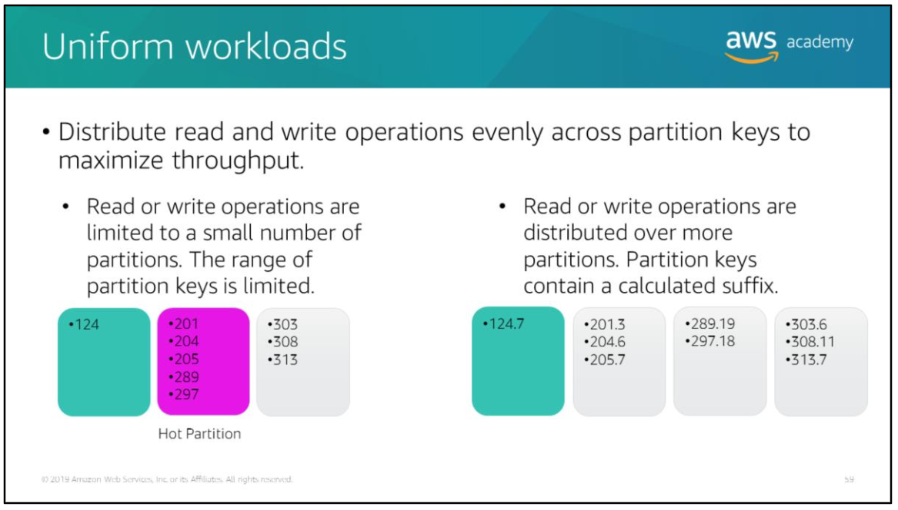

The partition key determines the distribution of data across the partitions where data is stored. The total throughput that is provisioned for a table is divided equally across partitions.

When you make a large number of consecutive reads or consecutive writes to a narrow range of partition keys, the same partitions are accessed repeatedly (hot partitions). The throughput allocated to remaining partitions remains unused.

To achieve maximum read/write throughput, implement your read/write operations as follows:
- Choose the partition key carefully to avoid hot spots.
- Consider concatenating a random number or a calculated value to the partition key when data is written so that you can ensure the distribution of partition keys. For example: you might concatenate the sum of the ASCII values of each character in the partition key.
- Distribute reads and writes across multiple partitions.

# Global secondary indexes

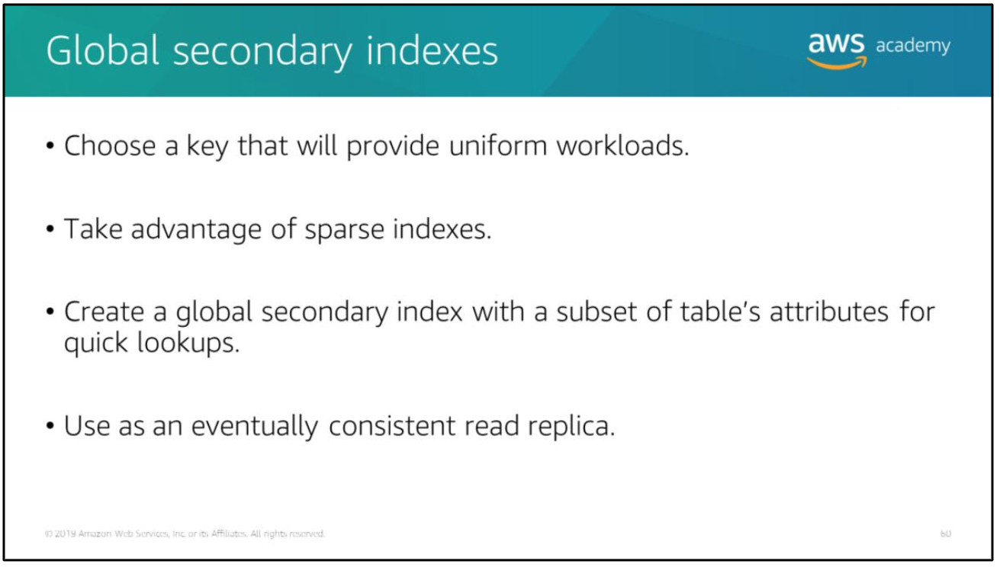

Choose a partition key and sort key that will distribute reads across multiple partitions.

DynamoDB will only write a corresponding entry to a global secondary index if the index key value is present in the item. Therefore, the index might be sparse because it does not contain all items that are in the parent table. You can use these sparse indexes for efficient queries.

You can create a global secondary index that has the same key schema as the table, but with a subset of the table's attributes. You can then provision minimal throughput for this index, and use it for lookups of data.

Consider this following scenarios:
- You want to restrict read access to a table that contains sensitive data.
- You have a high priority application that should read strongly consistent data with high throughput. You have a low-priority application that does not need the latest data.

> To handle that scenarios, you can create a global secondary index that has lower provisioned throughput and that also has a subset of the table’s attributes. The high priority application can perform strongly consistent reads with high throughput from the table. The low-priority application can perform eventually consistent reads from the global secondary index with lower throughput. This approach ensures that the required throughput is always available for the high-priority application. The global secondary index functions as an eventually consistent read replica.

# Local secondary indexes

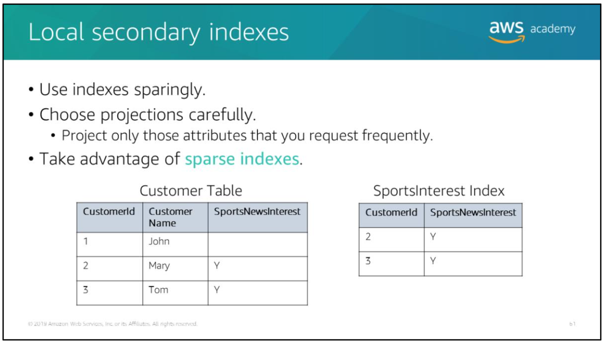

> Local secondary indexes consume storage and the provisioned throughput for the table. Keep the size of the index as small as possible.

> Create local secondary indexes only on attributes that you query often.

For any item in a table, DynamoDBwillonly writea corresponding entry in the index when the sort key attribute for the index is present in the item.

For example:  
Consider the Customer table (the partition key is `CustomerId`) and `SportsInterest` index (the partition key is `CustomerId`, and the sort key is `SportsNewsInterest`).

DynamoDB will add an entry to the `SportsNewsInterest` index only if the original item contains a value for the `SportsNewsInterest` attribute. Therefore, the index is said to be sparse because it does not contain an entry for every item in the table. You can use the sparse index to easily retrieve information about customers who are interested in sports news.

# Hot and cold data

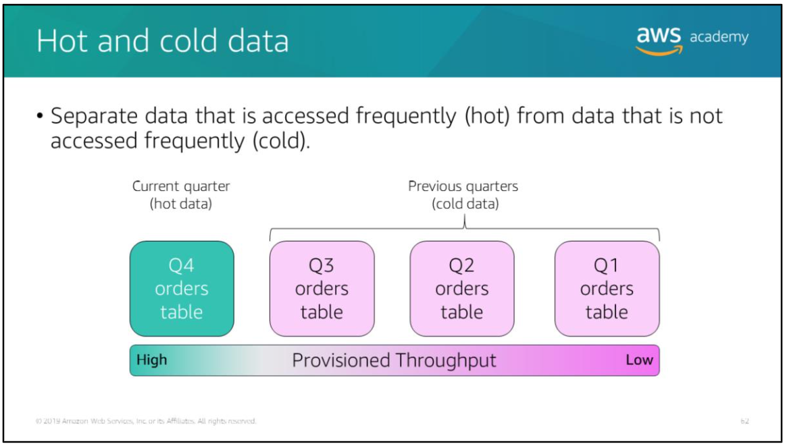

Consider access pattern for your data.

For example:  
You might have an Orders table with a partition key of `customer id` and sort key of `timestamp`. Your application probably accesses the latest order data most of the time. It might rarely access data about old orders.

For situations like that, consider breaking time series data into separate tables. Store the frequently accessed *hot* data in a separate table with higher throughput. Store rarely accessed *cold* data in tables with lower throughput.

You can even move the old data to other storage options, such as an Amazon S3 bucket, and delete the table that contains the old data.

# One-to-many tables

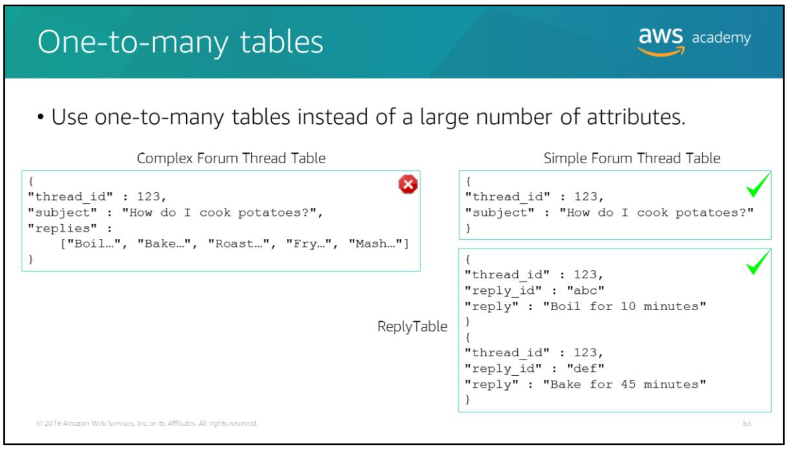

If your table has items that store a large number of values in an attribute that is of a *set* type, such as string set or number set, consider removing the set attribute from the table and splitting it into separate items in another table.

For example:  
Consider a table that stores threads in a forum. If the table stores replies for each thread as a string set in each thread item, an individual thread item can become large. The item size is likely to exceed the maximum item size in Dynamo DB. Throughput will be reduced because you will unnecessarily fetch large amounts of data, even if you only need minimum information such as the thread subject.

Instead, you can remove the replies from the forum thread table. Create a separate table to store the replies as individual items.

# Varied access patterns

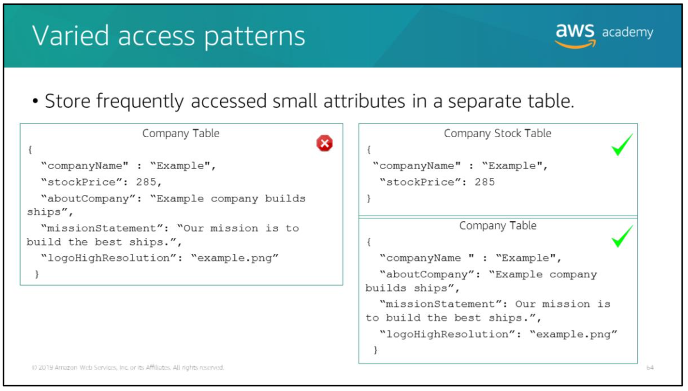

If you frequently access large items in a table but do not use the large attribute values, consider storing frequently accessed smaller attributes in a separate table.

For example:  
Consider the Company table. It has fairly large attributes, such as company information, mission statement, and logo. These attributes are fairly static and rarely accessed. To improve throughput, consider splitting the frequently changing and frequently read stock price attribute to a separate table.

# DynamoDB accelerator (DAX)

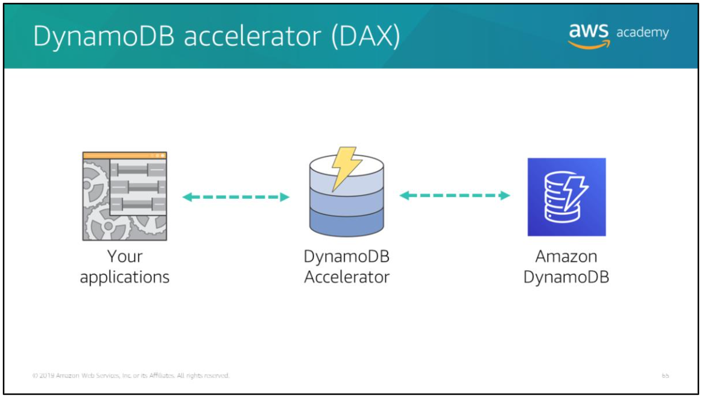

DynamoDB Accelerator (DAX) delivers fast response times for accessing eventually consistent data. DAX is a caching service that is compatible with DynamoDB, and it enables you to benefit from fast in-memory performance for demanding applications.

DAX addresses three core scenarios:
1. As an in-memory cache, DAX reduces the response times of eventually consistent read workloads by an order of magnitude, from single-digit milliseconds to microseconds.
2. DAX reduces operational and application complexity by providing a managed service that is API-compatible with Amazon DynamoDB, and thus requires only minimal functional changes to use with an existing application.
3. For read-heavy or bursty workloads, DAX provides increased throughput and potential operational cost savings by reducing the need to over provision read capacity units. This is especially beneficial for applications that require repeated reads for individual keys.

DAX is a read-through/write-through cache.When a read is issued to DAX, it first checks to see whether that item is in cache. If it is, DAX returns the value with response times in microseconds. If the item is not in cache, DAX automatically fetches the item from DynamoDB, caches the result for subsequent reads, and returns the value to the application. For writes, DAX first writes the value to DynamoDB, caches the value in DAX, and then returns success to the application.

# Troubleshooting

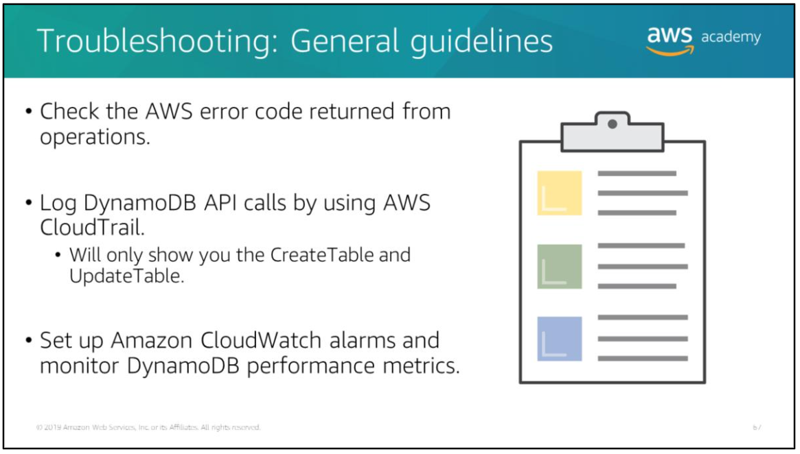

See the AWS Documentation for more information about:
- [DynamoDBerror handling](https://docs.aws.amazon.com/amazondynamodb/latest/developerguide/Programming.Errors.html#APIError)
- [Monitoring DynamoDB with CloudWatch](https://docs.aws.amazon.com/amazondynamodb/latest/developerguide/MonitoringDynamoDB.html)
- [Logging DynamoDB API operations using AWS CloudTrail](https://docs.aws.amazon.com/amazondynamodb/latest/developerguide/logging-using-cloudtrail.html)

# Error handling

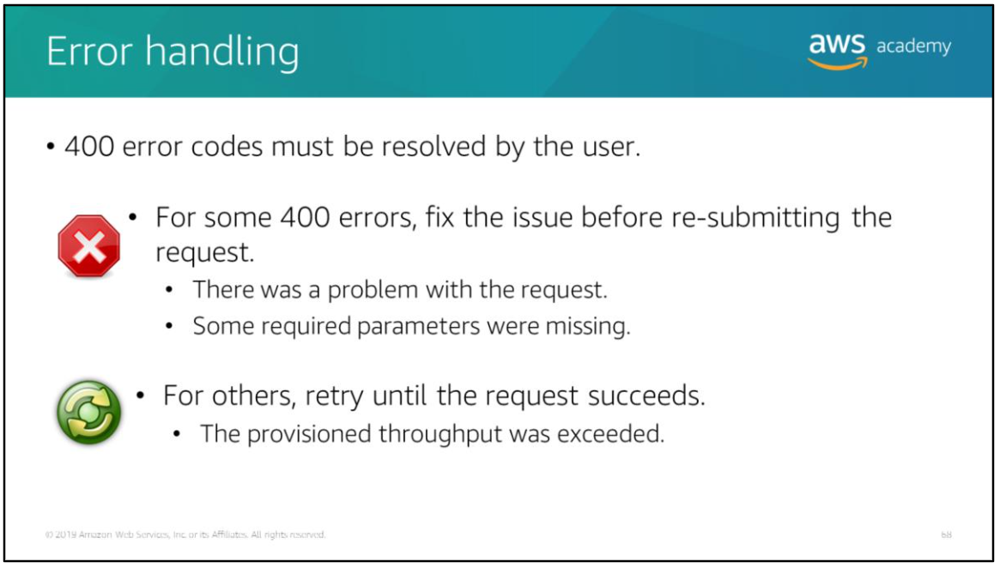

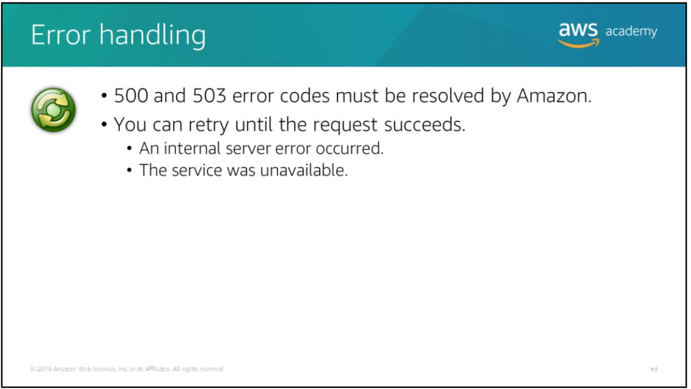

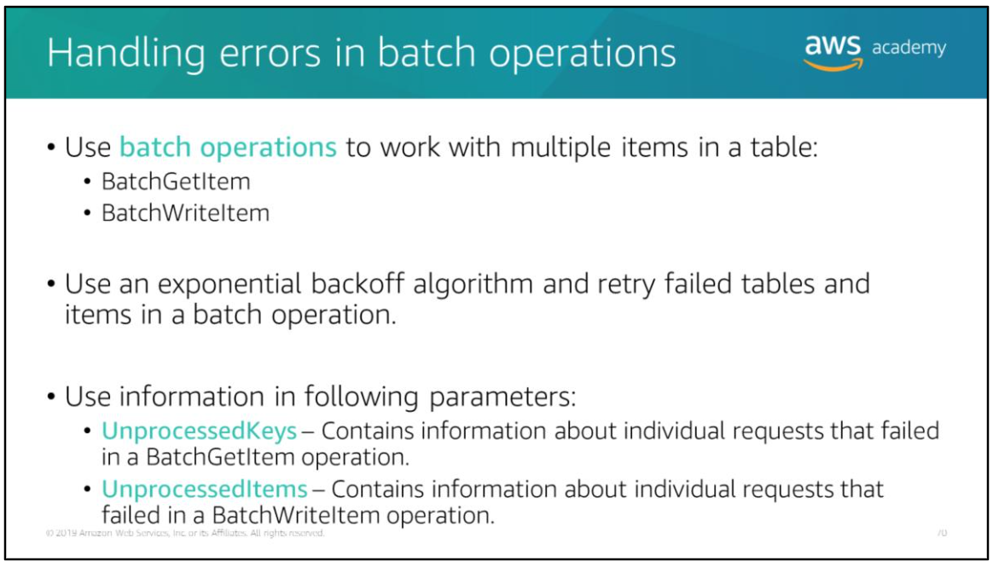

Batch operations can read or write items from one or more tables. Individual requests in a batch operation might fail. The most likely reason for failure is that the table in question does not have enough provisioned read or write capacity.

See the AWS Documentation for more information about:
- [BatchGetItem operation](https://docs.aws.amazon.com/amazondynamodb/latest/APIReference/API_BatchGetItem.html)
- [BatchWriteItem operaton](https://docs.aws.amazon.com/amazondynamodb/latest/APIReference/API_BatchWriteItem.html)

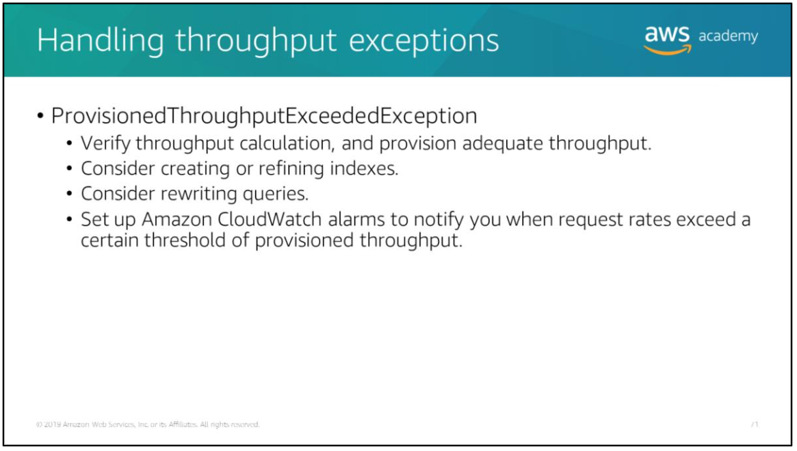

You can set up CloudWatch alarms to notify you when request rates for a table exceed a certain threshold of the provisioned throughput. For example, you might set up a CloudWatch alarm to notify you when request rates exceed a level that is 80 percent of the table’s provisioned throughput. If your application has a sudden surge in requests, you can respond to the CloudWatch alarm by provisioning additional throughput. You can also set up an AWS Lambda function that will be triggered based on a CloudWatch alarm. The Lambda function can update the table to provision additional throughput.
