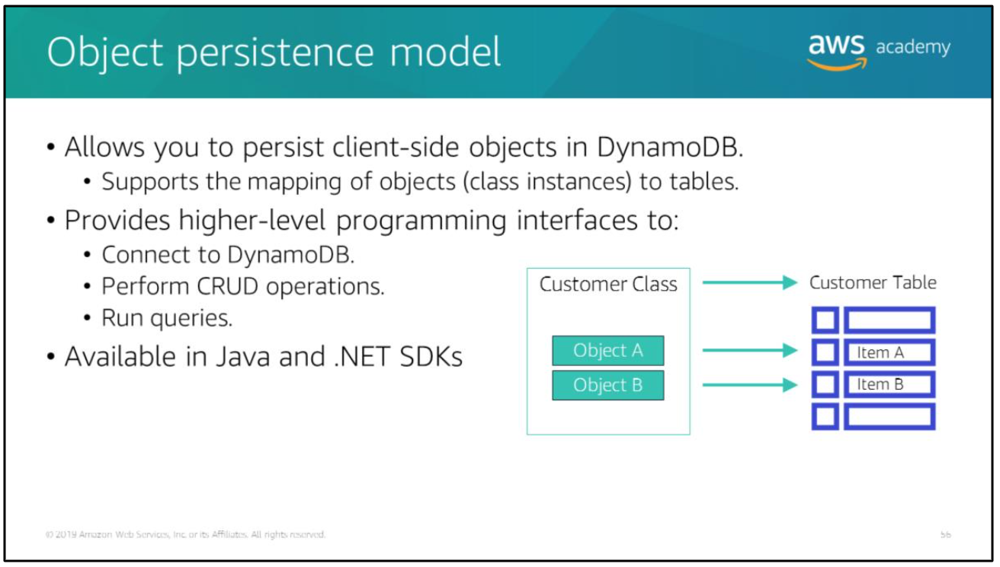
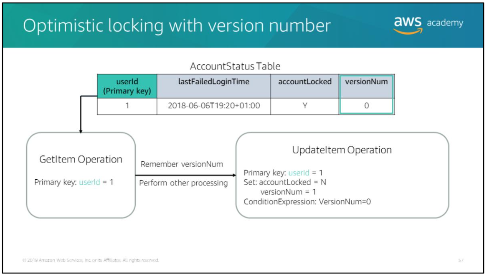

# Amazon DynamoDB API

Amazon DynamoDB API is a low-level HTTP-based API. It is a protocol interface for Amazon DynamoDB. The API accepts an HTTP(S) POST request as input, processes it, and returns an HTTP response.

Every HTTP(S) request must be correctly formatted and carry a valid digital signature. The API uses JavaScript Object Notation (JSON) as a wire protocol format.

> Use an AWS SDK to access the API at a higher level.

# Object persistence model

To simplify development, the AWS SDKKs for java and .NET provide additional interface with higher levels of abstraction. The higher-level interface for DynamoDB let you define the relationships between objects in your program and the database tables that store those objects' data. After you define this mapping, you call simple object methods such as save, load, or delete, and the underlying low-level DynamoDB operations are automatically invoked on your behalf. This allows you to write object-centric code, rather than database-centric code.

DynamoDB object persistence model enables you to map client-side classes to DynamoDB tables. The instances of these classes (objects) map to items in a DynamoDB table. You can use object persistence programming interface to connect to DynamoDB, perform CRUD operations, run queries, and implement optimistic locking with a version number.

> Optimistic locking is a strategy to ensure that the client-side item that you are updating (or deleting) is the same as the item in DynamoDB. If you use this strategy, then your database writes are protected from being overwritten by the writes of others and vice versa.

## Optimistic locking with version number

Consider a scenario where you read an item from the *AccountStatus* table and do some processing. Then, you set the `accountLocked` attribute to `N` because you determined that the last failed login was over 24 hours earlier. It is possible that the user might have made another failed login attempt between the time that you read the data and when you made the update. The update is incorrect because it is based on stale information.

Use optimistic locking with a version number as described in the following steps to make sure that an item has not changed since the last time you read it. Maintain a version number to check that the item has not been updated between the last read and update:
1. Read the item and remember the version number (`versionNum` = 0).
2. Make the state transition in memory after validating information (`accountLocked` = `N` if `currentLoginTime > lastFailedLoginTime + 24` hours).
3. Increment the version number (`versionNum` = 1).
4. Write the item with updated attributes (`accountLocked` = `N` and `versionNum` = 1). Use conditional expression to perform a write only if the item has not changed since it was last read.
5. If the condition fails, repeat from step 1.

> the approach above also know as the *read-modify-write* design pattern, or *optimistic concurrency control*.
