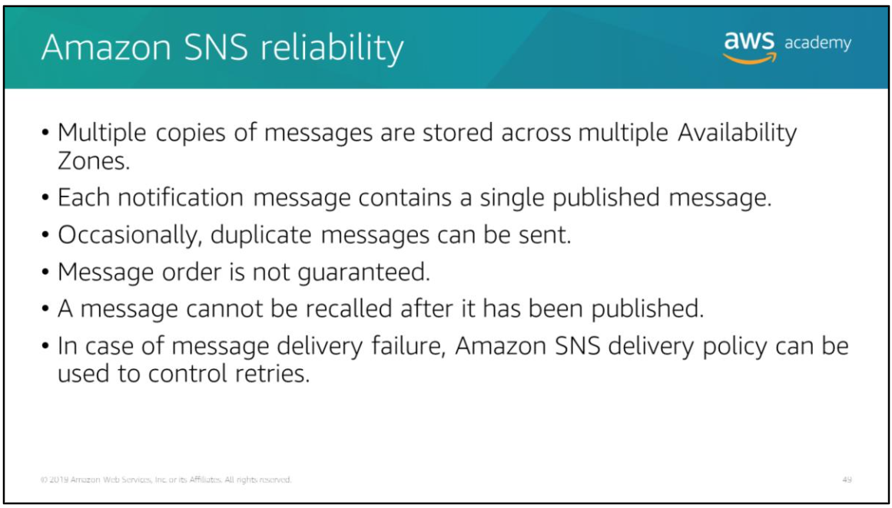
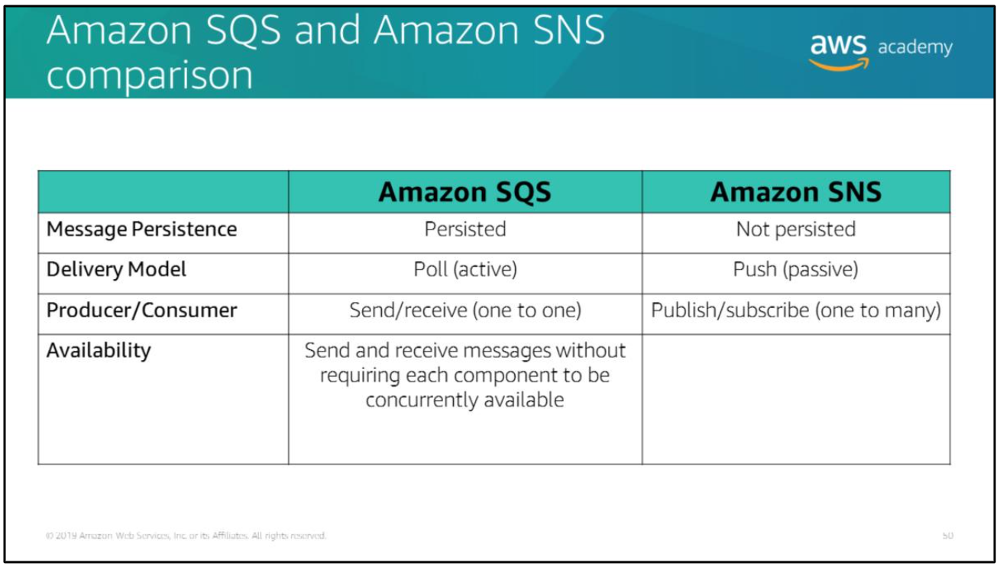

# Amazon SNS reliability

Amazon SNS offers reliability in the following ways:
- When it receives a publish request, Amazon SNS stores multiple copies (to disk) of the message across multiple Availability Zones before it acknowledges receipt of the request to the sender.
- Each notification message contains a single published message.
- Though each message will be delivered to your application exactly once most of the time, the distributed nature of Amazon SNS and transient network conditions could result in occasional, duplicate messages at the subscriber end. You should design your applications so that processing a message more than once does not create any errors or inconsistencies.
- The Amazon SNS service will attempt to deliver messages from the publisher in the order they were published into the topic. However, network issues could potentially result in out-of-order messages at the subscriber end.
- After a message has been successfully published to a topic, it cannot be recalled.
- When a message is published to a topic, Amazon SNS will attempt to deliver notification to all subscribers that are registered for that topic. Because of potential internet issues or email delivery restrictions, sometimes the notification might not successfully reach an HTTP or email endpoint. With HTTP, an Amazon SNS delivery policy can be used to control retries.

# Amazon SQS and Amazon SNS comparison

Amazon SQS is a message queue service that isused by distributed applications to exchange messages through a polling model, and it can be used to decouple sending and receiving components. Amazon SQS provides flexibility for distributed components of applications to send and receive messages without requiring each component to be concurrently available.

Amazon SNS allows applications to send time-critical messages to multiple subscribers through a push mechanism, which reduces the need to periodically check or poll for updates.
