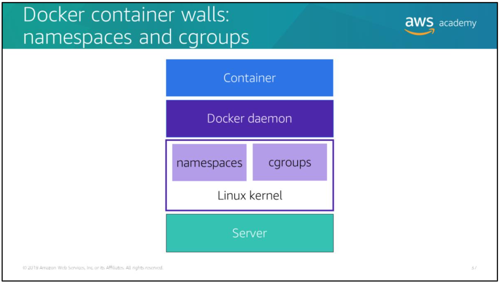
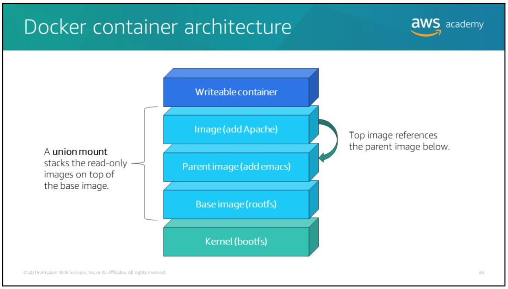

# Docker container walls: namespaces and cgroups

Container processes are kept isolated from each other by `namespaces` and `cgroups`, which are features of the Linux kernel.

> Namespaces control resource isolation for a single container, while cgroups manage resources for a group of containers.

## Namespaces

Namespaces wrap a set of system resources and present them to a process to make it look like they are dedicated to that process. Each container has its own set of namespaces that isolates it from other containers.

## Control groups (cgroups)

Control groups (cgroups) limit an application to a specific set of hardware resources, such as CPU, memory, network, and storage I/O.

> If you have an application that takes up a lot of CPU cycles and memory (such as scientific computing application), you can put the application in a cgroup to limit its CPU and memory usage.

Docker uses cgroups to share available hardware resources with containers.

# Docker container architecture

The docker container architecture is a collection of layered filesystems that is used to launch a container.

The architecture is structured as follows (from low-level to high-level):
- The boot filesystem (`bootfs`) is at the bottom of the architecture. The boot filesystem is what Docker uses to boot the container.
- The next layer is the base image or root filesystem (`rootfs`). The `rootfs` can be one or more operating systems (e.g., Debian, Ubuntu, BusyBox, Fedora).
- When Docker mounts the `rootfs`, it starts in read-only mode, as in a traditional Linux boot. However, instead of changing to a read/write mode, `rootfs` stays in read-only mode.
- Docker uses a *union mount* to stack a read-only file system (or image) over the read-only `rootfs`.
- Multiple images can be layered on top of each other. Each image references the parent image below it. The resulting image might contain files and subdirectories from any or all of the underlying images.
- Multiple images can be layered on top of each other. Each image references the parent image below it. **The resulting image might contain files and subdirectories from any or all of the underlying images**.
- Finally, Docker mounts a read/write filesystem on top of all the image layers to launch a *writeable container*.
