## Topics

- Application Programming Interfaces (APIs)
- Amazon API Gateway
- Steps for developing RESTful APIs with Amazon API Gateway

# Application Programming Interfaces (APIs)

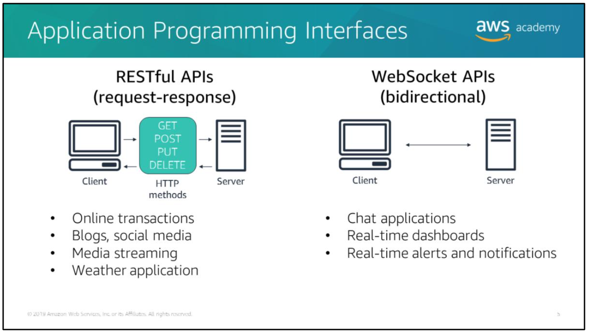

Application Programming Interfaces (APIs) are the backbone of web applications. They are the interface between clients on the front-end and servers or external software components on the back-end.

An API is a set of instructions that defines how developers interface with an application.

An API is often designed to be used with a Software Development Kit (SDK), which is a collection of tools that enables developers to create downstream applications based on the API.

There are two primary types of APIs used for web applications:
- RESTful APIs
- WebSocket APIs.

## RESTful APIs

RESTful APIs adhere to the REST (Representational State Transfer) architectural style.

A REST API is a group of resources and methods, or endpoints. It uses a request-response model where a client application sends an HTTP request (such as GET, POST, PUT, PATCH, or DELETE) to a back-end server, and the server responds synchronously back to the client.

> The response could be in Hypertext Markup Language (HTML), Extensible Markup Language (XML), or JavaScript Object Notation (JSON).

RESTful APIs are used for most applications that use a request-response model, such as online transactions, blog or social media posts, media streaming, or an application that gets the weather for you.

## WebSocket APIs

WebSocket APIs support two-way communication between clients and servers. This means that a client application and back-end servers can both send messages to each other at any time. Back-end servers do not have to wait for a request from a client.

WebSocket APIs are used to build real-time communication applications, such as chat applications, real-time dashboard (for example, stock tickers), and to get real-time alerts and notifications.

## Example

### Simple RESTful API example

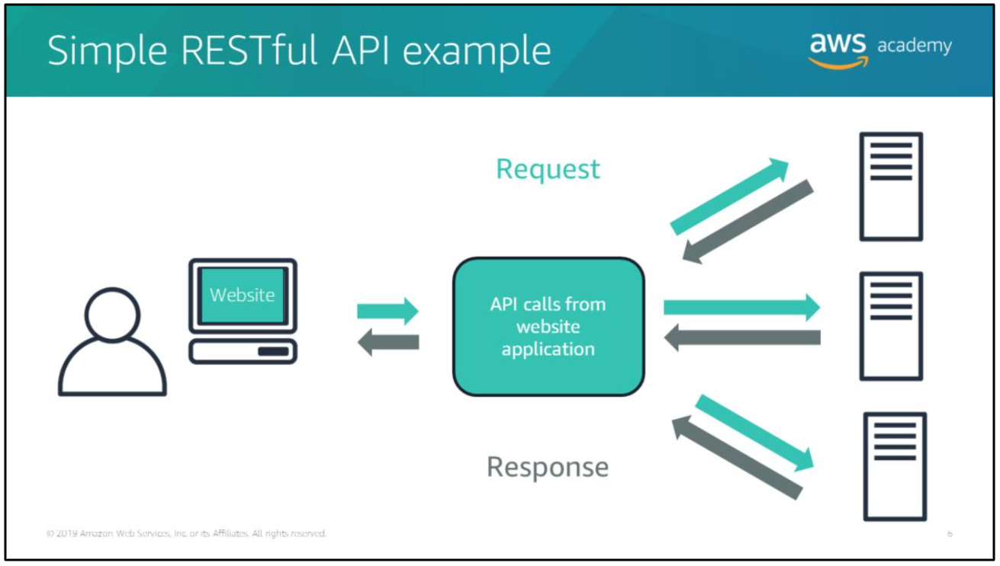

Say that you create a real estate application. A user goes to your website. They enter search criteria such as city, neighborhood, property type, and price range. Your application then makes a series of RESTful API calls to services that process the information and send back the requested information. The website application collects this information and presents it to the user.

### More complicated RESTful API example

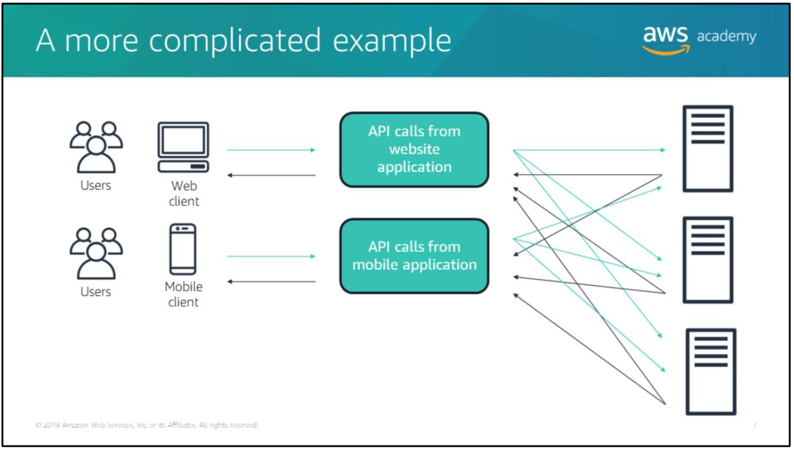

As your application evolves, your APIs will proliferate.

For example:  
You discover that your customers want your webpages to load faster. You move some of your business logic into your web front-end, so that it fetches data automatically in the background without having to reload the webpage. This makes your website feel more responsive.  
Next, you might want to introduce native mobile apps for iOS and Android. To support these different clients, you must refactor your back-end to expose an API so that your team can reuse the business logic across different applications.

### Even more complicated RESTful API example

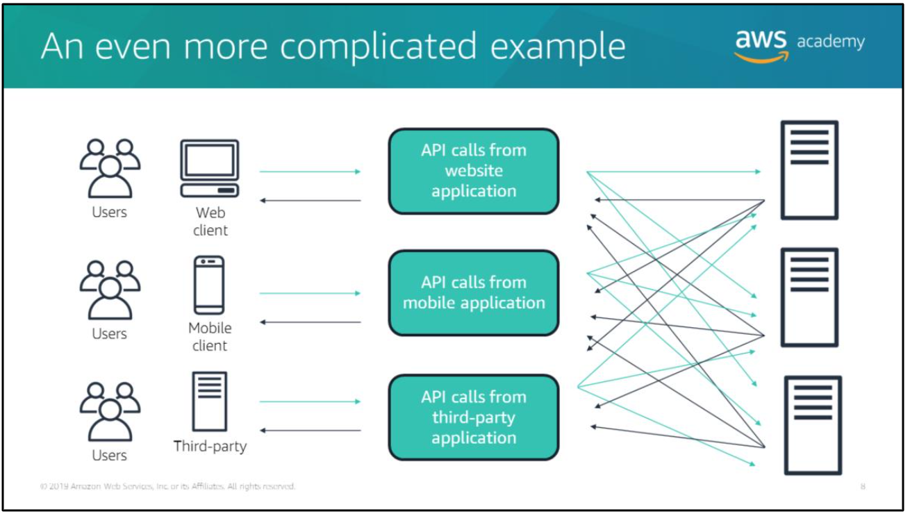

Along the way, your feature set grows, and so does your team.

You want to add new features, such as recommendations and inventory-tracking systems. You refactor your application into multiple microservices to enable each team to manage and update their service more rapidly. This causes you to expose more APIs.

You then want to expand further and build a marketplace to allow third-party sellers to list items. Some of your partners are now asking for APIs to help them automate repetitive tasks. In all of these cases, you are building and deploying APIs as part of your software development cycle.

# Scale and manage versions

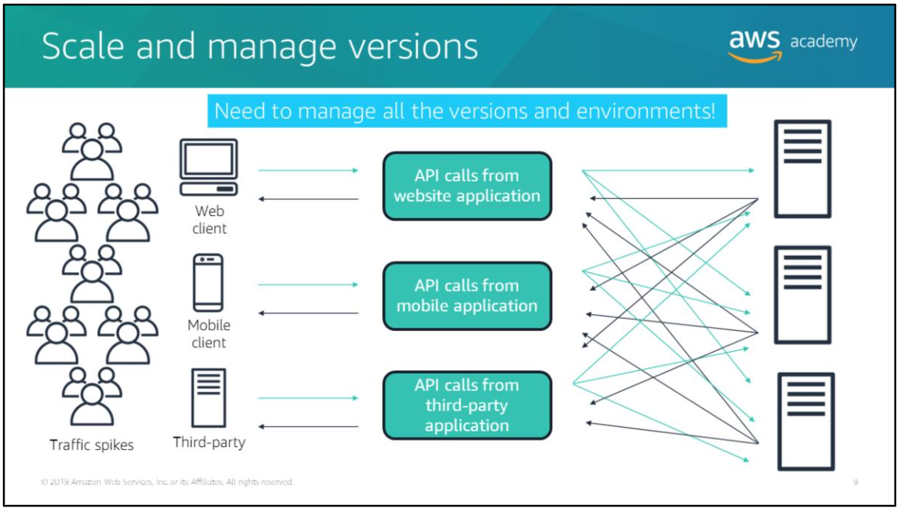

You must ensure that your APIs can handle spikes in traffic gracefully. You need a way to track API usage by client application, set up authentication and authorization on specific methods, and document the API so others can use it. You also need a way to maintain multiple versions of your APIs to maintain compatibility with older clients as you continue to innovate. Enter Amazon API Gateway.

# Amazon API Gateway

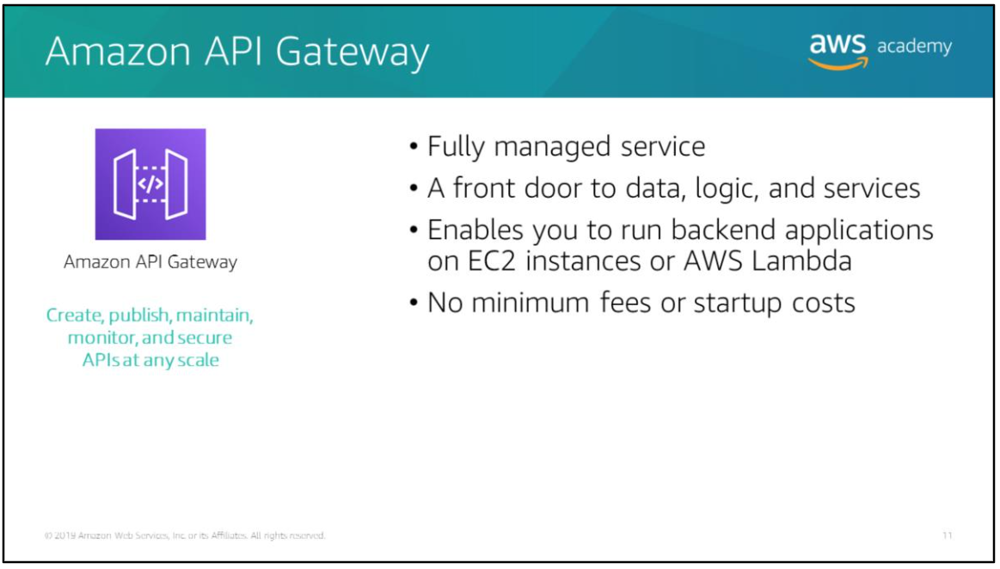

Amazon API Gateway is a fully managed service that lets you create, publish, maintain, monitor, and secure APIs at any scale.

You can use it to create RESTful and WebSocket APIs that act as a front door for applications. Application scan then access data, business logic, or functionality from your back-end services, such as applications that run on Amazon Elastic Compute Cloud (Amazon EC2), code that runs on AWS Lambda, any web application, or real-time communication applications.

API Gateway handles all the tasks that are involved in accepting and processing up to hundreds of thousands of concurrent API calls, including traffic management, authorization and access control, monitoring, and API version management.

API Gateway has no minimum fees or startup costs. You pay only for the API calls you receive and the amount of data that is transferred out. With the API Gateway tiered pricing model, you can reduce your cost as your API usage scales.

## Amazon API Gateway benefits

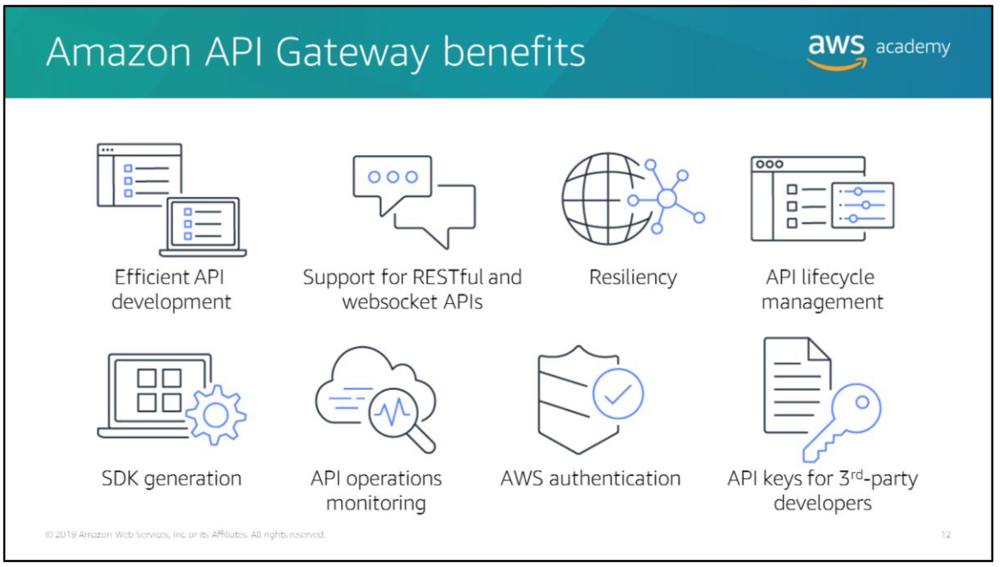

Amazon API Gateway offers the following benefits:
- Efficient API development -> you can create a custom API to your code running in AWS Lambda and then call the Lambda code from your API. API Gateway can run AWS Lambda code in your account, start AWS Step Functions state machines, or make calls to AWS Elastic Beanstalk, Amazon Elastic Compute Cloud (Amazon EC2), or web services outside of AWS with publicly accessible HTTP endpoints. Using the API Gateway console, you can define your REST API and its associated resources and methods, manage your API lifecycle, generate your client SDKs, and view API metrics.

- Support for RESTful and websocket APIs -> you can create REST APIs that leverage HTTP request types. You can also create WebSocket APIs that enable you to build real-time two-way communication applications, such as chat apps and streaming dashboards.

- Resiliency -> API Gateway helps you manage traffic to your back-end systems by allowing you to set throttling rules based on the number of requests per second for each HTTP method in your APIs. In addition, you can set up a cache with customizable keys and time-to-live in seconds for your API data to avoid hitting your back-end services for each request. API Gateway handles any level of traffic received by an API, so you are free to focus on your business logic and services rather than maintaining infrastructure.

- API lifecycle management -> API Gateway lets you run multiple versions of the same API simultaneously so that applications can continue to call previous API versions even after the latest versions are published. API Gateway also helps you manage multiple release stages for each API version, such as alpha, beta, and production. Each API stage can be configured to interact with different back-end endpoints based on your API setup. Specific stages and versions of an API can be associated with a custom domain name and managed through API Gateway. Stage and version management allow you to easily test new API versions that enhance or add new functionality to earlier API releases, and ensures backward-compatibility as user communities transition to adopt the latest release

- SDK generation -> API Gateway can generate client SDKs for a number of platforms, which you can use to quickly test new APIs from your applications and distribute SDKs to third-party developers. The generated SDKs handle API keys and sign requests using AWS credentials.

- API operations monitoring -> after an API is deployed and in use, API Gateway provides you with a dashboard to visually monitor calls to the services. The API Gateway console is integrated with Amazon CloudWatch, so you get backend performance metrics such as API calls, latency, and error rates.

- AWS authentication -> to authorize and verify API requests to AWS services, API Gateway can help you leverage signature version 4 (the same technology used by AWS for its services). Using signature version 4 authentication, you can use AWS Identity and Access Management (IAM) and access policies to authorize access to your APIs and all your other AWS resources.

- API keys for third-party developers -> API Gateway helps you manage the ecosystem of third-party developers accessing your APIs. You can create API keys on API Gateway, set fine-grained access permissions on each API keys, and distribute them to third-party developers to access your APIs. You can also define plans that set throttling and request quota limits for each individual API key.

## Amazon API Gateway architecture

Amazon API Gateway can be used to provide the API layer for your applications.

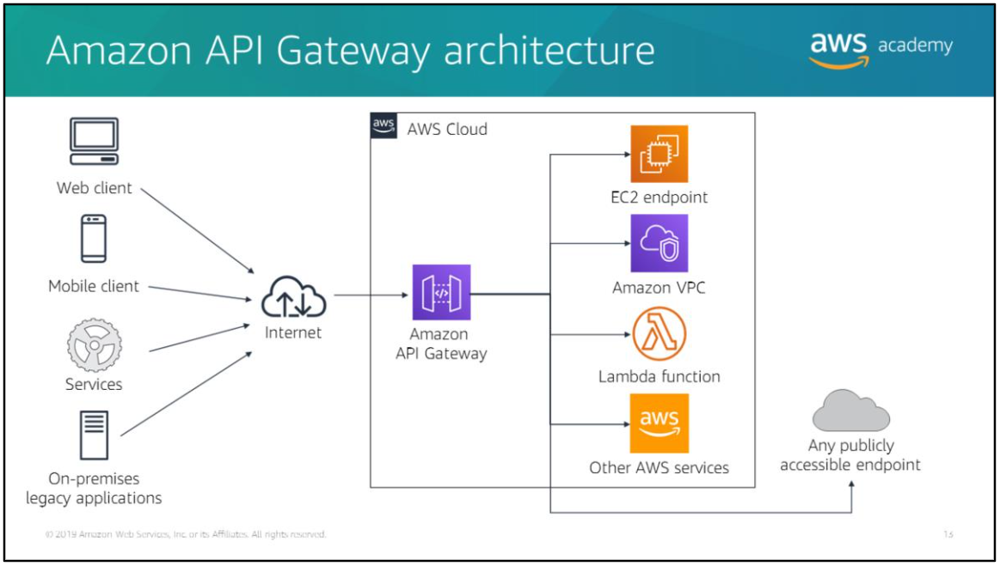

In the architecture diagram above, front-end client applications and application services send API requests to API Gateway over the internet. API Gateway manages all of these requests and sends them to servers that run on EC2 instances, inside a Virtual Private Cloud (VPC), or anywhere on the internet.

You can use API Gateway with other AWS managed services to build serverless back-ends for your applications. That means there are no servers for you to maintain.

For example:  
API Gateway can proxy requests to Lambda functions that run your code and generate responses. You can even create APIs that proxy requests to other AWS services, such as Amazon Simple Storage Service (Amazon S3), without having to write any code. This allows you to get production-scale back-ends running much more quickly because you have less code to write, and you also offloaded operational burden to the AWS services.

## API development and deployment steps

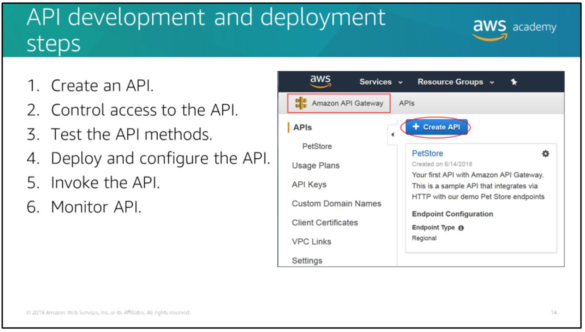

Development of both RESTful and WebSocket APIs occurs in the following broad steps:
1. Creating an API
2. Controlling access to API
3. Testing and deploying API
4. Invoking API from a client
5. Monitoring API

> While the steps are similar for both RESTful and WebSocket APIs, there are differences in the details of each step.

## Creating a RESTfull API

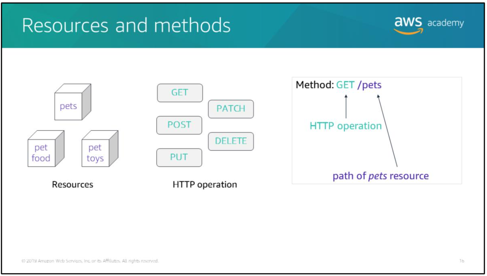

In Amazon API Gateway, a REST API is a group of resourcesand methods:
- A **resource** is a logical entity that an application can access through a resource path. In the abstract sense, resources are the things of your application.  
For example:  
For a pet store application, the resources might be pets and types of pet food.

- A **method** corresponds to a REST API request that is submitted by the user of your API and the responses returned to the user.  
The method is the combination of a resource path and an HTTP operation (e.g., GET, POST, PUT, PATCH, DELETE). It is what allows you to interact with resources inside your application. When you build an API, you assign methods against your resources and access those resources at the end of the resource path.  
For example:  
`/pets` could be the path of a pets resource. The `Get /pets` method would return a list of pets. Similarly, a user could add a pet by using the `POST /pets` method, which would send the information to the back-end service.

# API endpoint types

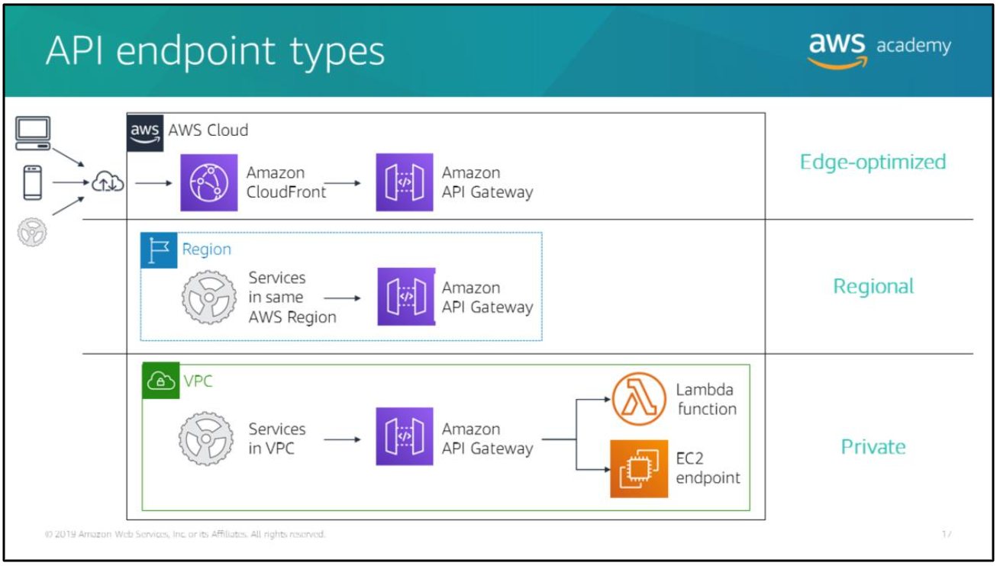

An **API endpoint** is the URL where an API is deployed. It refers to the hostname of the API. An endpoint can be edge-optimized, regional, or private, depending on where the majority of your API traffic originates from.

There are three API endpoint types:
- **Edge-optimized API endpoints** are publicly available endpoints that are designed to reduce latency to APIs that are deployed to an Amazon CloudFront distribution that is geographically closer to the client. (Amazon CloudFront is a global content delivery network, or CDN.) Edge-optimized endpoints help you reduce latency to clients accessing your API from anywhere on the internet, such as mobile, Internet of Things (IoT), or web-based applications.

- **Regional API endpoints** are publicly available endpoints that are designed to reduce latency when API requests originate from within the same AWS Region as your REST API.

- **Private API endpoints** are designed to expose APIsonly to services and resources that are inside your virtual private cloud (VPC).

> For more info: https://docs.aws.amazon.com/apigateway/latest/developerguide/api-gateway-api-endpoint-types.html

# API methods and integrations

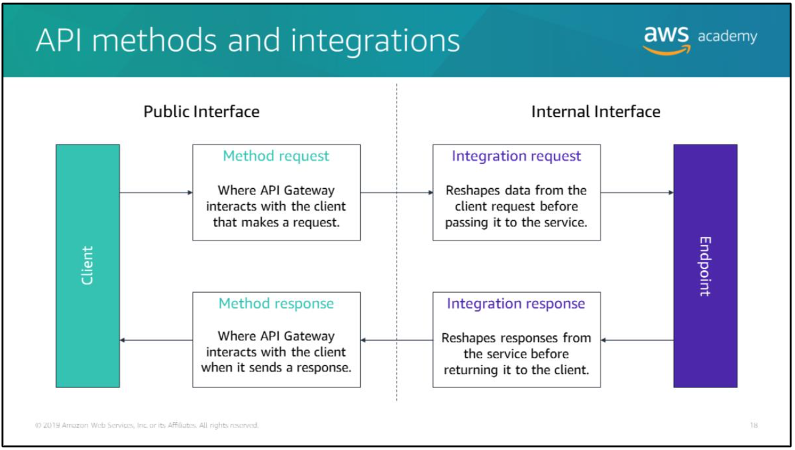

After you choose an API endpoint type, you set up an **API method**.

An API method is the API’s interface with the API’s front end (that is, a client). It has a method request and method response. The method request is an HTTP request that defines what a client should (or must) do to submit a request to access the service at the back-end.

> The method response is an HTTP response with a given status code that defines the responses that the client receives in return.

Next, you set up an API integration, where you integrate the API method with a back-end endpoint (also called an integration endpoint).

> The back-end endpoint can be a Lambda function, an HTTP webpage, or an AWS service. You can also choose a mock integration, where API Gateway serves as an integration endpoint that responds to a method request.

An API integration has an integration request and an integration response:
- An integration request encapsulates an HTTP request that is received by the back-end. It might or might not differ from the method request that is submitted by the client.

- An integration response is an HTTP response that encapsulates the output that is returned by the back-end.

A client uses the API to access a back-end feature through the **method request**. If necessary, API Gateway translates the client request into the form that is acceptable to the back-end in the integration request before it forwards the incoming request to the back-end. The transformed request is known as the integration request.

Similarly, the back-end returns the response to API Gateway in the integration response. API Gateway then routes the integration response to the method response before it sends the response to the client. Again, if necessary, API Gateway can map the back-end response data to a form that is expected by the client.

# Models and mapping templates

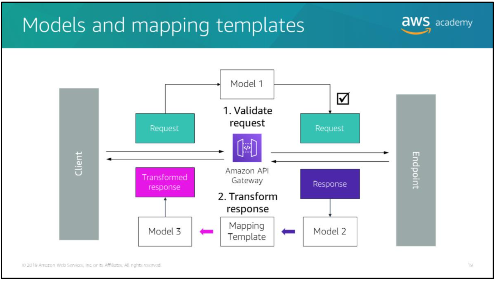

In API Gateway, request and response messages are transformed and validated between the client and the back-end endpoint. As a developer, you achieve this by creating models and mapping templates

The term explanation:
- A **model** defines the data structure of a request or response payload. It is described using a JSON Schema format. You can use a model to validate a request or response payload to ensure that the data that is exchanged between the client and the back-end is in the proper format.

- A **mapping** template transforms data from one model to another. Mapping templates transform a request body from the front-end data format to the back-end data format, or transform a response body from the back-end data format to the front-end data format.

## Model and mapping template example

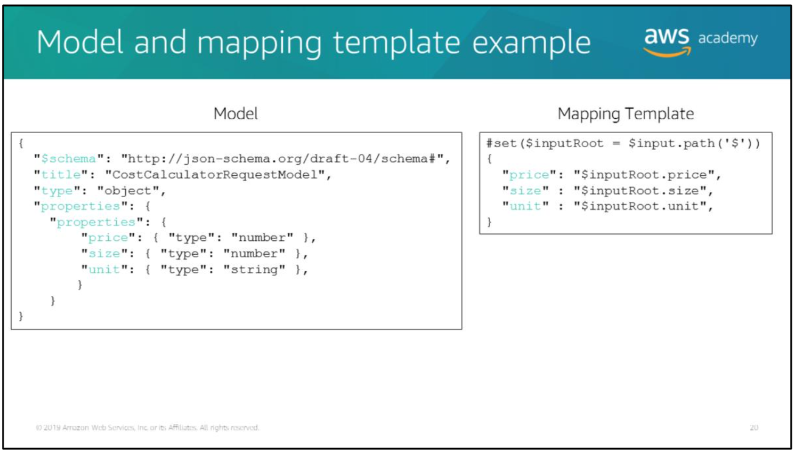

In the model example above:
- The `$schema` object represents a valid JSON Schema version identifier. In the example above, it refers to JSON Schema, draft version 4.
- The `title` object is a human-readable identifier for the model. In the example above, it is `CostCalculatorRequestModel`.
- The `top-level` (or `root`) construct in the JSON data is an object.
- The `root` object in the JSON data contains `price`, `size`, and `unit` properties. Below is the object type:
	- The `price` property is a number object in the JSON data.
	- The `size` property is a number object in the JSON data.
	- The `unit` property is a string object in the JSON data.

> The mapping template example translates the back-end data for price, size, and unit.

# Controlling access to a RESTful API

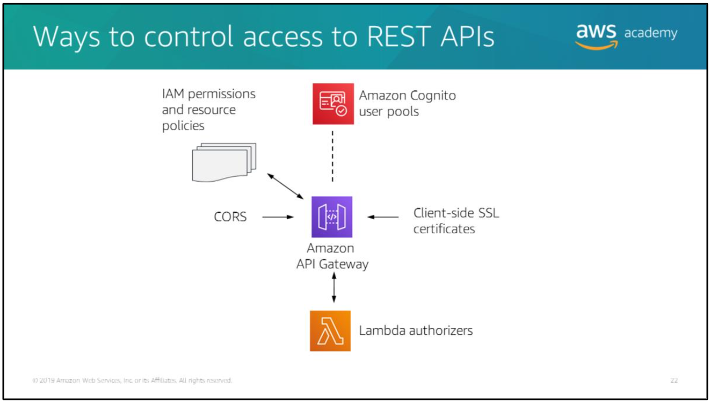

API Gateway provides multiple ways for you to secure access to your APIs, including the following options:
- **AWS Identity and Access Management (IAM) permissions** allow you to control access to the following two API Gateway component processes:
	- To create, deploy, and manage an API (granted to an API developer)
	- To invoke an API or refresh its caching (granted to an API caller)

- A **resource policy** is a JSON policy document that you attach to an API.  It controls whether a specified principal (typically an IAM user or role) can invoke the API. You can use a resource policy to allow users from a different AWS account to securely access your API. You can also use a resource policy to allow the API to be invoked only from specified source IP address ranges or Classless Inter-Domain Routing (CIDR) blocks. Attaching a policy applies the permissions in the policy to the methods in the API.

- **Lambda authorizers** use bearer token authentication strategies—such as Open Authorization (`OAuth`) or Security Assertion Markup Language (`SAML`) (to control access to your APIs). They can also use request parameters to determine the caller’s identity.

- **Amazon Cognito** user pools let you create customizable authentication and authorization solutions for your REST APIs. A user pool is a user directory in Amazon Cognito. With a user pool, your users can sign in to your web or mobile application through Amazon Cognito. Your users can also sign in through social identity providers like Facebook or Amazon, and through `SAML` identity providers.

- **Cross-origin** resource sharing (CORS) lets you control how your REST API responds to cross-domain requests, or to domains other than the API’s own domain.

- **Client-side Secure Sockets Layer** (SSL) certificates can be used to verify that HTTP requests to your back-end system are from API Gateway.

# Testing a RESTful API

After you create an API, you can test it in the Amazon API Gateway console. The results are displayed in a Logs entry.

Logs entries show the state changes from the method request to the integration request, and from the integration response to the method response. You can use Logs to troubleshoot any mapping errors that cause the request to fail.

> Logs shows the state changes from method request to integration request, and from integration response to method response.

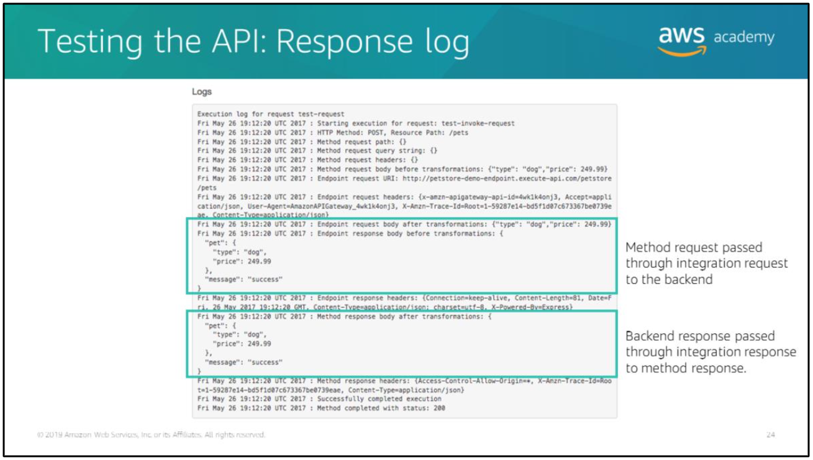

In the example above, no mapping was applied: the method request payload passed through the integration request to the back-end and, similarly, the back-end response passed through the integration response to the method response.

# Deploying a RESTful API

## Stages

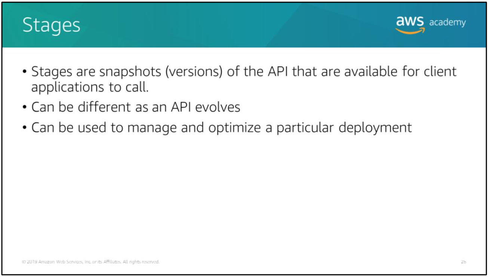

After creating your API, you must deploy it to make it callable by your users. To deploy an API, you create an API deployment and associate it with a *stage*.

Each stage is a snapshot of the API, and it is made available for client applications to call.  
As your API evolves, you can continue to deploy it to different stages as different versions of the API.  
For example:  
You can deploy a test version of your API to a `dev` stage and a different version to a `prod` stage.

You use a stage to manage and optimize a particular deployment.  
For example:  
You can set up stage settings to enable caching, customize request throttling, or configure logging.

## Enable API caching to enhance responsiveness

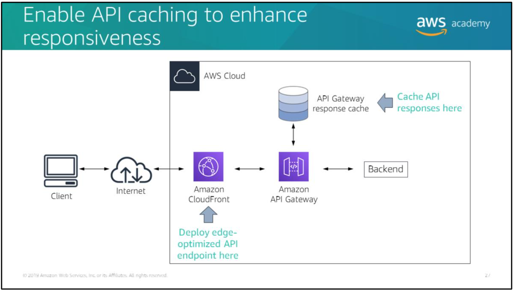

To cache your endpoint's responses, you can enable API caching for a specified stage. When you enable caching for a stage, API Gateway caches responses from your endpoint for a specified Time-To-Live (TTL) period, which is defined in seconds. API Gateway then responds to the request by looking up the endpoint response from the cache instead of making a request to your endpoint.

> The default TTL value for API caching is 300 seconds. The maximum TTL values is 3600 seconds. `TTL=0` means that caching is disabled.

You can also cache API responses by deploying your API endpoint in an Amazon CloudFront distribution that is geographically closer to the client. This is called an *edge-optimized* endpoint. Recall that you can choose this endpoint type when you create an API.

## Throttle API requests for better throughput

As an API developer, you can set throttling limits for individual API stages or methods to improve overall performance across all APIs in your account

Throttling prevents your API from being overwhelmed by too many requests. Alternatively, you can enable usage plans to restrict client request submissions to within specified request rates and quotas. A usage plan specifies who can access one or more deployed API stages and methods, and also how much and how fast they can access them.

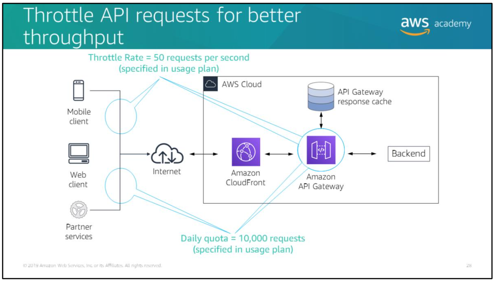

The example above shows the throttle rate and daily quota for specific consumers. The example shows that mobile consumers can invoke an API at a maximum rate of 50 requests per second and that partners have a quota of 10000 API requests per day.

# Invoking RESTful API

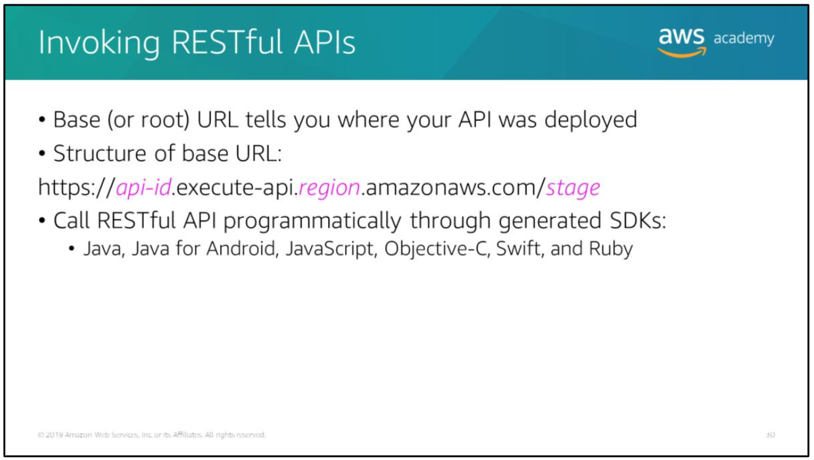

After you deploy an API, you can call it by submitting requests to the URL. The base (or root) URL tells you where your API was deployed.

The URL is determined by an API's protocol (such as HTTP(S) or SecureWeb Socket (WSS)) and its host name, stage name, and (for REST APIs) resource path. The host name and the stage name determine the API's base URL. The base URL is listed as the **Invoke URL** in the API Gateway console.

To call your API programmatically, you must generate a platform or language-specific Software Development Kit (SDK) for it. Currently, API Gateway supports generating an SDK for an API in the following languages:
- Java
- Java for Android
- JavaScript
- Objective-C
- Swift
- Ruby

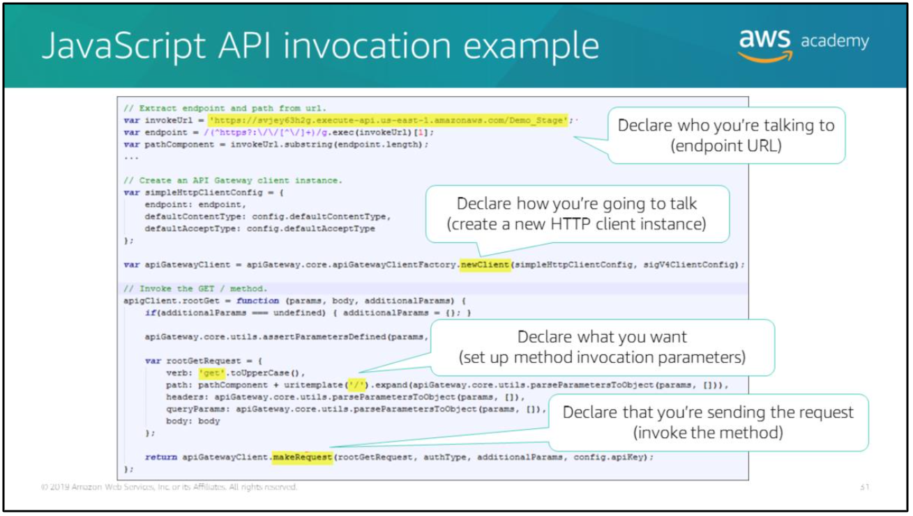

The example above shows JavaScript code that was provided in a generated SDK. It invokes an example pet store `Get /` method.

# Monitoring RESTful API

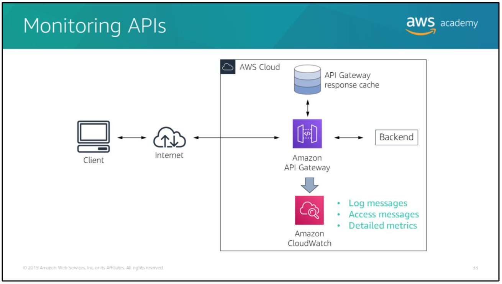

You can monitor APIs using Amazon CloudWatch, which collects and processes raw data from API Gateway into readable, near-real-time metrics. These statistics are recorded for a period of two weeks, so that you can access historical information and gain a better perspective on how your web application or service is performing.

By default, API Gateway sends the following metrics data to CloudWatch every minute:
- Count -> total number of API calls in a giving period.
- Integration latency -> measures the responsiveness of the back-end.
- Latency -> time between when API Gateway receives a request from a client and when it returns a response to the client.
- CacheHitCount -> number of requests that were served from the API cache in a given period.
- CacheMissCount -> number of requests that were served from the back-end in a given period when caching is enabled.
- HTTP 400 and 500 errors -> number of client-side and server-side errors, respectively, that were captured in a given period.
