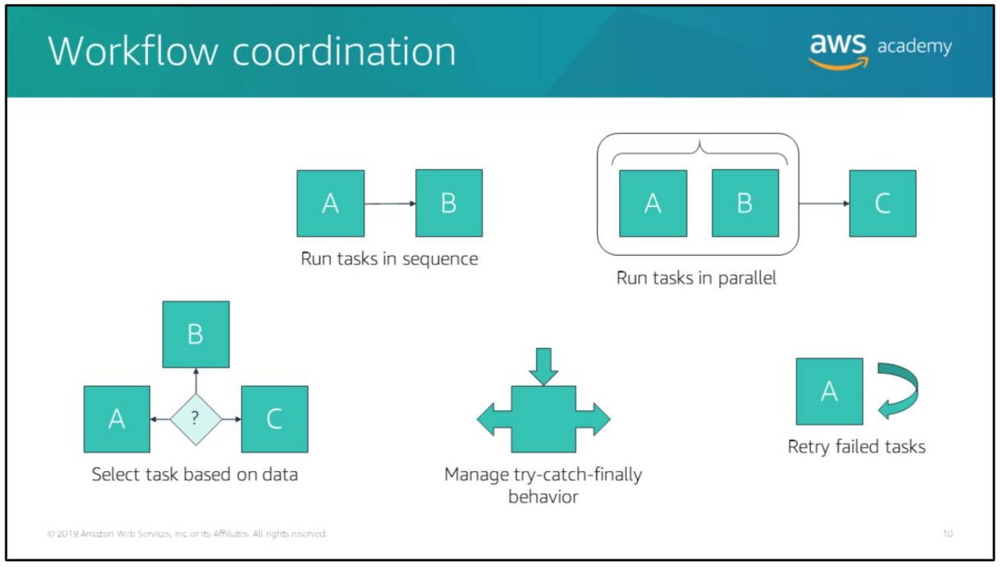
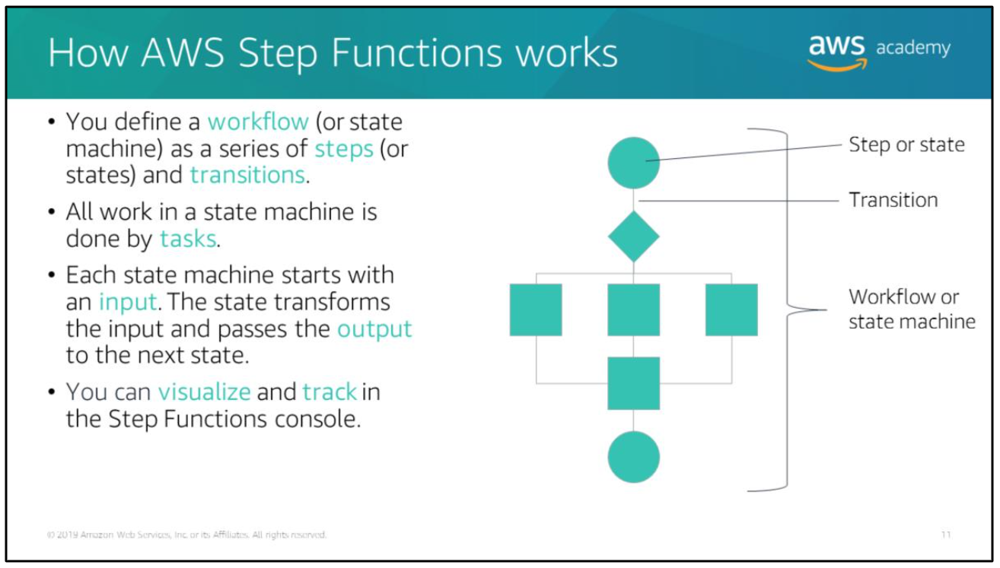

## Topics

- Workflow coordination in distributed applications
- Introduction to AWS Step Functions
- State types
- AWS Step Functions use case
- AWS Step Functions API

# Microservices architecture for distributed applications

In modern cloud architecture, applications are decoupled into smaller, independent building blocks called microservices, which are easier to develop, deploy and maintain.

With microservices, you can build distributed applications from individual components that each perform a discrete function or task.

# Challenges with a distributed application

As your application grows in size, the number of components increases and there can be many patterns to run tasks

Consider a serverless application that is built by using AWS Lambda functions, for example. You might want to invoke a Lambda function immediately after another function, and only if the first function runs successfully.

You might want two functions to be invoked in parallel and then feed the combined results into a third function. Or you might want to choose which of two functions is invoked based on the output of another function.

Function invocation can result in an error for several reasons. Your code might raise an exception, time out, or run out of memory.

The runtime that runs your code might encounter an error and stop. When an error occurs, your code might have run completely, partially, or not at all.

> In most cases, the client or service that invokes your function retries if it encounters an error, so your code must be able to process the same event repeatedly without unwanted effects. If your function manages resources or writes to a database, you must handle cases where the same request is made several times.

You need this coordination layer to be able to scale automatically in response to changing workloads, and handle errors and timeouts. It must also maintain the state of your application while it’s running, such as tracking what step it’s in and storing data that is moving between the steps of your workflow.

# AWS Step Functions

Step Functions provides a reliable way to coordinate components and step through the functions of your application.

> Step Functions offers a graphical console so you can visualize the components of your application as a series of steps

## Benefits of AWS Step Functions

You can use AWS Step Functions to:
- Build and update applications quickly -> you can use AWS Step Functions to build visual workflows that enable fast translation of business requirements into technical requirements. When needs change, you can exchange or reorganize components without customizing any code.

- Scale and recover reliably -> AWS Step Functions automatically scales the operations and underlying compute to run the steps of your application for you in response to changing workloads.

- Evolve applications easily -> AWS Step Functions manages state, checkpoints, and restarts for you to make sure that your application runs in order and as expected. It has built-in try/catch, retry, and rollback capabilities to deal with errors and exceptions automatically.

## AWS Step functions workflow coordination

AWS Step Functions manages the logic of your application for you and it implements basic primitives, such as running tasks sequentially and in parallel, branching, and timeouts. This removes extra code that might be repeated in your microservices and functions.

AWS Step Functions automatically handles errors and exceptions with built-in try/catch and retry, whether the task takes seconds or months to complete.

You can automatically retry failed or timed-out tasks, respond differently to different types of errors, and recover gracefully by falling back to designated cleanup and recovery code.

## How AWS Step Functions works

With AWS Step Functions, you define a workflow as a series of steps and transitions between each step. A workflow is also called a *state machine*, and states are elements in a state machine. A state machine is an object that has a set number of operating conditions that depend on the object’s previous condition to determine output.This means that individual states can make decisions based on their input, perform actions, and pass output to other states.

All work in your state machine is done by tasks. A task performs work by using an activity or an AWS Lambda function, or by passing parameters to the application programming interface (API) actions of other services. Each state machine starts with an input. The state transforms the input and passes the output to the next state.

## Defining and visualizing workflows

You define state machines by using the Amazon States Language.The Amazon States Language is a JavaScript Object Notation (JSON)-based, structured language.

> AWS Step Functions then represents the JSON structure in a real-time graphical view so that you can visualize your state machine directly in the Step Functions console.

## Running state machines

The steps:
1. When a state machine is launched, the system begins with the state that is referenced in the top-level **StartAt** field.
2. After AWS Step Functions runs a state, it uses the value of the **Next** field to determine the next state to advance to. This is called a *transition*.
3. When the system reaches a terminal state (that is, a *Succeed* state, a *Fail* state, or if the **End** field is set to true) or if a runtime error occurs, the state stops running and returns a result.

# State types of AWS Step Functions

A finite state machine can express an algorithm as a number of states, their relationships, and their input and output.

States are elements in your state machine. Individual states can make decisions based on their input, perform actions, and pass output to other states.

States can perform a variety of functions in your state machine:
- Do some work in your state machine (a *Task* state)
- Make a choice between which branch to run (a *Choice* state)
- Stop running a state with a failure or success (a *Fail* state or *Succeed* state)
- Pass its input to its output or inject some fixed data (a *Pass* state)
- Provide a delay for a certain amount of time or until a specified time and date (a *Wait* state)
- Begin running parallel branches (a *Parallel* state)
- Dynamically iterate steps (a *Map* state)

## Task state

All work in your state machine is done by `tasks`. A task performs work by using an activity or an AWS Lambda function, or by passing parameters to the API actions of other services.

The Amazon States Language represents tasks by setting a state’s type to *Task* (that is, “`Type`”: “`Task`”) and by providing the task with the Amazon Resource Name (ARN) of the activity or Lambda function.

A few explanation:
- An activity consists of program code that waits for an operator to perform an action or to provide input. You can host activities on Amazon Elastic Compute Cloud (Amazon EC2), on Amazon Elastic Container Service (Amazon ECS), or even on mobile devices. Activities poll Step Functions using the `GetActivityTask` and `SendTaskSuccess`, `SendTaskFailure`, and `SendTaskHeartbeat` API actions.

- AWS Step Functions can invoke Lambda functions directly from a task state.

- AWS Step Functions also integrates with some AWS services, including the ability to directly call and pass parameters to the API of those services. You can use Step Functions to coordinate these services directly from the Amazon States Language.

Above are two examples of the *Task* state:
- The first example performs an activity that is named *HelloWorld* (which is identified by the activity ARN in the **Resource** field).
- The second example performs a Lambda function (which is identified by the Lambda function ARN).

## Pass state

A Pass state ("`Type`": "`Pass`") passes its input to its output, without performing work.Pass states are useful when constructing and debugging state machines.

Above is an example of a state machine that consists of a single `Pass` state. When this state machine runs, it injects some fixed data, which might be useful for testing purposes.

> `End` state is different from `End: true` workflow. `End` state only end the current state, while `End: true` is for ending the current workflow.

## Choice state

A Choice state ("`Type`": "`Choice`") adds branching logic to a state machine. A Choice state must have a Choices field whose value is a non-empty array, and whose every element is an object called a Choice Rule.

A Choice Rule contains the following:
- A comparison -> two field that specify an input variable to be compared, the type of comparison, and the value to compare the variable to.
- A next field -> the value of this field must match a state name in the state machine.

In the example above, the first choice rule checks whether the numerical value is equal to 1. The second choice rule checks whether the numerical value is equal to 2.

## Parallel state

The Parallel state ("`Type`": "`Parallel`") creates parallel branches in your state machine.

A Parallel state causes AWS Step Functions to run each branch—starting with the state named in that branch's **StartAt** field (as concurrently as possible). It will wait until all branches reach a terminal state before it processes the Parallel state's **Next** field.

## Wait state

A Wait state ("`Type`": "`Wait`") delays the state machine from continuing for a specified time. You can choose either a relative time(which is specified in seconds from when the state begins), or an absolute end-time(which is specified as a timestamp).

In the example above, the Wait state introduces a 10 seconds delay into the state machine.

## Succeed and Fail states

### Succeed state

A Succeed state ("`Type`": "`Succeed`") stops running a state successfully. The Succeed state is a useful target for Choice state branches that don't do anything except stop running the state.

> Because Succeed states are terminal states, they have no **Next** field, and they don't need an **End** field.

### Fail state

A Fail state ("`Type`": "`Fail`") stops running the state machine and marks it as a failure. The Fail state requires the **Type** field(which specifies the state’s type). In addition, the Fail state allows the following optional fields:
- Cause -> provides a custom failure string that can be used for operational or diagnostic purposes.
- Error -> provides an error name that can be used for error handling (retry/catch), operational, or diagnostic purposes.

> Because Fail states always exit the state machine, they have no **Next** field and they do not require an End field.

# AWS Step Functions use case

For more details on the use cases: https://aws.amazon.com/step-functions/use-cases/

For more details on how to build a machine learning workflow using AWS Step Functions: https://aws.amazon.com/blogs/machine-learning/automated-and-continuous-deployment-of-amazon-sagemaker-models-with-aws-step-functions/

## Activity state machine use case: Manual approval

In AWS Step Functions, activities are a way to associate code that runs somewhere (which is known as an *activity worker*) with a specific task in a state machine.

> An activity worker can be an application that runs on an Amazon EC2 instance, an AWS Lambda function, or a mobile device (it can be any application that can make an HTTP connection, hosted anywhere).

When Step Functions reaches an activity task state, the workflow waits for an activity worker to pull for a task. An activity worker pulls Step Functions by using the `GetActivityTask` API action and it sends the ARN for the related activity.

`GetActivityTask` returns a response, including input (which is a string of JSON input for the task) and a `taskToken` (which is a unique identifier for the task). After the activity worker completes its work, it can provide a report of its success or failure by using `SendTaskSuccess` or `SendTaskFailure`.

> The two calls above (`SendTaskSuccess` and `SendTaskFailure`) use the `taskToken` that is provided by `GetActivityTask` to associate the result with that task.

One common use case for activities is to manage a workflow that has a manual approval step, such as a promotion approval.

In the example above, Amazon CloudWatch invokes AWS Lambda on a schedule. AWS Lambda (the activity worker) pulls AWS Step Functions for an activity task by calling `GetActivityTask`.

When AWS Lambda successfully calls the API action, the activity is vended to AWS Lambda as a string of JSON input for the task and a `taskToken` for callback.

AWS Lambda calls the Amazon Simple Email Service (Amazon SES) messaging service, which sends an email notification to a manager to either approve or deny an employee's promotion.

The response is recorded as either a success (approve) or failure (deny) and is sent as an API request to Amazon API Gateway. API Gateway calls either `SendTaskSuccess` or `SendTaskFailure` and uses the vended token.

In this example serverless application, the code that fetches the work and acquires the token is separate from the code that responds with the completion status and sends the token back.

Above is what the JSON for the activity state machine for the manual approval process might look like. In the example above, the state type is "`Task`" and the activity ARN is provides as a resource for the task.

# AWS Step Functions API

> You can access and use Step Functions using the console, the AWS Software Development Kits (SDKs), or the API.

## Running state machines via the API

You can run a Step Functions state machine by:
- Calling the Step Functions `StartExecution` API action.
- Associating your Step Functions APIs with API operations in Amazon API Gateway. When an HTTPS request is sent to an API operation, API Gateway invokes your Step Functions API actions.

# AWS Step Functions Limits

AWS Step Functions places limits on the sizes of certain state machine parameters, such as
- The number of API actions that you can make during a certain time period.
- The number of state machines that you can define.

> Although these limits are designed to prevent a misconfigured state machine from consuming all of the resources of the system, they aren't hard limits.

# Knowledge check

Common use cases for step functions activities is to manage workflow that has a manual approval step like employee promotions or expense report approval.
