## Topics

- Secure network connections
- Manage application secrets
- Authenticate with AWS Security Token Service (AWS STS)
- Authenticate with Amazon Cognito

# Application security

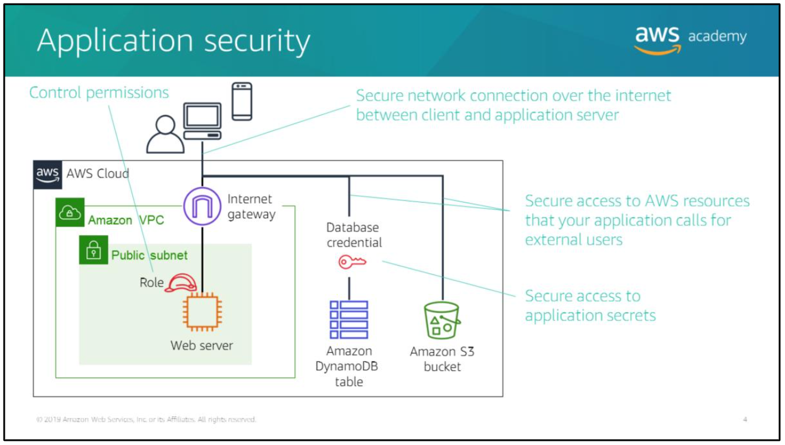

You learned about using AWS Identity and Access Management (IAM) to authenticate users and control access to your AWS resources with permissions. In addition, you need to be able to secure:
- Network connection between the client from which users access your application and the server hosting your application
- Application secrets, such as database credentials
- Access to your AWS resources for users who are on a corporate network or who are using a social network from their phone or other device

# Secure network connections

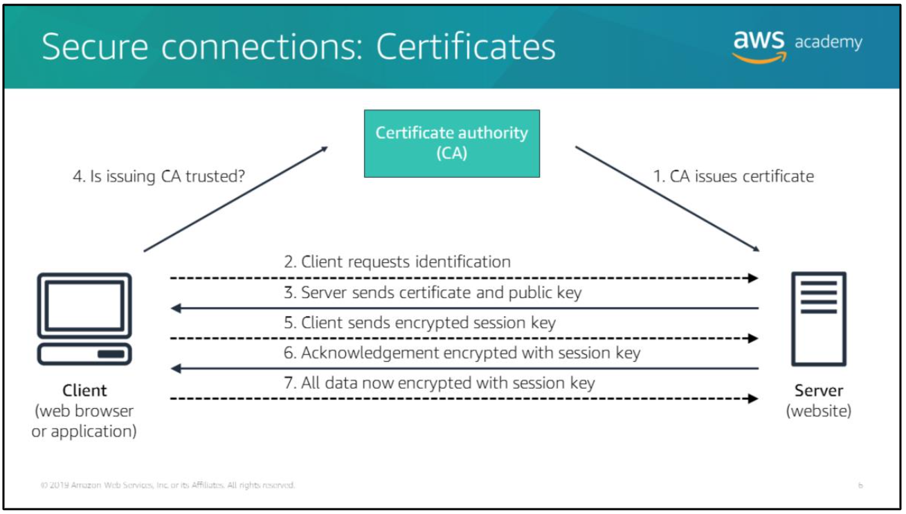

Secure Sockets Layer(SSL) and Transport Layer Security (TLS) are industry-standard protocols that use public and private certificates to establish the identity of websites over the internet and resources on private networks, respectively.

> SSL and TLS protocols also encrypt network communications between connected resources.

For example:  
Amazon.com uses TLS for all traffic on its website, and AWS uses TLS to secure application programming interface (API) calls to AWS services.

> *Certificate authorities*, also known as CAs, issue certificates to specific domains. When a domain presents a certificate that is issued by a trusted CA, your browser or application knows it’s safe to make the connection

## Challenges with managing certificates

Managing your SSL/TLS certificates presents several challenges:
- Security -> certificates can be vulnerable for many reasons (for example: certificate name mismatch, use of internal names, missing or misconfigured fields and values, outdated or weak hashing algorithms, week keys, and weak cypher suites that compromises SSL endpoints). Finding and fixing these vulnerabilities can be challenging.

- Discovery -> manually gathering details about all the individual certificates in your network is not practical when you have hundreds or thousands of certificates.

- Rotations and renewals -> manually managing certificate expiration is prone to error and could cause you to miss rotations and renewals.

- Authorization -> you need to be able to verify that someone is authorized to approve and issue a certificate.

- Cost -> managing certificates can be expensive. You must pay a fee to validate certificates. You must also consider support costs, legal costs (including insurance, warranties, and so forth), ownership or control costs (such as fees for root-embedding), and infrastructure costs.

# AWS Certificate Manager

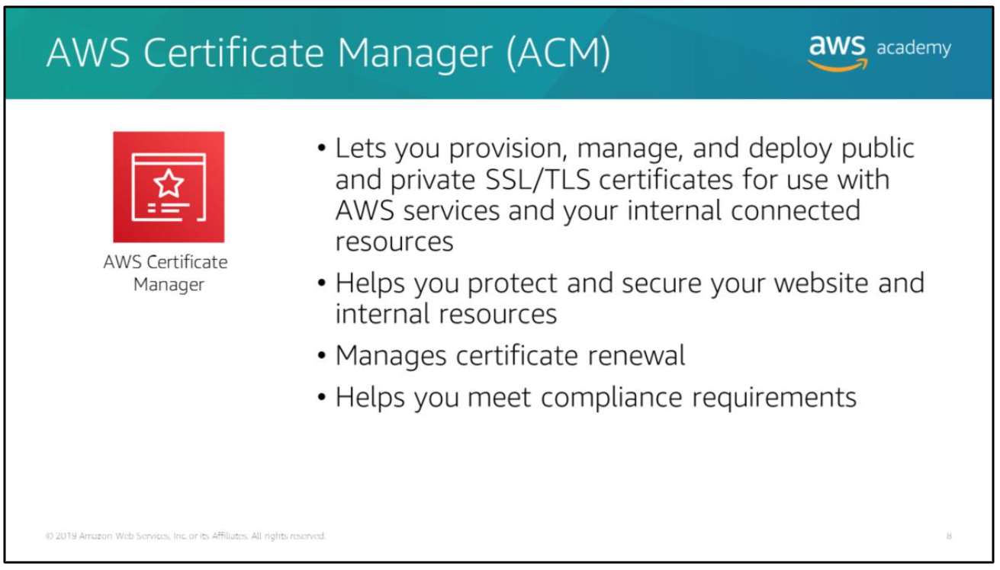

AWS Certificate Manager (ACM) is a service that lets you provision, manage, and deploy public and private SSL/TLS certificates for use with AWS services and your internal connected resources.

With AWS Certificate Manager, you can quickly request a certificate and deploy it on AWS resources integrated with ACM, such as Elastic Load Balancing load balancers, Amazon CloudFront distributions, and APIs on Amazon API Gateway. AWS manages certificate renewals. It also enables you to create private certificates for your internal resources and centrally manage the certificate lifecycle.

> Public and private certificates provisioned through AWS Certificate Manager for use with AWS services are free. You pay only for the AWS resources you create to run your application.

# Manage application secrets

> Secrets are encrypted values that are used routinely in applications to connect to databases, APIs, and other IT resources. Examples of secrets include database credentials, passwords, third-party API keys, and even arbitrary text.

## Challenges with managing secrets

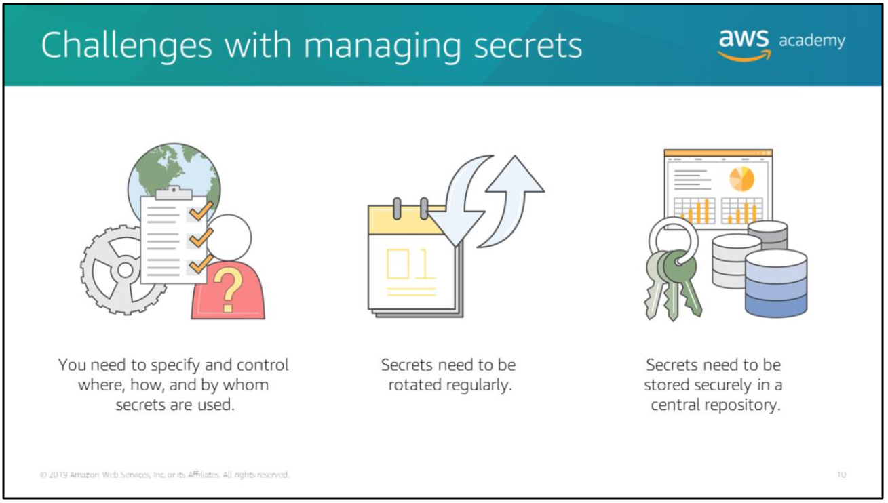

> Having internet-facing credentials is like leaving your house key under a doormat that millions of people walk over daily. Even if the secrets are hard to find, it is a game of hide and seek that you eventually lose.

Some challenges around managing secrets include:
- Access and authorization -> you need proper access controls to specify and control where, how, and by whom secrets are used.

> For example: an employee who left the company 6 months ago might still have the password for the database on their laptop.

- Rotation - secrets have a lifecycle. If a secret has been shared with users and is never changed, it's vulnerability to misuse increases. Secrets need to be rotated regularly to improve security and meet compliance needs.

> For example: Payment Card Industry (PCI) compliance requires that secrets be rotated every 30 days.

- Storage -> controlling access to secrets can be difficult, because they are often stored in plain text and distributed to developers through email, sticky notes, and plaintext files. You also don't want to store secrets in application source code or environment variables. Proper secrets management allows you to securely store secrets in a central repository.

# AWS Secrets Manager

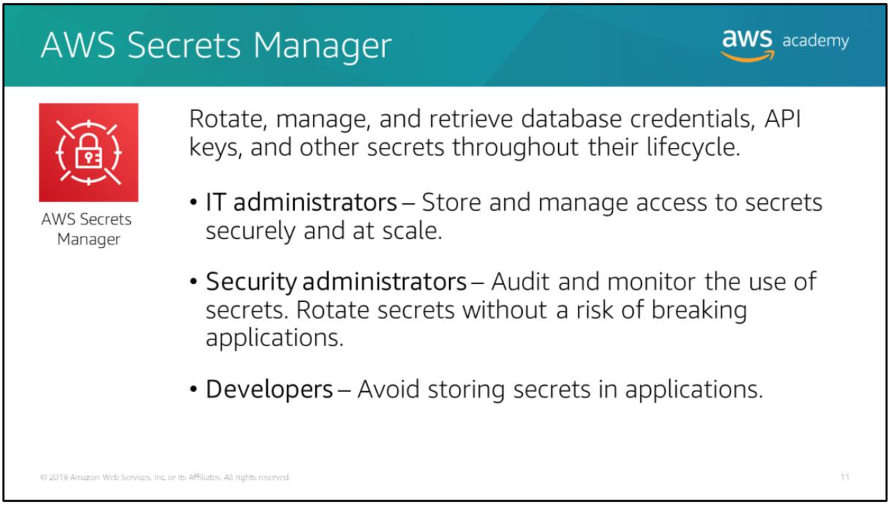

Users and applications retrieve secrets with a call to Secrets Manager APIs, eliminating the need to hardcode sensitive information in plain text.

Secrets Manager offers secret rotation with built-in integration for Amazon Relational Database Service (Amazon RDS) for MySQL, PostgreSQL, and Amazon Aurora.

The service is extensible to other types of secrets, including API keys and OAuth tokens. Secrets Manager enables you to control access to secrets using fine-grained permissions. You can also audit secret rotation centrally for resources in the AWS Cloud, third-party services, and on-premises.

## How AWS Secrets Manager works

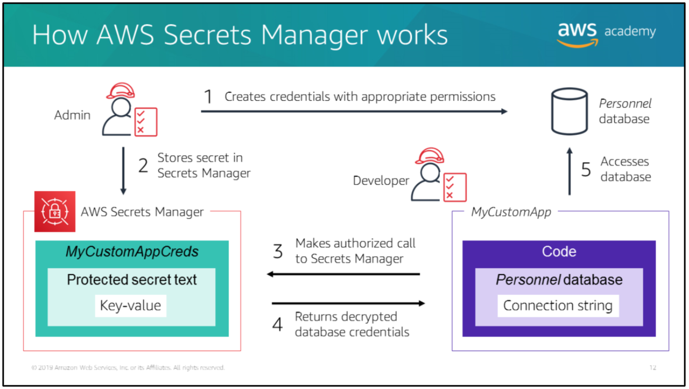

To understand how AWS Secrets Manager works, consider this basic scenario for storing credentials for a database:
1. A database administrator creates a set of credentials in Secrets Manager for the `MyCustomApp` application to use to access the *Personnel* database. The administrator also creates fine-grained AWS Identity and Access Management (IAM) policies and resource-based policies to define permissions that are required for the application to access the *Personnel* database.

2. The administrator stores those credentials as a secrets called `MyCustomAppCreds` in Secrets Manager. The credentials are encrypted and stored in the secret as protected secret text (key-value pair).

3. When `MyCustomApp` needs to access the database, the application queries Secrets Manager for the secret `MyCustomAppCreds`.

4. Secrets Manager retrieves the secret, decrypts the protected secret text, and returns it to the application over a secure (HTTPS with TLS) channel.

5. The application parses the credentials, connections string, and any other required information from the response. It uses the information to access the database server.

# AWS Systems Manager Parameter Store

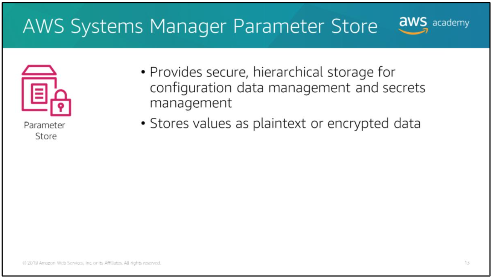

Another option for securing and managing secrets is to use the AWS Systems Manager Parameter Store.

> Parameters are different from secrets in that they can be unencrypted plaintext values, whereas secrets are always encrypted values. You can use Parameter Store parameters to reference AWS Secrets Manager secrets.

Parameter Store provides secure, hierarchical storage for configuration data management and secrets management. You can store data such as passwords, database strings, and license codes as parameter values.

You can store values as plaintext or as encrypted data.You can then reference values by using the unique name that you specified when you created the parameter. Parameter Store is backed by the AWS Cloud and is highly scalable, available, and durable. Parameter Store is offered at no additional charge.

# Authenticate with AWS Security Token Service

Identity-based security is a crucial component of modern applications. As mission-critical applications continue to be moved to the cloud, developers are asked to write the same authentication code repeatedly. Enterprises want to use their on-premises identities with their cloud applications. Web developers want to use web identities from social networks to allow their users to sign-in.

## Reason to use temporary credentials

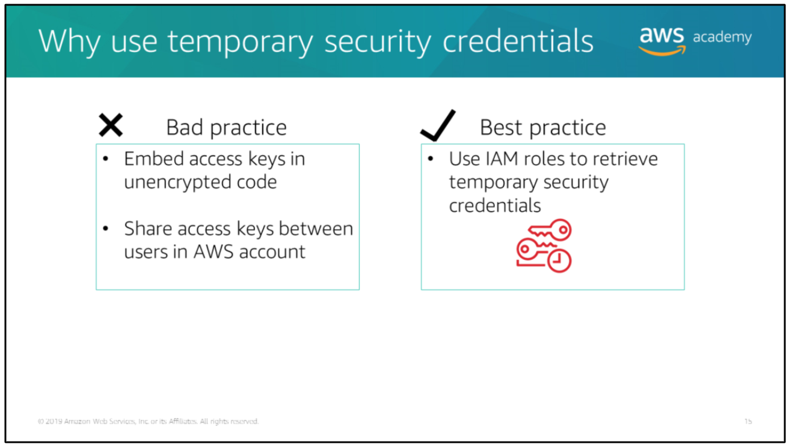

You can authenticate programmatically to AWS services through the AWS Command Line Interface (AWS CLI), software development kits (SDKs), and APIs using your AWS access key. The *access* key is a combination of your access key ID and secret access key.

Embedding access keys in unencrypted code and sharing security credentials between users in your AWS account are bad security practices. If your application or users of your application need to access AWS services, you should configure *temporary security credentials*.

> For more information about best practices around temporary security credentials: https://docs.aws.amazon.com/IAM/latest/UserGuide/best-practices.html

## Temporary security credentials

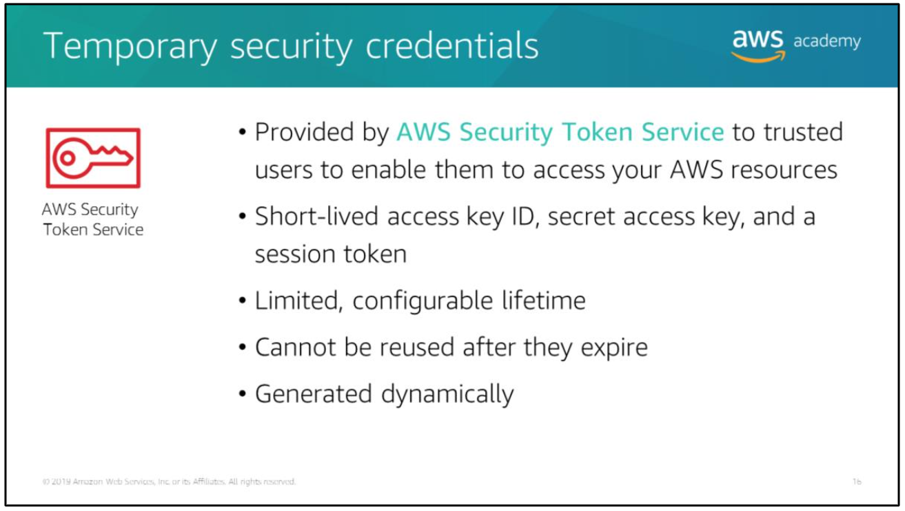

Temporary security credentials consist of a short-lived access key ID, a secret access key, and a session token.

> You can use AWS Security Token Service (AWS STS) to provide trusted users with temporary security credentials to access your AWS resources.

Temporary security credentials have a limited lifetime. They can be configured to last from a few minutes to several hours. After the credentials expire, AWS no longer recognizes them or allows any kind of access from API requests made with them.

Temporary security credentials are not stored with the user but are generated dynamically and provided to the user when requested. When (or even before) the temporary security credentials expire, the user can request new credentials, as long as the user requesting them still has permissions to do so.

# AWS STS

## AWS STS trusted users

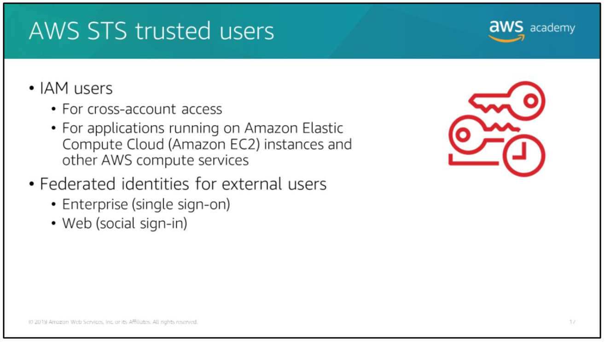

AWS STS trusted users can be:
- IAM users -> you can establish cross-account access for IAM users in one AWS account who need temporary access to AWS resources in another AWS account. To do this you can provide temporary security credentials to an IAM role that the IAM user assumes. You can also use IAM roles with temporary security credentials to manage access to applications running in an Amazon Elastic Compute Cloud (Amazon EC2) environment and other AWS compute services.

- Federated identities -> *Federated identities* are users who sign in to your application from an authentication system outside of AWS. IAM supports two types of identity federation:
	- Enterprise identity federation -> for employees who are on a corporate network and are authenticated via a Security Assertion Markup Language (SAML) 2.0-compatible enterprise identity provider, such as Microsoft Active Directory, Lightweight Directory Access Protocol (LDAP), and so forth.
	- Web identity federation -> for mobile and web-based application users who are authenticated via an online third-party identity provider, such as Login with Amazon, Facebook, Google, or any OpenID Connect (OIDC)-compatible provider.

> For federated identities, you do not need to create new AWS identities for users and require them to sign in to your application with a separate user name and password. Instead, users can access your AWS resources directly using their corporate network credentials (referred to as single sign-on, or SSO) or through a third party, such as Login with Amazon, Facebook, or Google (referred to as social sign-in).

## AWS STS key concepts

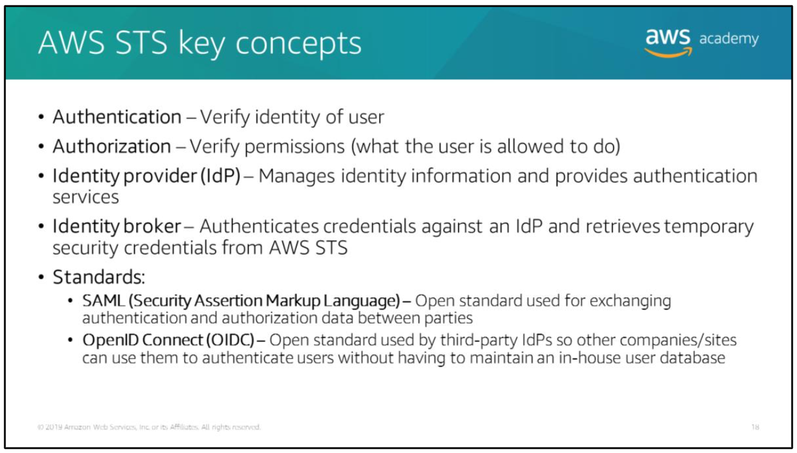

To understand how AWS STS works, you should familiarize yourself with the following key concepts:
- Authentication -> verifies user identity.
- Authorization -> verifies the user's permissions (or what the user is allowed to do).
- Identity provider (IdP) -> manages identity information and provides authentication services.
- Identity broker -> software layer that authenticates credentials against an IdP and retrieves temporary security credentials from AWS STS.
- Secure Assertion Markup Language (SAML)
- OpenID Connect (OIDC) -> open standard used by third-party IdPs so other companies or sites can use them to authenticate users without having to maintain an in-house user database.

## Authentication with AWS STS

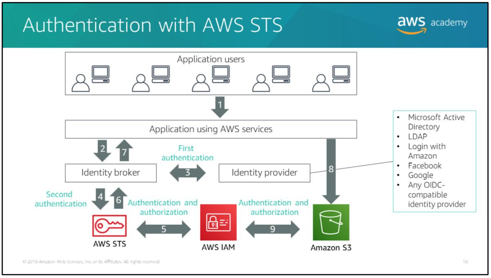

How authentication with AWS STS works:
1. A user uses an application backed by AWS.

2. The application calls an *identity broker*. The identity broker accepts a user's identifier as input.

3. **First authentication**: The identity broker first authenticates the user's identity against an *identity provide* (IdP) such as Microsoft Active Directory (for enterprise federation), an online third-party IdP (for web federation), or against IAM (for IAM users).

4. **Second authentication**: If the authentication is successful, the identity broker makes an API call to AWS STS. The call must include an IAM policy and a duration, along with a policy that specifies the permissions to be granted to the temporary security credentials.

5. AWS STS uses IAM to confirm that the policy of the IAM user that is making the API call has permission to create new tokens.

6. AWS STS returns four values to the identity broker (an access key, a secret access key, a session token, and a duration (that is, the token's lifetime)).

7. The identity broker returns the temporary security credentials and token to the application.

8. The application uses the temporary security credentials and token to make requests to an AWS service, such as Amazon S3.

9. The AWS service uses IAM to confirm that the credentials allow the requested operation on the given resource.

## AWS STS API operations

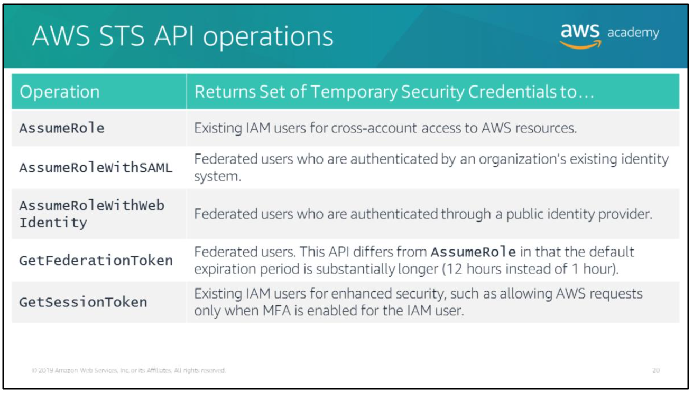

Different AWS STS API operations return temporary security credentials:
- `AssumeRole` -> returns a set of temporary security credentials for existing IAM users to grant cross-account access to AWS resources.

- `AssumeRoleWithSAML` -> returns a set of temporary security credentials for federated users who are authenticated by an organization's existing identity system. The users must also use SAML 2.0 to pass authentication and authorization information to AWS.

- `AssumeRoleWithWebIdentity` -> returns a set of temporary security credentials for federated users who are authenticated through a public identity provider, such as Login with Amazon, Facebook, Google, or any OpenID Connect (OIDC)-compatible identity provider.  
> This API is useful for creating mobile applications or client-based web applications that require access to AWS in which users do not have their own AWS or IAM identities. However, instead of directly calling `AssumeRoleWithWebIdentity`, we recommend that you use Amazon Cognito and the Amazon Cognito credentials provider with the AWS SDKs for mobile development.

- `GetFederationToken` -> returns a set of temporary security for federated users. This API differs from AssumeRole in that the default expiration period is substantially longer (12 hours instead of 1 hour).

- `GetSessionToken` -> returns a set of temporary security credentials for an existing IAM user. This is useful for providing enhanced security, such as allowing AWS requests only when multi-factor authentication (MFA) is enabled for the IAM user.

## AWS CloudTrail - Track federated user actions

You can use AWS CloudTrail to track the activity of federated users  
For example:  
A SAML-federated user who terminated an EC2 instance in your account, or a mobile application user who signed in to your application using her Facebook account and deleted a photo from your S3 bucket.

> Being able to track federated users can help you conduct audits of their activity, which, in turn, can help you with your compliance and security efforts. To capture the activity of federated users, CloudTrail records the `AssumeRoleWithSAML` and `AssumeRoleWithWebIdentity` AWS STS API calls.

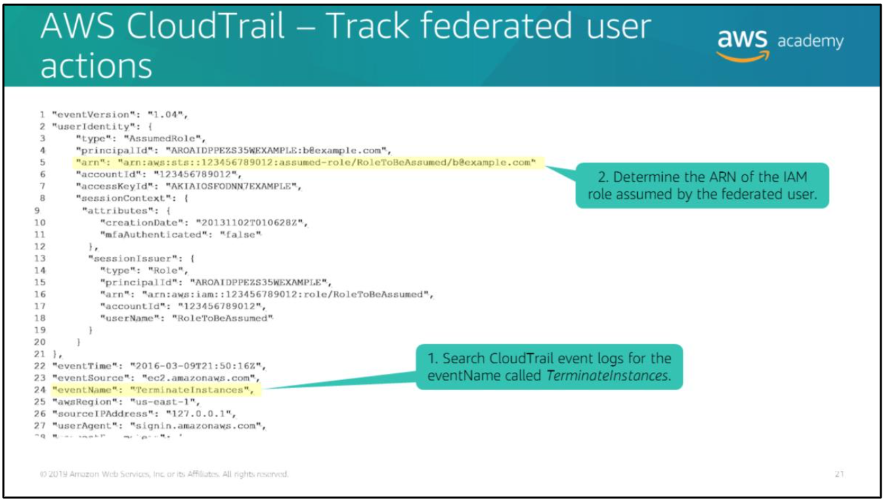

To understand how you can use CloudTrail to capture the activity of federated users, consider this example:  
Say that the organization `example.com` has an IAM administrator named Alice and an employee named Bob.  
`Example.com` has configured its SAML 2.0-compliant identity provider and AWS to permit federated users such as Bob (email address: `b@example.com`) to access the AWS Management Console.  
Bob signs in to the AWS Management Console via SSO using SAML 2.0 and terminates an EC2 instance.  
Alice learns that a user has terminated the EC2 instance. She uses AWS CloudTrail to identify which federated user terminated the instance.

First, Alice searches the CloudTrail event logs for the `eventName` called `TerminateInstances`. In the `userIdentity` section of the event log, Alice determines the Amazon Resource Name (ARN) of the IAM role assumed by the federated user.

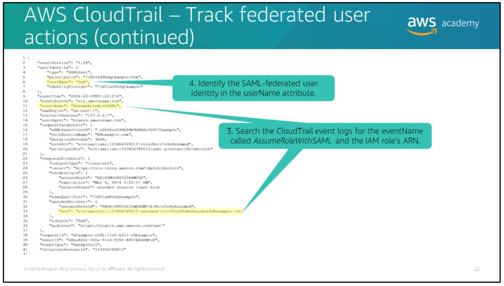

Alice then searches the CloudTrail event logs for the `eventName` called `AssumeRoleWithSAML` that includes the IAM role’s ARN. Finally, Alice identifies Bob as the federated user in the `userName` attribute of the `userIdentity` section of the CloudTrail event log.

> For detailed instructions about using AWS CloudTrail to identify federated user actions and to access links to additional resources, see the How to Easily Identify Your Federated Users by Using AWS CloudTrailblog post:  
https://aws.amazon.com/blogs/security/how-to-easily-identify-your-federated-users-by-using-aws-cloudtrail/

# Amazon Cognito

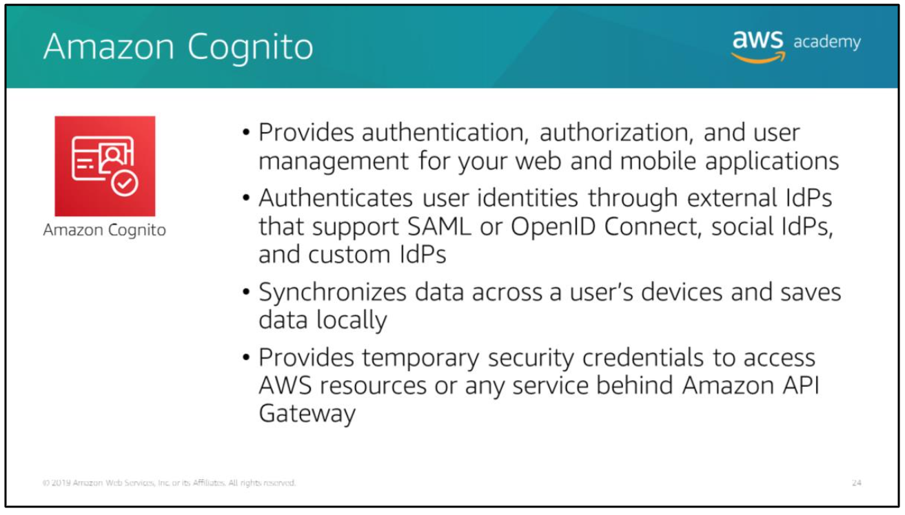

Amazon Cognito is a service that provides authentication, authorization, and user management for your web and mobile applications.

You can use Amazon Cognito to:
- Create unique identities for your users and authenticate the identities with identity providers. Amazon Cognito works with external identity providers that support SAML or OpenID Connect, social identity providers (such as Facebook, Twitter, and Amazon), and your own identity provider.

- Synchronize data across a user’s devices so their application experience remains consistent when they switch between devices or upgrade to a new device. Amazon Cognito can also save data locally on users’ devices, which allows your application to work when devices are offline. Amazon Cognito then automatically synchronizes data when the devices are back online.

- Provide temporary security credentials to your application to access AWS resources or any service behind Amazon API Gateway.

## Amazon Cognito components

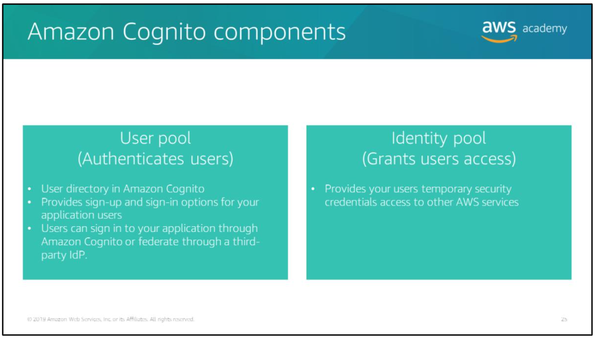

The two main components of Amazon Cognito are user pools and identity pools. Below is the explanation:
- *User pools* are user directories that provide sign-up and sign-in options for your application users. User can sign in to your web or mobile application through Amazon Cognito, or federate through a third-party identity provider. Whether your users sign in directly or through a third party, all members of the user pool have a directory profile that you can access through an SDK.

- *Identity pools* provide your users temporary security credentials to access other AWS services.

### User pool scenarios

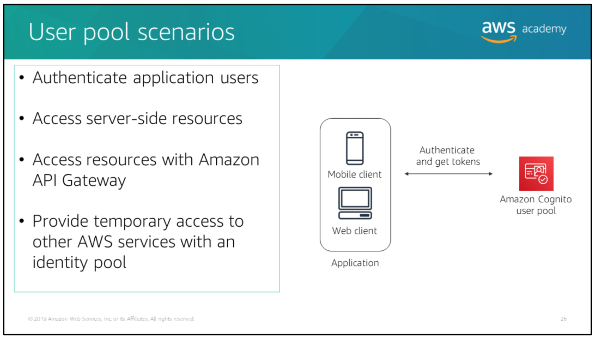

You can authenticate your application users with a user pool. After successfully authenticating a user, Amazon Cognito returns user pool tokens to your application. You can use the tokens to grant your users access to your server-side resources or to Amazon API Gateway. You can also exchange them for temporary AWS credentials to access other AWS services with an identity pool.

The user pool manages the overhead of handling the tokens that are returned from social sign-in (such as Login with Amazon, Facebook, and Google), OIDC IdPs, and SAML IdPs.

### Identity pool scenarios

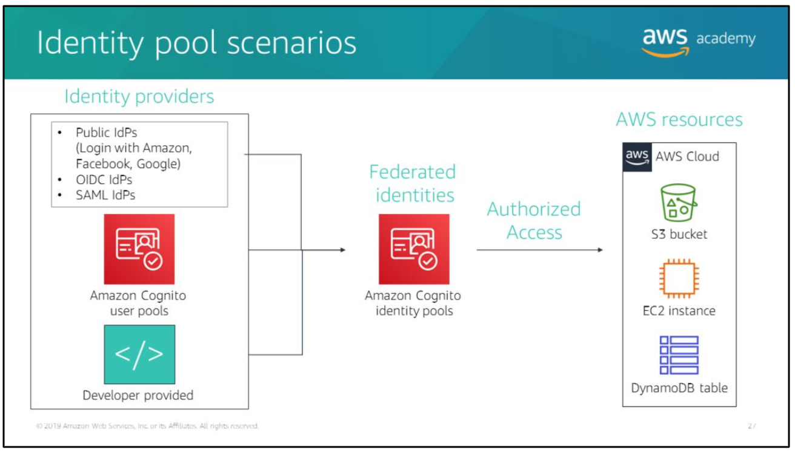

In addition to user pools, you can also authenticate users with a third-party IdP or your own authentication process, and access AWS services with an identity pool.

Amazon Cognito identity pools (federated identities) enable you to create unique identities for your users and federate them with identity providers. With an identity pool, you can obtain temporary, limited-privilege AWS credentials to access other AWS services.

Amazon Cognito identity pools support the following identity providers:
- Public IdPs, such as Login with Amazon, Facebook, and Google.
- OIDC IdPs.
- SAML IdPs.
- Amazon Cognito user pools.
- Developer-provided authenticated identities.

See the *Building fine-grained authorization using Amazon Cognito User Pools groups* blog post to learn how to integrate authentication and authorization into an Angular web app using Amazon Cognito:  
https://aws.amazon.com/blogs/mobile/building-fine-grained-authorization-using-amazon-cognito-user-pools-groups/
