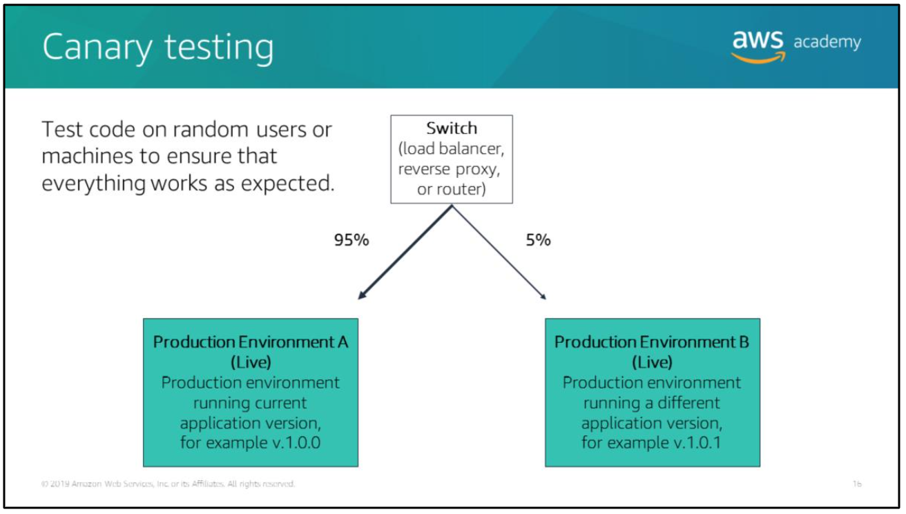

## Topics

- Introducing DevOps
- Using AWS code services for Continuous Integration/Continuous Delivery (CI/CD)
- Introducing deployment and testing strategies
- Deploying applications with AWS Elastic Beanstalk
- Deploying applications with AWS CloudFormation
- Deploying serverless applications with the AWS Serverless Application Model (SAM)

# Intro to DevOps

In the cloud, **your application is not just your application**. Your application is your application plus the infrastructure required to run it (this can include virtual private clouds (VPCs), load balancers, Auto Scaling groups, Amazon Relational Database Service (Amazon RDS) databases, Amazon Simple Storage Service (Amazon S3) buckets and their associated data, Amazon ElastiCache servers, and any other AWS and non-AWS resources that your application requires to run).

> Until the past 20 years or so, software development (Dev) and system operations (SysOps) teams often worked independently. Developers ensured that applications worked in their dev environments, but left it to system administrators to set up the corresponding production environment. This disconnected approach resulted in a lot of expensive, time-consuming conversations between the two teams as SysOps teams struggled to host whatever the Dev teams created in a scalable, secure manner.

Cloud technology gives developers the ability to provision their own infrastructure, test their code on that infrastructure at scale, and turn that infrastructure off when it’s not in use.

> Developers can create environments that are similar or identical to the environments that their applications run in when deployed to production.

This technological advance has led to new ways of thinking about software development (for example: “In the cloud, your application is your application plus all of the associated infrastructure”), which in turn, has fostered new software development methodologies such as `Agile` and `DevOps`.

> DevOps (the combination of Development and Operations) is a combination of cultural philosophies, practices, and tools.

## DevOps cultural philosophies

The DevOps culture is in the motto **People over Process over Tools**. DevOps is more a mentality than a specific set of tools that you create. DevOps is about removing the barrier between development and operations teams, and getting them to communicate with each other. With DevOps, teams work together to optimize both the productivity of developers and the reliability of operations.

## DevOps practices

DevOps supports a set of practices that leads to rapid delivery of secure, reliable, and maintainable software:
- Microservice architecture -> instead of having a monolithic application in which all the processes are tightly coupled and run as a single service, you can write your applications as discrete microservices that run independently inside containers or as Lambda functions.

- Continuous Integration/Continuous Delivery (CI/CD) -> CD expands on CI by deploying all code changes to a testing environment, a production environment, or both after the build stage has been completed. When CD is properly implemented, developers always have a deployment-ready build artifact that has passed through a standardized test process. Code that has been deployed requires continuous monitoring and improvement.

> CI is a software development practice in which developers regularly merge their code changes into a central repo. CD is a software development practice where code changes are automatically built, tested, and prepared for production release.

- Automate everything -> DevOps supports the practice of **automating every phase of the software development lifecycle**. Automation reduces the level of human effort required in each phase and reduces errors caused by manual processes. In turn, business value can be delivered more quickly from the technical side to the company.

- Infrastructure as Code -> use AWS CloudFormation to create a repeatable method for deploying your cloud architecture.

## DevOps tools

## Benefits of DevOps

Under DevOps, development and operations are no longer separate functions. These functions are often merged under a single team of engineers who work together across the entire software development lifecycle. These engineers develop a range of cross-functional skills.

> Quality assurance and security teams may also become more tightly integrated with development and operations throughout the software development lifecycle.

Releases are more reliable because you can automate the creation of development environments that mirror production environments, which means you don’t run into the problem of “it worked on my machine”.

# Continuous Integration/Continuous Delivery (CI/CD)

Continuous integration/continuous delivery (CI/CD) is a DevOps practice that spans the develop (that is, code, build, and test) and deploy stages of the systems development lifecycle (SDLC).

Although there are different definitions of continuous integration, it is commonly thought that CI stops at the build stage.

Continuous delivery extends continuous integration to include testing out to production-like stages and running verification testing against those deployments.

> Continuous delivery may extend all the way to production deployment, but there is some form of manual intervention between when code is checked in and when that code is released to customers.

Continuous deployment is the automated release of software to customers. This automation extends from check-in through production without human intervention. The continuous deployment reduces the time it takes to get customer feedback and allows you to iterate and release valuable software updates quickly to customers.

## CI/CD with AWS code services

AWS code services can help you manage and automate your CI/CD pipeline:
- AWS CodeStar -> provides a unified interface to manage your software development activities in one place.

- AWS CodeCommit -> hosts secure Git-based repo.

- AWS CodeBuild -> compile source code, runs tests, and produces software packages that are ready to deploy.

- AWS CodeDeploy -> fully managed deployment service that automates software deployments to a variety of compute services such as Amazon Elastic Compute Cloud (Amazon EC2), AWS Fargate, AWS Lambda, and your on-premises servers.

- AWS CodePipeline -> automates the build, test, and deploy phases of your release process every time there is a code change, based on the release model you define.

# Testing and deployment strategies

## A/B testing

With A/B testing, you test your new feature on a random subset of users to gain insight into its usability, popularity, noticeability, and so forth.

For example:  
You would perform A/B test on 30% of your total users for a few months to see if they like a new marketing page better than the old one.

## Feature flags

Feature flagging is a way for you to flag certain features in your code to control visibility of that feature to your beta users.

## Canary testing

Before releasing your new feature to all your users, you also want to test your code on a random subset of users or machines to ensure that everything works as expected. This is referred to as a *canary test*.

In this case, you send a small fraction of production traffic to the environment that’s running the new version of your application.

> You can use a weighted routing policy to implement canary testing with Amazon Route 53.

After you determine that there are no issues, you can then perform either a blue/green deployment or a rolling deployment to deploy your code to all your users.

## Blue/green deployment

Blue/green deployment is a method in which you have two identical stacks of your code running in their own environments.

Your **blue** environment is a live production environment running the current version of your code. In parallel, you provision a **green** environment to run a different version of your code. There is no live traffic going to your green environment.

Blue/green deployment is like a light switch. After the green environment is ready and tested, you route all production traffic from the blue environment to the green environment. If you encounter any issues with the new version of your code, you revert traffic back to the blue environment.If the new version has no issues, you can delete the blue environment. The green environment then becomes the new blue environment and the cycle starts over.

> The two most common methods to implement blue/green deployment on AWS are to perform Domain Name Server (DNS) cut over with Amazon Route 53 and to swap Amazon EC2 Auto Scaling groups.

### Blue/green deployment with Amazon Route 53

You first stand up a new (green) EC2 environment behind an Elastic Load Balancing (ELB) load balancer in parallel to your existing (blue) EC2 production environment. You then use Amazon Route 53 to shift traffic from the blue environment to the green environment by swapping the Elastic Load Balancing URLs.

The downside of this approach is that a DNS change can take time to propagate*, which means that not all of your users will see your new feature at the same time.

> *DNS propagation can take 5 minutes or longer.

### Blue/green deployment with Amazon EC2 Auto Scaling

You set the Auto Scaling group to double its usual capacity. The new instances are created next to the old instances. After you ensure that the new instances are running and receiving traffic, you set the Auto Scaling group back to its original capacity. This causes the old instances to be terminated immediately in accordance with the termination policy that you set.

### Blue/green deployment of serverless applications

You can’t incrementally deploy your software across a fleet of servers, because you don’t have any servers to manage; however, when you promote a new version of your Lambda function into production, you can implement blue/green deployment by updating the PROD alias to point to the latest stable version.

> AWS Lambda also allows you to perform canary testing. To implement canary testing, you can use the AWS Lambda traffic shifting feature to point to two different versions of your Lambda function and dictate what percentage of incoming traffic is sent to each version; however,this is an advanced networking topic that is beyond the scope of this module.

## Rolling deployment

With a rolling deployment, you release the new version of your code in increments.

For example:  
You release to 10% of machines or users, and then wait a few minutes to see if anything breaks. Then, you release to another 10% and wait. You repeal this process until you have released your code to all machines or users.

# Deploying applications with AWS Elastic Beanstalk

## AWS Elastic Beanstalk

Elastic Beanstalk provides a wrapper for several lower-level AWS services, including Amazon EC2, Amazon CloudWatch, Auto Scaling, and Elastic Load Balancing.

Using Elastic Beanstalk, you can select the application environment you want to use (for example PHP, Perl, or Ruby), select the application package you want to deploy, and select how you want the application to scale.

> Elastic Beanstalk handles the details of creating and connecting the various components required by your application, such as load balancers and auto scaling groups.

Elastic Beanstalk uses Auto Scaling and Elastic Load Balancing to easily support highly variable amounts of traffic. You can start small and scale up.

## Elastic Beanstalk: Resource provisioning

## AWS Elastic Beanstalk components

AWS Elastic Beanstalk has three critical components:
1. Environment -> the infrastructure that supports your application.

> An environments can be either a web server tier or a worker tier.  
> The worker tier is an application that runs in the background that typicality processes some sort of queued request, such as messages sent to an Amazon Simple Queue Service (Amazon SQS) queue.  
> An environments can also be either a single EC2 instance environment or an Auto Scaling group with an Elastic Load Balancing load balancer in front of it. You can configure your AWS Elastic Beanstalk application to maintain Auto Scaling groups in multiple subnets to distribute traffic across Available Zones.

2. Versions -> a specific release of your application.

> New versions of your application can be released onto an existing stack in a rolling update. You can specify that a new application version is distributed to a certain percentage of your fleet at the same time or that instances are updated individually.

3. Configuration -> the set of customizations to apply to your environments.

> The type of customization that you can perform is specific to the environments you choose and to the language/programming framework used by your application.

## Elastic Beanstalk environments

To concretize the relationship between application, environments, and configurations a little better, consider this example:  
Three environments—test, staging, and production - are configured to use a custom Amazon Machine Image (AMI) on its underlying EC2 instance.  
Having multiple environments per application allows you to run the known good version of your application on your production system while you test both a new application version and a new underlying AMI.

## Elastic Beanstalk CLI

AWS Elastic Beanstalk CLI has three commands:
- `eb init` -> sets defaults values for Elastic Beanstalk applications created with EB CLI by prompting you with a series of questions.
- `eb create` -> creates a new environment and deploys an application version to it.
- `eb deploy` -> deploys the most recent version of your application. As you make revisions to your application, you can run `eb deploy` to rapidly update and test the changes in your existing AWS Elastic Beanstalk application.

> Three commands above take several arguments; however, if you do not specify any arguments for these commands, the Elastic Beanstalk CLI will prompt you for key values it requires, such as the name of the key pair you want to use and the name to use for your environment.

> NOTE: Elastic Beanstalk also offers Git integration and provides the ability to launch an application from a specific Git branch. This means you can create a branch, make a series of changes, and then immediately test your changes in a live environment using the Elastic Beanstalk CLI commands.

## Elastic Beanstalk permission model

When you create an environment, AWS Elastic Beanstalk prompts you to provide two AWS Identity and Access Management (IAM) roles:
1. The service role is assumed by Elastic Beanstalk to use other AWS services on your behalf. This permission is required for the AWS Elastic Beanstalk service to create Amazon EC2 instances, Auto Scaling groups, and other resources it requires to deploy your application.

2. The instance profile is applied to the instances in your environment and allows them to retrieve application versions from Amazon S3, upload logs to Amazon S3, and perform other task that vary depending on the environment type and platform. If your web application requires access to any other AWS services, add statements or managed policies to the instances profile that allow access to those services.

> AWS Elastic Beanstalk will create these roles for you if you don't supply them.

# Deploying applications with AWS CloudFormation

> AWS CloudFormation is a service that supports Elastic Beanstalk application environments.

## Infrastructure as code

Nearly everything that you can create in AWS through the AWS Management Console can be created programmatically using an SDK or the AWS CLI.  You can use this capability to define your infrastructure as a series of scripts or other code artifacts.

This enables you to create, update, and delete your AWS infrastructure automatically and in a repeatable fashion. This makes it possible to create multiple environments - development, testing, staging, and production - all from the same code base. This capability is referred to as **infrastructure as code**.

## AWS CloudFormation

CloudFormation creates, updates,and deletes the resources needed for your applications in environments called `stacks`.

AWS CloudFormation is all about automated resource provisioning, it simplifies the task of repeatedly and predictably creating groups of related resources that power your applications.

AWS CloudFormation supports the infrastructure needs of many different types of applications, such as existing enterprise applications, legacy applications, applications built using a variety of AWS resources and container-based solutions (including those built using AWS Elastic Beanstalk).

## Automated provisioning of AWS resources

The example above shows an application running on EC2 instance inside a public subnet in a Virtual Private Cloud (VPC). The EC2 instance has an AWS Identity and Access Management (IAM) role associated with it. The application calls an Amazon DynamoDB table and an Amazon S3 bucket.

## How AWS CloudFormation works

AWS CloudFormation reads `template files`, which provide instructions for what resources need to be provisioned. AWS CloudFormation constructs the resources listed in the `template file`. The output of this process is your environment, or `stack`.

> You can create a template that creates a single resource stack or a stack with hundreds of resources.

## AWS CloudFormation stacks

Stacks are the resources generated by a template. They are also a unit of deployment. You can create stacks, make updates to a stack by rerunning a modified template, and delete stacks.

> When you delete a stack, all the resources in the stack are deleted by default.

## AWS CloudFormation templates

An AWS CloudFormation template is a `JSON`-or `YAML`-formatted text file that describes your AWS infrastructure. If you provision your environment using templates, your templates become a form of documentation for your environment.

### CloudFormation template structure

Above is an example of an AWS CloudFormation template structure and its sections. Templates include several major sections:
- Format version -> the AWS CloudFormation template version that the template conforms to, it identifies the capabilities of the template.

> The latest template format version is 2010-09-09 and is currently the only valid value.

- Description -> a text string that describes the template.

- Metadata -> objects that provide additional information about the template.

- Parameters -> values to pass to your template at runtime when you create or update a stack.

- Mappings -> a mapping of keys and associated values you can use to specify conditional parameter values, similar to a lookup table.

- Conditions -> conditions control whether certain resources are created or whether certain resource properties are assigned a value during stack creation or update, for example: you could conditionally create a resources that depends on whether the stack is for a production or test environment.

- Transform -> for serverless (that is, Lambda-based) applications, it specifies the version of the AWS SAM to use. When you specify a transform, you can use AWS SAM syntax to declare resources in your template. The model defines the syntax that you can use and how it is processed.

- Resources -> specifies the stack resources and their properties, such as an Amazon Elastic Compute Cloud instance or an Amazon Simple Storage Service (Amazon S3) bucket, this is the only required section..

- Outputs -> describes the values that are returned whenever you view your stack's properties.

> You don’t have to list your resources in the template in the exact order of creation. You can use the `DependsOn` attribute to specify the order in which AWS CloudFormation will create the resources. In this way, you can build a sequence of events, such as creating a database server before a web server.

# Deploying serverless applications with AWS SAM

## AWS Serverless Application Model (AWS SAM)

With serverless applications, you must provide everything needed to deploy a function (the code, any necessary dependencies, and the blueprint for setting up the infrastructure).

However, you can’t create the environment that you specified in your blueprint locally. You aren’t connecting to a specific server from which you debug code. You need the ability to deploy your stack to each AWS account. This is where an application framework like the AWS Serverless Application Model (AWS SAM) is useful.

AWS SAM is an open-source framework for building serverless applications. AWS SAM is an extension of AWS CloudFormation, so you get the reliable deployment capabilities of AWS CloudFormation.

> You use AWS SAM to build templates that define your serverless applications. You then deploy your SAM template with AWS CloudFormation.

AWS SAM has two components:
- AWS SAM template specification -> this specification defines your serverless application. It provides a shorthand syntax to describe the functions, APIs, permissions, configurations, and events that make up a serverless application.

> You can use an AWS SAM template file to operate on a single, deployable, versioned entity that's your serverless application.

- AWS SAM CLI -> this tool allows you to build serverless applications that are defined by AWS SAM templates. The CLI provides commands to verify that AWS SAM template files are written according to the specification, invoke Lambda functions locally, step-through debug Lambda functions, package and deploy serverless applications to the AWS Cloud, and so on.

AWS SAM has deep integration with CI/CD tools. You can use AWS SAM with CodeBuild, CodeDeploy,and CodePipeline to build a deployment pipeline for your serverless applications.

## AWS SAM template

Above is an example of what SAM template looks like:
- The transform directive of AWS CloudFormation specifies that this is a SAM template.
- In the Resources section, `AWS::Serverless::Function` tells AWS CloudFormation that it's going to create a Lambda function.
- The Properties section references the zip file, handler, and runtime to be used.
- The Policies section provides the IAM policy to be referenced for the function.
- You can also include commands to create an Amazon API Gateway endpoint, and the SAM transform will perform the mappings and permissions.
- The last part of the template creates a DynamoDB table with a default of five read and write capacity units.
