## Topics

- Systems development lifecycle
- Steps to get started developing on AWS
- Fundamentals of working with AWS Software Development Kits (SDKs)
- Errors and exceptions
- Introduction to AWS X-Ray
- Introduction to Amazon CloudWatch and AWS CloudTrail

## Objectives

- Recognize the systems development lifecycle
- Describe how to get started developing on AWS
- Indicate how to work with AWS SDKs
- Identify why AWS X-Ray is a critical developer tool
- Identify AWS management tools
- Develop and run a simple program in AWS Cloud9

# Systems development lifecycle

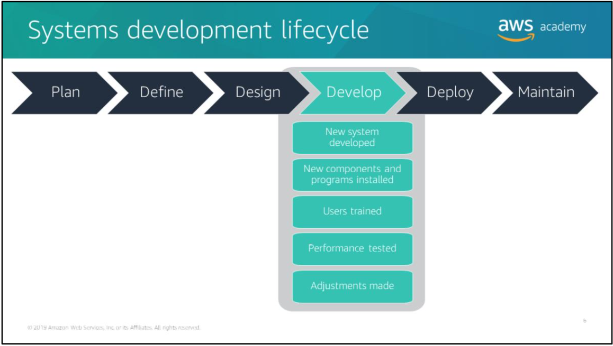

Software development goes through a series of phases in the systems development lifecycle (SDLC). The SDLC is a conceptual model used in project management. It describes the stages in an information system development project, from an initial feasibility study to the maintenance of the completed application.

In general, an SDLC methodology follows these steps:
- plan
- define
- design
- develop
- deploy
- maintain

In the Develop phase, the new system is developed. New components and programs must be obtained and installed. System users must be trained, and all aspects of the system’s performance must be tested. If necessary, bugs must be fixed and adjustments must be made to improve performance.

## SDLC methodologies

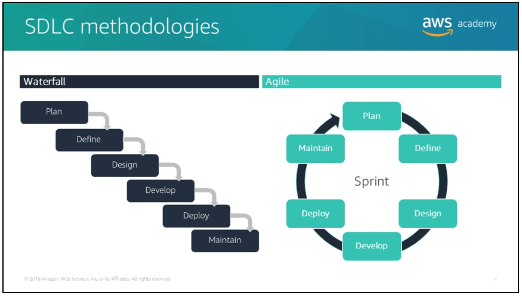

### Waterfall methodology

The waterfall model describes a sequential development method in which each development phase has distinct goals and tasks that must completed before the next phase can begin.

### Agile methodology

Product teams push their work to customers as quickly as possible so that they can collect feedback and improve the previous iteration of their products.

There are a number of agile methodologies, like Crystal methods, Dynamic Systems Development Method (DSDM), and scrum.

Under agile, software is developed iteratively in short time periods called sprints, which typically last 1-4 weeks.

# Major phases of software development

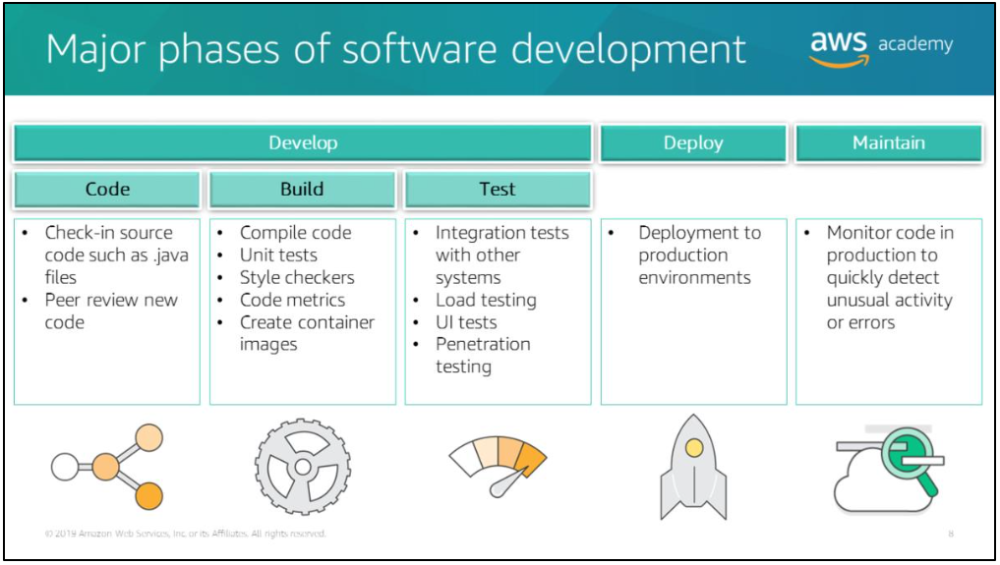

The five major phases of software development:
- Code
- Build
- Test
- Deploy
- Maintain

Note that Code, Build, and Test fall under Develop stage of software development lifecycle.

## Code phase

During the code phase, developers write application source code and check changes into a source code repository, such as Git repo or AWS CodeCommit.

Many teams use code reviews to provide peer feedback of code quality before they ship code into production. Other teams use pair programming as a way to provide real-time peer feedback.

## Build phase

During the build phase, an application's source code is compiled and the quality of the code is tested on the build machine.

The most common type of quality check is an automated test that doesn't require a server in order to run.

## Test phase

During the test phase, additional tests are performed that cannot be done during the build phase. These tests require the software to be deployed to a production-like environment. Often, these tests include integration testing with other live systems, load testing, user interface (UI) testing, and penetration testing.

A common pattern is for engineers to deploy builds to a personal development stage where they can check that their automated tests work correctly. They then deploy to pre-production stages where their application interacts with other systems to ensure that the software works in an integrated environment.

## Deploy phase

Finally, code gets deployed to production. Though there are different deployment strategies, the common goal is to reduce risk when deploying new changes and to minimize the impact if a bad change is released to production.

## Maintain phase

After code is deployed, it must be monitored in production to determine if everything works as expected.

# How to get started developing on AWS

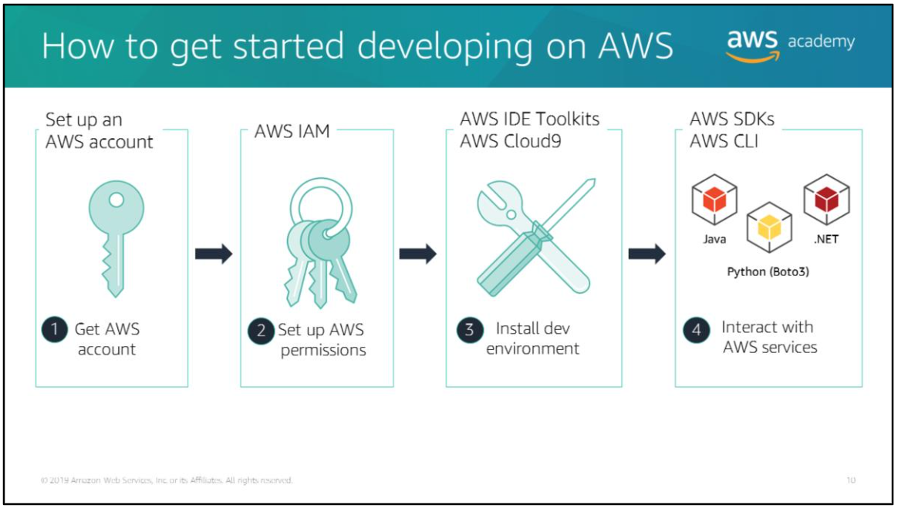

Before you start developing applications on AWS, you must do a few things:
1. You need an AWS account
2. Create an AWS Identity and Access Management (IAM) user
3. You need to install the AWS Software Development Kit (SDK) for the programming language you use or the AWS Command Line Interface (AWS CLI) in order to interact with AWS services
4. You need to setup AWS permissions to access specific services and operations

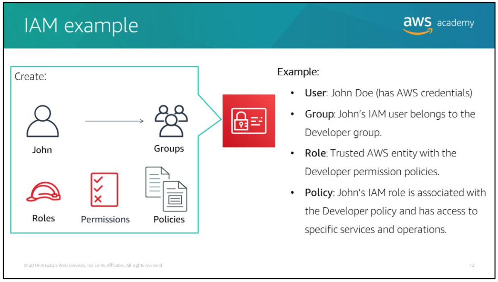

IDEs and AWS IDE toolkits:
(for more details: https://aws.amazon.com/tools/)
- AWS Cloud9
- Eclipse
- IntelliJ
- PyCharm
- Visual Studio
- Visual Studio Code
- Azure DevOps
- Rider

# AWS Cloud9

AWS Cloud9 is a cloud-based IDE that lets you write, run, and debug your code with a browser. AWS Cloud9 can access to a full linux server for running and storing code.

For more info: https://aws.amazon.com/cloud9/

AWS Cloud9 key benefits:
- Start projects quickly and code with only a web browser
- Code together in real time
- Build serverless application with ease (for example: you can edit and debug AWS Lambda functions locally, which eliminates the need to upload your code to the Lambda console for testing and debugging)

AWS Cloud9 integrates with AWS CodeCommit and other remote repo so that you can work with files in your environment.

# Interacting with AWS services

AWS provides an Application Programming Interface (API) for each of its services.

There are four ways to interact with the APIs to access your AWS resources:
- Directly -> call the APIs directly
- AWS Management Console -> an implementation of the API calls in the web console (note that from time to time, new features might not have all of their capabilities available in the console when the feature initially launches)
- AWS CLI
- AWS SDKs

The AWS CLI and AWS SDKs provide a lof of flexibility, they enable you to create your own tools and customize existing AWS feature.  
For example: 
You can create your own scripts or applications for launching Amazon EC2 instances that enforce using a specific set of Amazon Machine Images (AMIs), add a standard set of tags, and so on.

# AWS Command Line Interface (AWS CLI)

There are a variety of tools ou can use with the command line interface to call AWS services:
- AWS CLI
- AWS Tools for Powershell
- AWS Serverless Application Model (AWS SAM) Local -> AWS CLI tool for the local development and testing of serverless applications. (more info: https://github.com/awslabs/aws-sam-cli).
- AWS Amplify -> provisions and manages your mobile back-end and provides a simple framework to easily integrate your back-end with your iOS, Android, Web, and React Native front-ends, also automates the application release process of both front-end and back-end.

## AWS CLI command line format

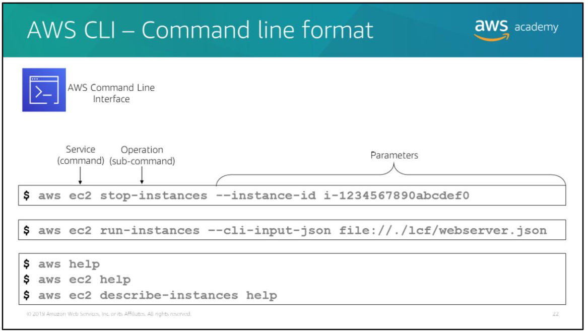

AWS CLI have a certain format:
- Invoke AWS CLI using `aws` command.
- Followed by service command. A list of currently supported services: https://docs.aws.amazon.com/cli/latest/reference/
- Next is the operation subcommand which is the operation that you want to perform on that service.
- Then, specify any parameters. Argument names are preceded by two dashes (`--`).
- You can also specify options. The options are choices that you can specify when you run an operation. For example, you can use `--query` option to limit the response text so that it returns only the instance ID of your new instance.

# Amazon Resource Name (ARN)

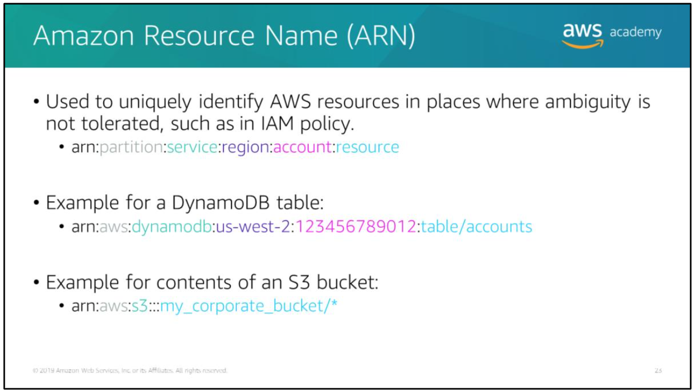

Amazon Resource Names (ARNs) allow you to uniquely identify AWS resources or groups of resources. An ARN is used to specify a resource unambiguously accross all of AWS, such as in IAM policy, Amazon Relational Database Service (Amazon RDS) tags and API calls.

# AWS Software Development Kits (AWS SDKs)

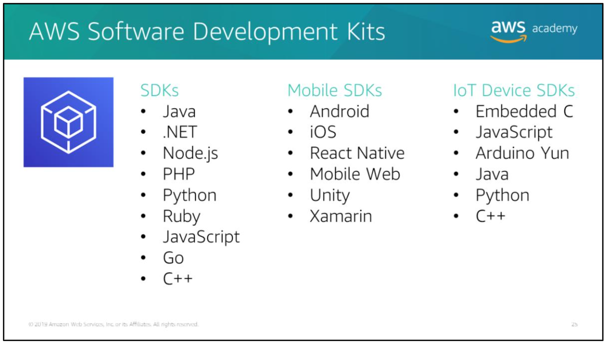

## Developing apps with AWS SDKs

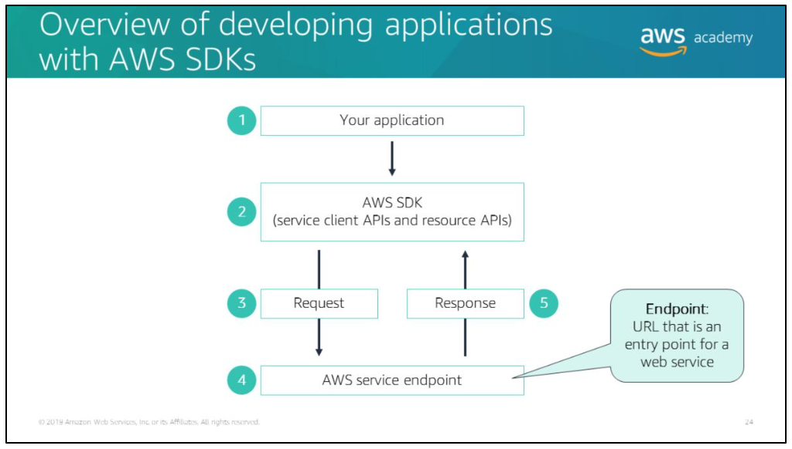

The diagram above illustrates application development with the AWS SDKs:
1. Write an application using an AWS SDK in your programming language of choice.
2. Each of AWS SDK provides one or more APIs for working with AWS services.
3. The AWS SDK constructs an HTTP(S) request for use with the service API, and sends the request to the AWS service endpoint.
4. The service performs the request and sends a response.
5. The AWS SDK processes the response and propagates it back to your application.

AWS SDKs offer two levels of APIs:
- Service client APIs
- Resource APIs

## Service client API

AWS SDKs provide a set of client classes. Each client class exposes a direct mapping of the API for the AWS service. These client objects have a method for each operation that the service supports, with corresponding objects that represent the request parameters and the response data. Using this low-level client API gives you full control over the requests you make to the service, which enables you to tightly control the behavior and performance of your calls to AWS services.

## Resource API

Some AWS SDKs, such as the AWS SDK for Python (Boto3), provide higher-level APIs that are called resource APIs. Resource APIs provide a higher-level abstraction than the low-level calls made by clients. Instead of a single client object exposing the entire API for a service, the resource APIs consist of classes that represent each of the conceptual resources that you interact with when you use a service. These classes expose methods to retrieve data about the resource, invoke actions that can be taken on the resource, and retrieve links to other related resources. Resources include service resources, such as Amazon S3 or Amazon Simple Queue Service (Amazon SQS), and individual resources, such as a bucket or a queue. Individual resources have an identifier and attributes.

# Specifying AWS Regions

When you write your application, you can access AWS services that physically reside in a specific geographic region. How you specify the AWS Region depends on which AWS SDK you use.

With some AWS SDKs, such as the AWS SDKs for Java and .NET, you can specify the Region when you instantiate the service client or you can set it soon after the client is instantiated. You must create a separate instance of the service client for every Region that you want to work with. For other SDKs, such as the AWS SDK for Python (Boto 3), you can use the default Region that is set in the `~/.aws/config` file.

# Handling REST error responses

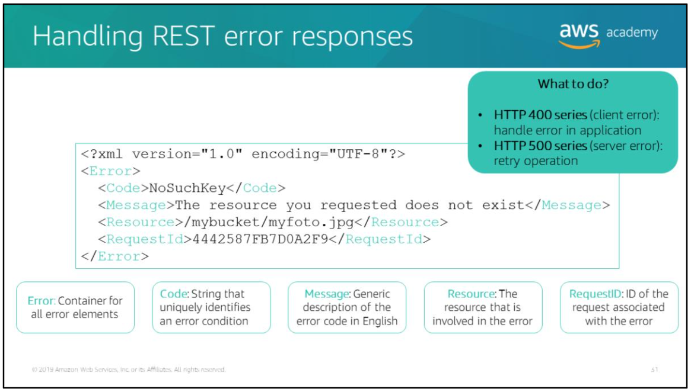

When an API call is made to an AWS service, the service performs the request and returns a response that includes an HTTP status code.

If the request is successful, the AWS service returns an HTTP 200 response code. If the request is unsuccessful, the AWS service returns an error response which consist of the following elements:
- Error -> container for all error elements.
- Code -> string that uniquely identifies an error condition. It is meant to be read and understood by programs that detect and handle errors by type.
- Message -> generic description of the error condition in english. It is intended for human audience.
- Resource -> The source that is involved in the error.
- RequestID -> ID of the request associated with the error.

You can use the error code to determine how to handle the error:
- 400 series error -> you need to handle the error in your application. For example: the Amazon S3 service will return 404 error code if the bucket you're trying to access doesn't exist. Your application can handle this error by first creating the bucket and then performing operations on it.
- 500 series error -> indicates internal server error (you might retry the operation). Each AWS SDK implements automatic retry logic. You can configure the maximum number of retry attempts. In addition to simple retries, each AWS SDK implements an exponential backoff algorithm to retry after failed connection attempts. With an exponential backoff algorithm, you specify progressively longer waits after each failed attempt before retrying your request.

(error retries and exponential backoff in aws: https://docs.aws.amazon.com/general/latest/gr/api-retries.html)

## Exceptions

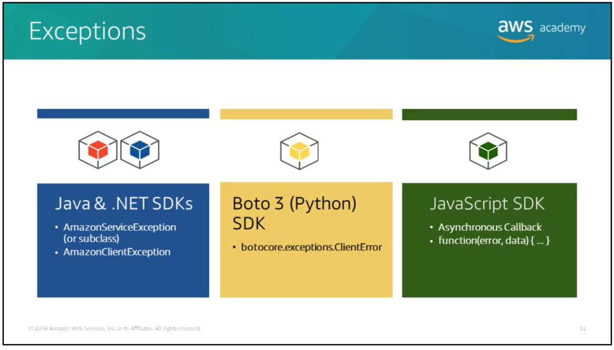

### AWS SDK for java

The AWS SDK for Java throws the following unchecked (runtime) exceptions when errors occur:
- AmazonServiceException (and subclasses):

indicates that the request was correctly transmitted to the service, but for some reason, the service was not able to process it and returned an error response instead. The exception has the following information that you can use to determine how your application should handle the error:  
	- HTTP status code returned by the service, such as `404 Not Found`  
	- AWS error code returned by the service, such as `NoSuchBucket`  
	- Detailed error message from the service, such as `The specified bucket does not exist`  
	- AWS request ID for the failed request  

- AmazonClientException:

Indicates that a problem occurred inside the Java client code, either while trying to send a request to AWS or while trying to parse a response from AWS.

For example:  
the AWS SDK for Java will throw an `AmazonClientException` if no network connection is available when you try to call an operation on one of the clients.

- java.lang.IllegalArgumentException:

Thrown if you pass an illegal argument when you perform an operation on a service.

For more info: https://docs.aws.amazon.com/sdk-for-java/latest/developer-guide/home.html

### AWS SDK for .NET

The AWS SDK for .NET throws `Amazon.Runtime.AmazonServiceException` and `Amazon.Runtime.AmazonClientException,` which aresimilar to the errors from the AWS SDK for java.

### AWS SDK for Python (Boto 3)

The AWS SDK for Python throws the `botocore.exceptions.ClientError`.

### AWS SDK for javascript

Each service method that sends a request can accept a callback as the last parameter with the signature `function(error, data) { ... }`. This callback will be called when the response or error data is available.

# AWS X-Ray

AWS X-Ray is an application performance management tool that helps you analyze and debug distributed applications, such as applications built using a microservices architecture.

AWS X-Ray makes it easy for you to:
- Create a service map:

By tracking requests made to your applications, X-Ray can create a map of services used by your application. This provides you with a view of connections among services in your application, and enables you to create a dependency tree, detect latency or errors when working across Availability Zones or Regions, focus on services that are not operating as expected, and so on.

- Identify errors and bugs:

X-Ray can automatically highlight bugs or errors in your application code by analyzing the response code for each request made to your application. This enables you to debug your application code without requiring you to reproduce the bug or error.

- Identify performance bottlenecks:

X-Ray service maps let you see relationships between services and resources in your applicationin real-time. You can easily detect where high latencies are occurring, visualize node and edge latency distributionfor services, and then drill down into the specific services and paths that affect application performance.

- Build your own analysis and visualization applications:

X-Ray provides a set of query APIs, which you can use to build your own analysis and visualization applications that use the data that X-Ray records.

For more info: https://aws.amazon.com/xray/

## How AWS X-Ray works

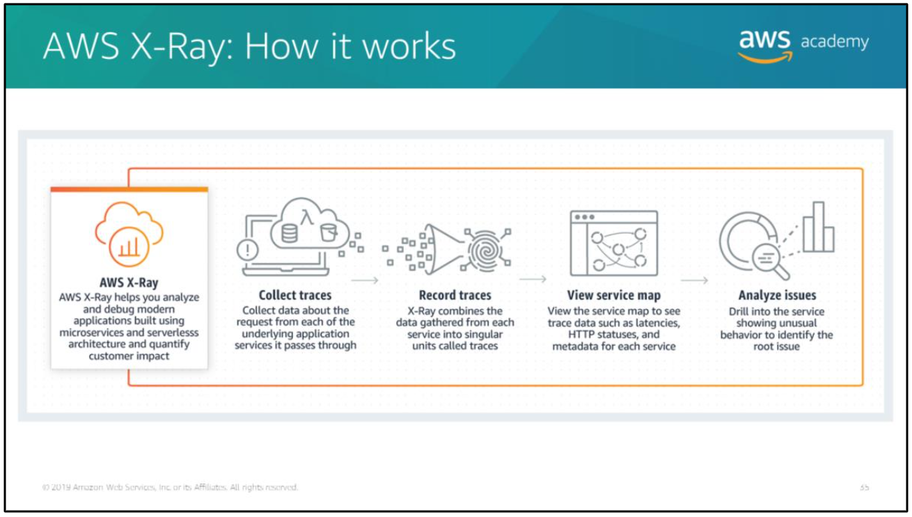

For any traced request to your application, you can see detailed information about the request and response. You can also see information about calls that your application makes to downstream AWS resources, microservices, databases, and HTTP web APIs.

## AWS X-Ray service maps

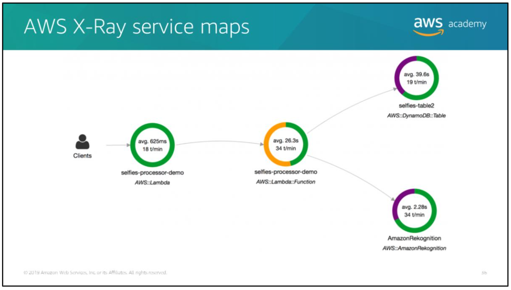

In the example above:
1. The Lambda function called `selfies-processor-demo` talks to a DynamoDB table called `selfies-table2` and to the Amazon Rekognition service. The idea is that the client uploads an image, which triggers the Lambda function to call Amazon Rekognition.
2. Next, Amazon Rekognition processes the image and returns metadata about the image. This metadata then gets stored in the DynamoDB table.

In the example above, the average latencies of the different services are 26.3 seconds for the Lambda function, 39.6 seconds for the DynamoDB table, and 2.28 seconds for Amazon Rekognition.

# Amazon CloudWatch

Amazon CloudWatch:
- Collects and tracks metrics so that you can visualize and review them.
- Monitors your AWS Cloud resources and your cloud powered applications.
- Lets you set alarms that will fire when a metric goes beyond a limit that you specified.
- Gives you visibility into resource utilization, application performance, and operational health.

# AWS CloudTrail

AWS CloudTrail is a service that enables governance, compliance, operational auditing, and risk auditing of your AWS account.

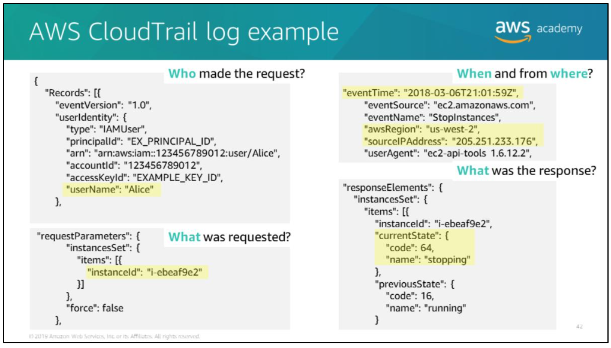

In that example, the CloudTrail log shows that an IAM user named `Alice` tried to stop the EC2 instance `i-ebeaf9e2` in the `us-west-2` Region from the source IP address `205.251.233.176` by requesting an Amazon EC2 `StopInstances` action. The request was successful.

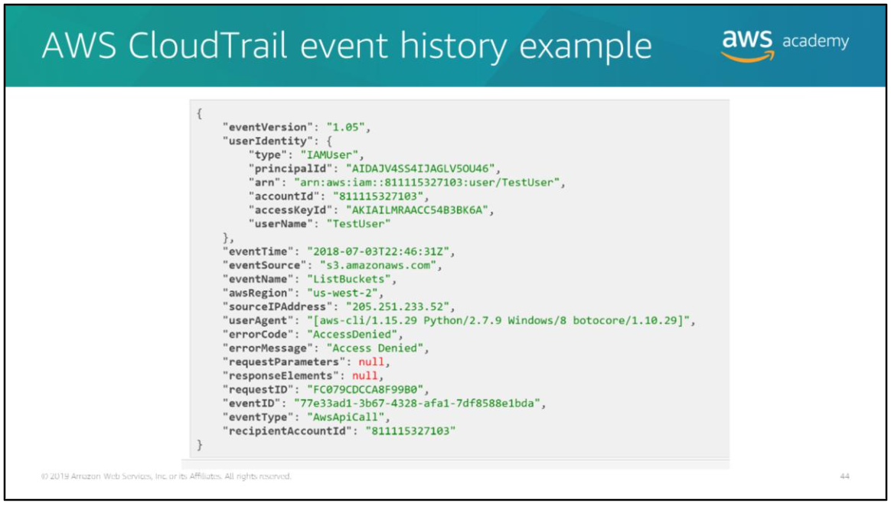

In this example, the event history shows that the user `TestUser` tried to do a `ListBuckets` action in the `us-west-2` Region from the source IP address `205.251.233.52`. The `userAgent` value tells you that this request was made programmatically by using the Boto 3 SDK. The AWS CLI request to these S3 buckets failed because the user doesn't have permissions. This might be a legitimate request, so you might want to check the permissions on the bucket policy to see whether that user is being restricted from accessing it.
