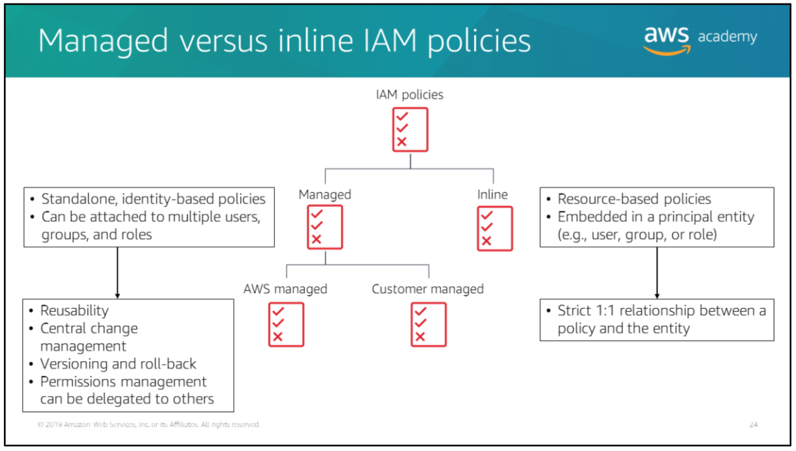

## Topics

- How security responsibilities are shared between you and AWS
- An overview of IAM
- How to use IAM for authentication
- How to use IAM to manage access to AWS resources

> Authentication is when AWS verifies a user's identity.
> Authorization is giving access to complete request.

# Shared responsibility model

# AWS Identity and Access Management (AWS IAM)

AWS IAM component:
- IAM user -> an entity that you create in AWS to represent the person or application that interacts with AWS. A user has a permanent set of credentials that stays with the user until there is a forced rotation.
- IAM group -> collection of IAM users, let you specify permissions for multiple users.
- IAM role -> similar to IAM user in that it is an AWS identity with permission policies that determines what the identity can and cannot do in AWS. A role doesn't have long-term credentials (such as password or access keys), instead it's uses temporary security credentials for your role session.
- IAM policy -> lists permissions to a user, group, or role.

## IAM credentials

There are two primary types of credentials:
- To authenticate from the console, you must sign in with your user name and password.
- To authenticate through AWS CLI, SDKs, and API, you must provide AWS access key (which is a combination of your access key ID and secret access key).

### Temporary credentials

There might be times when you need to provide trusted users with temporary security credentials to your AWS resources. In this case, it's best to create an IAM role with temporary credentials instead of creating an IAM user.

Example:
- An IAM user in one AWS account might need temporary access to resources in another AWS account.
- User identities that were authenticated by a system outside AWS (like, by an enterprise identity provider or web identity provider) might need to perform AWS tasks and access your AWS resources. This is referred to as identity federation.
- For a mobile application that needs access to your AWS resources. You don't want to store AWS credentials with the application, where they can be difficult to rotate and where users can potentially extract them.
- You can provide temporary security credentials to applications that run on EC2 instances and other AWS compute services so that you don't need to store long-term credentials locally.

### Providing AWS credentials

There are several ways to provide credentials to your environment:
- Use AWS managed temporary credentials -> manage AWS access credentials in an Amazon EC2 environment on your behalf.
- Attach on IAM instance profile to the EC2 instance -> manage AWS access credentials on your behalf, however you must create, manage, and attach the instance profile to the EC2 instance yourself. For applications that run on Amazon EC2 instances, create IAM role and attach it to your EC2 instance (this will allow your applications to securely make API requests from your EC2 instances without requiring you to manage the security credentials that the applications use).
- Store your permanent credentials within the Amazon EC2 or Secure Shell (SSH) environment -> less secure than using temporary AWS access credentials, however it's the only supported approach for an SSH environment (use local environment variables AWS_ACCESS_KEY_ID and AWS_SECRET_ACCESS_KEY to store your permanent credentials).

### AWS credentials file

Benefits using AWS credentials file:
- Your projects' credentials are stored outside of your projects, so it's unlikely you will accidentally commit them into version control.
- You can define and name multiple sets of credentials (called credential profiles) in one place.

# Identity-based and resource-based policies

Identity-based policies are attached to IAM user, group, or role and indicate what that identity can do.

Resource-based policies are attached to a resource and indicate what a specified user (or group) is permitted to do with it. You use resource-based policies for granting cross-account access between two trusted AWS accounts.

## Identity-based policy example

The policy above allows IAM users to do the following:
- Create, change, or remove their own password by using the `LoginProfile` actions.
- Create or delete their own access key by using the `AccessKey` actions.
- Create or delete their own SSH key by using the `SSHPublicKey` actions.

Note that the policy is getting the AWS user name dynamically, as defined in `Resources`.

## Resource-based policy example

In the scenario above, Account A has created a resource-based policy to grant Account B to perform any action (indicated by the asterisk) to Account A's S3 bucket (called `mybucket`). This S3 bucket policy does not specify any individual IAM users, groups, or roles - it only specifies Account B (AWS account number `111122223333`). Account B should create an IAM user policy to allow a user in Account B to access Account A's bucket.

# Managed vs inline IAM policies

## Managed policies

Managed policies are standalone, identity-based policies that you can attach to multiple users, groups, and roles

A few info about managed policies:
- AWS managed policies are created and managed by AWS.
- Customer managed policies are created and managed by you.
- Managed policies provide serveral features, including reusability, central change management, versioning, and roll back, and the ability to delegate permissions management to other users.

## Inline policies

Inline policies are embedded in a principal entitiy such as a user, group, or role. That is, the policy is an inherent part of the entity.

A few info about inline policies:
- You can use the same policy for multiple entities but those entities are not sharing the policy, instead each has its own copy of the policy. This makes it impossible to centrally manage inline policies.
- Inline policies are useful if you want to maintain a strict one-to-one relationship between a policy and the principal entity to which it is applied.

# Evaluation logic for IAM policies

Example of how policy logic works:

Consider this example to understand how policy logicworks. The top half of this policy gives users access to only the following:
- The DynamoDB table pollynotes
- The S3 bucket polly-notes-web
- The S3 bucket polly-notes-mp3 and all the objects it contains

The bottom half of this policy is an explicit deny. Here, the explicit deny ensures that the entity cannot perform any action on any DynamoDB table or S3 bucket except for the tables or buckets that are specified in the policy—even if permissions have been granted in another policy. An explicit deny statement takes precedence over an allow statement.
