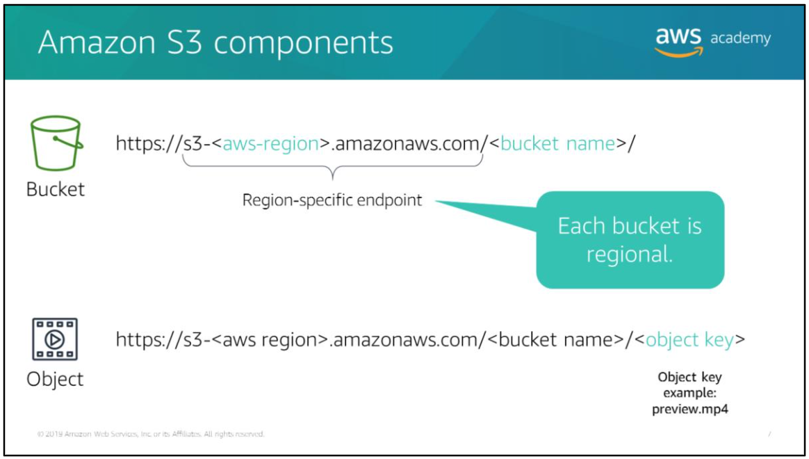

## Topics

- Introducing Amazon S3
- Creating Amazon S3
- Working with Amazon S3 objects
- Protecting data and managing access to Amazon S3 resources

# Amazon Simple Storage Service (Amazon S3)

Amazon Simple Storage Service (Amazon S3) is an object storage service that offers industry-leading scalability, data availability, security, and performance. Amazon S3 is designed for 99.999999999% (11 9's) of durability, and stores data for millions of applications for companies all around the world.

Example of Amazon S3 use case:
- Content storage and distribution
- Backup and restore (archive)
- Data lakes and big data analytics (a data lake is a centralized repository that allows you to store all your structured and unstructured data at any scale)
- Disaster recovery
- Static website hosting

## Amazon S3 components

The basic components of Amazon S3:
- A bucket -> a container for objects stored in Amazon S3. Purposes: organize Amazon S3 namespace at highest level, identify the account responsible for storage and data transfer charges, play a role in access control, and they serve as the unit of aggregation for usage reporting.
- An object -> a fundamental entity stored in Amazon S3. An object can be any kind of file such as text, video, photo, or another binary format.
- An object key -> every object in bucket has exactly one key. When you highlight a bucket in the Amazon S3 console, a list of objects in your bucket appears. These name are object keys.

> Note that each bucket is regional, objects stored in an AWS Region never leave the Region unless you explicitly transfer them to another Region.

## Amazon S3 bucket names

The rules:
- An Amazon S3 bucket name must be globally unique, and the namespace is shared by all AWS accounts. After a bucket is created, the name of that bucket cannot be used by another AWS account in any AWS Region until the bucket is deleted.
- Must be at least 3 and no more than 63 characters long.
- Can contain lowercase letters, numbers, and hyphens (-).
- Must not contain uppercase characters, underscores, or period. Bucket names that have period can cause certificate exceptions when they are accessed with HTTP-based URLs.

## Amazon S3 bucket urls

Amazon S3 supports two types of URLs to access buckets:
- Path-style url -> the bucket name is not part of the domain.
- Virtual-hosted-style url -> the bucket name is part of the domain.

## Amazon S3 directory structure

Amazon S3 has a no hierarchy structure like you would see in a file system. However, Amazon S3 supports the directory concept as a means of grouping objects. Amazon S3 does this by using a shared name prefix for objects (that is, objects that have names that begin with a common string).

## Object keys

When you create an object, you specify the key name.

Object keys:
- Uniquely identify bucket objects
- Are encoded using UTF-8 encoding
- Have a maximum length of 1024 bytes
- Can contain alphanumeric characters [0-9,a-z,A-Z]

More info: https://docs.aws.amazon.com/AmazonS3/latest/userguide/UsingMetadata.html

## Object metadata

Object consist of object data and metadata. Object metadata is a set of key-value pairs that provides additional information about the object.

There are two kinds of object metadata:
- System-defined metadata -> includes information such as object creation data, object size, and object version.
- User-defined metadata -> you can assign User-defined metadata to an object when you upload the object or after the object has been uploaded. User-defined metadata is stored with the object and returned when you download the object. User-defined metadata must begin with the prefix `x-amz-meta-`key, otherwise Amazon will not set the key value pair as you define it.

## PUT object

PUT object operation allows you to add an object to an S3 bucket. You must have `write` permissions on a bucket to add an object to it.

A few info about PUT object in S3:
- Single upload for objects up to 5 GB
- Multipart upload for objects up to 5 TB -> multiple upload allows you to upload a single object as a set of parts. If transmission of any part fails, you can retransmit that part without affecting other parts. After all parts of your object are uploaded, Amazon S3 assembles these parts and creates the object.

## GET object

You can use GET object operation to retrieve objects from Amazon S3. You must have `read` access to the object.

A few info about GET object in S3:
- You can retrieve object in a single GET request
- You can retrieve object in a parts by specifying the range of bytes needed

## SELECT object

You can use the SELECT object operation to filter the contents of an Amazon S3 object based on a simple Structured Query Language (SQL) statement.

You must send a SQL expression to the request, and you must also specify a data serialization format for the S3 object, such as JavaScript Object Notation (JSON), Comma Separated Values (CSV), or Apache Parquet. You must have `s3:GetObject` permission for this operation.

Example:  
You can use the select request to retrieve all records from an S3 object by using `<Expression>Select * from S3Object</Expression>` or to identify the column headers in your file by name using `SELECT s.Id, s.FirstName, s.SSH FROM S3Object s`

## Versioning

Versioning is a means of keeping multiple variants of an object in the same bucket. You can use versioning to preserve, remove, and restore every version of every object stored in your Amazon S3 bucket.

By default, versioning is disabled in S3 buckets. Once you enable versioning, you can only suspend it (you cannot disable it). Note that normal Amazon S3 rates apply for every version of an object that is stored or requested.

> Amazon S3 Object Lock is another option you can use to prevent data from being changed, overwritten, or deleted.

## DELETE object

You can use DELETE object operation to delete a single object or multiple objects.

### DELETE object: versioning disabled

In a bucket that is not versioning enabled, you can permanently delete an object by specifying the key of the object that you want to delete.

### DELETE object: versioning enabled

In a bucket that is versioning enabled, you can permanently delete an object by invoking a DELETE with a delete key and version ID. You must delete each individual version to completely remove an object.

If you specify only a delete key, Amazon S3 adds a delete marker that becomes the current version of the object. If you try to retrieve an object that has a delete marker, Amazon S3 returns a `404 Not Found error`.

## Data encryption

Data protection refers to protecting data while in transit (while it travels) and at rest (while it's stored).

You can protect data in transit by using Secure Sockets Layer/Transport Layer Security (SSL/TLS) or by using client-side encryption. For more info: https://docs.aws.amazon.com/AmazonS3/latest/userguide/inter-network-traffic-privacy.html

To protect data at rest in Amazon S3, you have the following options:
- With client-side encryption -> you manage the encryption process, the encryption keys, and related tools.
- With server-side encryption -> Amazon S3 encrypts your data at the object level as it writes it to disks in its data centers, and then decrypts it for you when you access it. You have three mutually exclusive options depending on how you choose to manage the encryption keys:
	- Server Side Encryption with Amazon S3-Managed Keys (SSE-S3) -> each object is encrypted with a unique key that employs strong multi-factor encryption. It also encrypts the key itself with a master key that it regularly rotates.
	- Server Side Encryption with AWS KMS-Managed Keys (SSE-KMS) -> there are separate permissions for the use of an envelope key (that is, a key that protects your data's encryption key), which provides added protection against unauthorized access of your Amazon S3 objects. SSE-KMS also provides you with an audit trail of when your key was used and by whom. Additionally, you have the option of creating and managing encryption keys yourself, or you can use a default key that is unique to you, the service you're using, and the Region you're working in.
	- Server Side Encryption with Customer-Provided Keys (SSE-C) -> You manage the encryption keys. Amazon S3 manages the encryption as it writes to disks, and it also manages the decryption when you access your objects.

## User policies and resource-based policies

By default, all Amazon S3 resources (buckets and objects) are private. Only the AWS account that created the resources can access them.

There are two types of access policies:
- Identity-based policies -> attach these policies to AWS identity and Access Management (IAM) users, groups, and roles in your account to grant them access to AWS resources.
- Resource-based policies -> attach these policies to your Amazon S3 resources. (bucket policies and Access Control Lists (ACLs) are resource-based policies)

## Access Control Lists (ACLs)

Access Control Lists (ACLs) are one of the resource-based access options that you can use to manage access to your buckets and objects. You can use ACLs to grant basic read/write permissions to other AWS accounts.

There are limits to managing permissions using ACLs. For example, you can grant permissions only to other AWS accounts, you cannot grant permissions to users in your account. You cannot grant conditional permissions, nor can you explicitly deny permissions.

ACLs are suitable for specific scenario. For example:  
If a bucket owner allows other AWS accounts to upload objects, permissions to these objects can only be managed using object ACLs by the AWS account that owns the object.

Use an object ACLs for the following scenarios:
- An object ACL is the only way to manage access to objects that are not owned by the bucket owner.
- Permission vary by object, and you need to manage permissions at the object level.
- Object ACLs control only object-level permissions. (the entire bucket has a single bucket policy but object ACLs are specified per object)

The only recommended use case for the bucket CLS is to grant write permission to the Amazon S3 Log Delivery group to write access log objects to your bucket.

## Bucket policies

In the example above, the bucket policy grants anonymous read permission on all objects in a bucket. The bucket policy has one statement, which allows the `s3:GetObject` action (read permission) on objects in a bucket named `examplebucket`. By specifying the principal with a wild card (`*`), the policy grants anonymous access.

You use a bucket policy when you want to manage cross-account permissions for all Amazon S3 permissions.

## Pre-signed urls

Pre-signed urls are useful if you want your user to be able to upload a specific object to your bucket without needing AWS security credentials or permissions.

When you create a pre-signed url, you must provide your security credentials, bucket name, an object key, an HTTP method (PUT for uploading objects, GET for retrieving objects), and expiration data and time.

The pre-signed urls are valid only for specified duration.

## Cross-origin resource sharing (CORS)

Sometimes websites have to load resources from other places. Cross-origin resource sharing (CORS) defines a way for client web applications that are loaded in one domain to interact with resources in a different domain.

Example of when to enable CORS:
- JavaScript in one domain's webpage (http://www.example.com) wants to use resources from your S3 bucket by using the endpoint `website.s3.amazonaws.com`. The browser will allow such cross-domain access only if CORS is enabled on your bucket.
- You want to host a web font in your S3 bucket. A webpage in a different domain might try to use this web font. Before the browser loads this webpage, it will perform a CORS check to make sure that the domain where the page is being loaded is allowed to access resources from your S3 bucket.

To enable CORS, create a CORS configuration XML file with rules that identify the origins you will allow to access your bucket, the operations (HTTP methods) that you will support for each origin, and other operation-specific information. You can add up to 100 rules to the configuration. You can apply the CORS configuration to the S3 bucket by using the AWS SDK.
