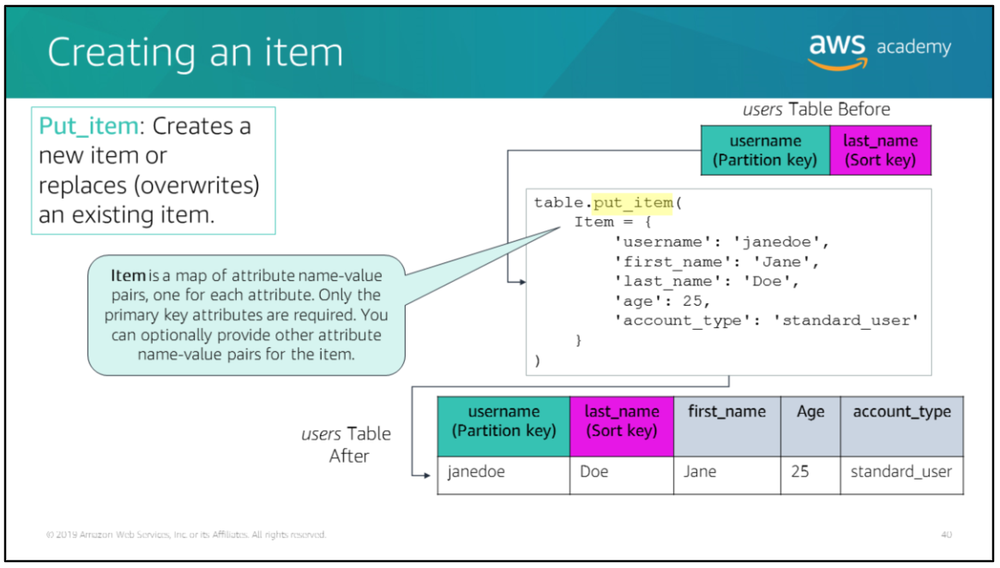
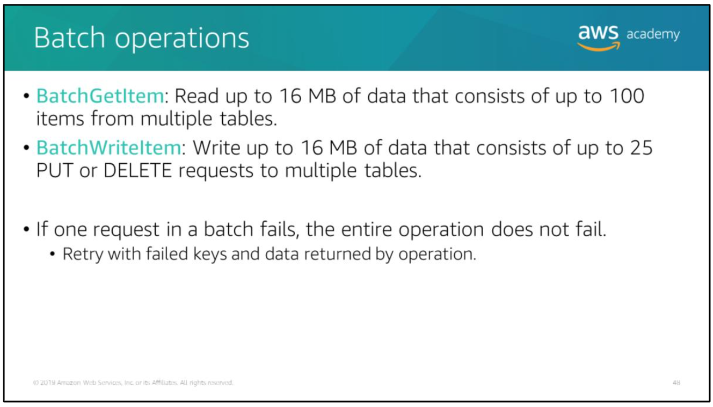

## Topics

- Introduction to Amazon DynamoDB
- Amazon DynamoDB key concepts
- Partitions and data distribution
- Secondary indexes
- Read/write throughput
- Streams and global tables
- Backup and restore
- Basic operations for Amazon DynamoDB tables

# Growth in unstructured data

Traditionally, digital data was structured data (data that could be structured into columns and rows, and stored in a relational database). However, according to a 2017 survey conducted by 451 Research and sponsored by Western Digital, unstructured data is growing between 40-60 percent per year. This growth is due to the increased size and volume of unstructured data types, such as audio, video, images, research data and Internet of Things (IoT) data (source: https://blog.westerndigital.com/2018-data-trends-today-tomorrow-change/).

# Amazon DynamoDB

Unstructured data can be stored in a non-relational NoSQL database, such as Amazon DynamoDB.

Amazon DynamoDB is a fast and flexible non-relational databaase service for all applications that need consistent, single-digit milisecond latency at any scale. It is a fully managed cloud database and supports both document and key-value store models.

Amazon DynamoDB offers the following benefits:
- Fully managed -> DynamoDB is a fully managed, non-relational database service. You simply create a database table, set your target utilization for automatic scaling, and let the service handle the rest (you no longer need to worry about database management tasks). DynamoDB also provides point-in-time recovery, backup, and restore for all your tables.
- Fast, consistent performance -> as your data volumes grow and application performance demands increase, DynamoDB uses automatic partitioning and Solid State Drive (SSD) technologies to meet your throughput requirements and deliver low latencies at any scale.
- Fine-grained access control -> DynamoDB integrates with AWS Identity and Access Management (IAM) for fine-grained access control of users in your organization. You can assign unique security credentials to each user and control each user's access to services and resources.
- Flexible -> DynamoDB supports storing, querying, and updating, documents. By using AWS Software Development Kit (SDK), you can write applications that store JavaScript Object Notation (JSON) documents directly into Amazon DynamoDB tables. You can perform powerful database operations, such as nested JSON queries, by using a few lines of code.

Amazon DynamoDB use cases example:
- Serverless web applications
- Microservices data store
- Mobile backends
- Adtech
- Gaming
- Internet of Things (IoT)

## Amazon DynamoDB components

The basic components of DynamoDB:
- Tables -> DynamoDB stores data in tables. A table contains items with an attributes.
- Items -> each table contains zero or more items. An item is a group of attributes that is uniquely identifiable among all of the other items.
- Attributes -> each item is composed of one or more attributes. An attributes is a fundamental data element, something that does not need to be broken down any further.
- Primary key -> a table has a primary key that uniquely indentifies each item in the table. No two items can have the same key.

> when compared to the components of a relational database table, items are analogous to rows and attributes are analogous to columns.

## Amazon DynamoDB primary keys

Amazon DynamoDB supports two types of primary keys:
- Simple primary key -> composed of one attribute known as the partition key. DynamoDB builds an unordered index on this primary key attribute. Each item in the table is uniquely identified by its partition key value.
	- In the SensorLocation table, the primary key is a partition key because it consists of a single attribute `SensorId`, which is the partition key. Each item in the table is uniquely identified by its partition key value (`SensorA` and `SensorB`). Also, each sensor has exactly one location, which is expressed in terms of latitude and longitude.

- Composite primary key -> composed of two attributes: the partition key attribute and a sorted index on the sort key attribute. DynamoDB builds an unordered index on the partition key and a sort key, it's possible for two items to have the same partition key value (however, those two items must have different sort key values).
	- In the SensorReadings table, the primary key is a `partition` and `sort primary` key because it is composed of the `SensorId` attribute (the partition key) and the `Time` attribute (the sort key).  
	For each `SensorId`, there might be multiple items corresponding to sensor readings at different times. The combination of `SensorId` and Time uniquely identifies items in the table.  
	This design enables you to query the table for all readings related to a particular sensor.

> Remember that DynamoDB can be used as a key-value store and document store. In the examples shown, the primary key value (partition key and sort key if present) is the key, and the remaining attributes constitute the value that corresponds to the key.

## Items and attribute types

Unlike a relational database, DynamoDB is not constrained by a pre-defined schema. An items can have any number of attributes with different value types. Each attribute has a name and a value.

An attribute value can be one of the following types:
- Scalar types -> number, string, binary, boolean, and null.
- Multi-valued types -> string set, number set, and binary set.
- Document types -> list and map.

The size of an item is the sum of the lengths of its attribute names and values. An item can be a maximum of 400 KB in size.

## Partitions

DynamoDB stores data in partitions. A partition is an allocation of storage for a table, backed by Solid State Drives (SSDs), and automatically replicated across multiple Availability Zones within an AWS Region. Partition management is handled entirely by DynamoDB.

If your table has a simple primary key (partition key only), DynamoDB stores and retrives each item based on its partition key value.

A partition key of an item is also known as its *hash attributes*. If a table has a composite primary key (partition key and sort key), then DynamoDB will store all of the items with the same partition key value physically close together and order them by sort key value in the partition. The sort key of an item is also known as its *range attribute*.

### Partitioning with simple primary key example

In the partition above, the *Pets* table has a simple key (partition key only) and spans multiple partitions. DynamoDB calculates the hash value of the partition key to determine which partition should, which in this case, is based on the hash value of the string `Dog`.

> Note that the items are not stored in sorted order.

### Partitioning with composite primary key example

Suppose that the *Pets* table has a composite primary key consisting of `AnimalType` (partition key) and `Name` (sort key). DynamoDB again calculates the hash value of the partition key to determine which partition should contain the item.

In that partition, there are several items with the same partition key value, so DynamoDB stores the new item among the others with the same partition key, in ascending order by sort key. In the example above, DynamoDB writes an item with a partition key value of `Dog` and a sort key value of `Fido` in ascending order.

## Secondary indexes

Amazon DynamoDB provides fast access to items in a table by specifying primary key values. However, many applications might benefit from having one or more secondary (or alternate) keys available, which allows for efficient access to data with attributes other than the primary key. To address this, you can create one or more secondary indexes on a table.

A secondary index enables you to perform queries on attributes that are not part of the table's primary key. A secondary index lets you query the data in the table by using an alternate key, in addition to queries against the primary key.

In addition to the alternate key attributes and primary key attributes (partition key and sort key), a secondary index contains a subset of the other table attributes. When you create an index, you specify which attributes will be copied, or projected, from the base table to the index. At a minimum, DynamoDB projects the key attributes from the base table into the index.

DynamoDB supports two types of secondary indexes:
- Global secondary index -> an index with a partition key and a sort key, both of which can be different from those on the base table. A global secondary index is considered global because queries on the index can span all of the data in the base table, across all partitions. A global secondary index has no size limitations and has its own provisioned throughput settings for read and write activity that are separate from those of the table.
- Local secondary index -> an index that has the same partition key as the base table, but a different sort key. A local secondary index is local in the sense that every partition of a local secondary index is scoped to a base table partition that has the same partition key value. As a result, the total size of indexed items for any one partition key value can't exceed 10 GB. Also, a local secondary index shares provisioned throughput settings for read and write activity with the table it is indexing.

> Each table in DynamoDB has a limit of 20 global secondary indexes (default limit) and 5 local secondary indexes per table.

The difference between Global Secondary Index (GSI) and Local Secondary Index (LSI):
- GSI:
	- "Dapat membuat key baru sebagai index yang sama sekali berbeda dari primary key (partition and sort key) di base table, bahkan key baru tersebut juga dapat berupa simple key (misal: hanya partition key)."
	- "GSI dapat dibuat kapan saja setelah base table dibuat."
	- "Dengan kelebihan fleksibilitasnya tentu saja akan membutuhkan extra cost dibandingkan LSI."
- LSI:
	- "Key baru pada index yang dibuat harus tetap menggunakan partition key dari base table, yang dirubah hanya sort key."
	- "LSI hanya dapat dibuat bersamaan dengan pembuatan base table."

> "Setelah base table dibuat, opsi pembuatan secondary index hanya untuk GSI saja"
> For more info about the difference between GSI and LSI:
> - https://docs.aws.amazon.com/amazondynamodb/latest/developerguide/SecondaryIndexes.html
> - GSI: https://docs.aws.amazon.com/amazondynamodb/latest/developerguide/GSI.html
> - LSI: https://docs.aws.amazon.com/amazondynamodb/latest/developerguide/LSI.html

### Global secondary index example

Here is an example of when you would use a global secondary index:  
Say you have a *Music* table. You can query data items by `Artist` (partition key) or by `Artist` and `SongTitle` (partition key and sort key).  
What if you also wanted to query the data by `Genre` and `AlbumTitle`? You cannot do this query with the *Music* table. To do this, you create a global secondary index on `Genre` and `AlbumTitle` from the base *Music* table, and then query the index in much the same way that you would query the *Music* table.  
In the index, `Genre` is the partition key and `AlbumTitle` is the sort key.

> Note that the combination of `Genre` and `AlbumTitle` might not be unique. Multiple albums can belong to one genre.

### Local secondary index example

Here is an example of when you would use a global secondary index:  
Say that you want to query by `Artist` and by `AlbumTitle`. In this case, you would create a local secondary index (called `ArtistAlbumTitle`) from the base *Music* table.  
The local secondary index has the same partition key as the base table (`Artist`) but different sort key (`AlbumTitle`).  
For a local secondary index, the partition key is the same as the table's partition key. The sort key can be any scalar attribute.

## Read/write throughput

### Read consistency

DynamoDB automatically replicates your data across multiple Availability Zones in an AWS Region, which provides built-in high availability and data durability. All copies of you data are usually consistent within a second after a write operation.

DynamoDB supports *eventually consistent* and *strongly consistent* reads:
- Eventually Consistent Reads (ECR) -> when you read data from DynamoDB table, the response might not reflect the results of a recently completed write operation. The response might include some stale data (out-of-date data). If you repeat your read request after a short time, the response should return the latest data.
- Strongly Consistent Reads (SCR) -> when you request a strongly consistent read, DynamoDB returns a response with the most up-to-date data, which reflects the updates from all prior write operations that were successful. A strongly consistent read might not be available if there is a network delay or outage. Consistent reads are not supported on global secondary indexes.

> Basically, ECR is fast but higher possibility of using out-of-date data, and SCR is slow but using up-to-date data.

### Transactions

Amazon DynamoDB transactions simplify the developer experience of makig coordinated, all-or-nothing changes to multiple items both within and across tables.

Transactions provide atomicity, consistency, isolation, and durability (ACID) in DynamoDB, and they enable you to maintain data correctness in your applications.

Use cases:
- Processing financial transactions
- Fulfilling and managing orders
- Building multiplayer game engines
- Coordinating actions across distributed components and services

### Provisioned read/write throughput

Provisioned throughput is the maximum amount of capacity that an application can consume from a table or index. If your application exceeds your provisioned throughput capacity on a table or index, it is subject to request throttling.

DynamoDB divides throughput evenly among partitions. The throughput per partition is the total provisioned throughput divided by the number of partitions.  
For example: 
If we have 400 throughput and 4 items, then we're gonna have 100 throughput per item.

With the provisioned throughput, you specify the throughput capacity in terms of Read Capacity Unit (RCU) and Write Capacity Unit (WCU):
- Read Capacity Unit (RCU) is the number of strongly consistent reads per second of items that are up to 4 KB in size. If you perform eventually consistent reads, you use half of the read capacity units that are provisioned.

> 1 RCU = 1 SCR (read speed: 4 KB per second), 1 RCU = 2 ECR (read speed: 8 KB per second).

- Write Capacity Unit (WCU) is the number of 1 KB writes per second.

### On-demand read/write throughput

Tables that use on-demand mode deliver the same single-digit milisecond latency, service-level agreement (SLA) commitment, and security that DynamoDB already offers.

You can choose on-demand for both new and existing tables, and you can continue using the existing DynamoDB Application Programming Interface (API) without changing code.

On-demand mode is a good option if:
- You create new tables with unknown workloads
- You have unpredictable application traffic
- You prefer the ease of paying for only what you use

### Calculating Read Capacity Unit (RCU)

Say that you need to read 20 items that are 11 KB in size every second, with eventual consistency (ECR). How many RCUs must you provision?

> 1 RCU = 1 SCR with 4 KB per second read speed, so if we need 11 KB per second then we need 3 SCR which 12 KB per second. Also, we need to read 20 items, so 3 * 20 = 60 RCU. We need 60 RCU if we use SCR, and 30 RCU if we use ECR (please keep in mind that 1 RCU = 2 ECR).

The answer is 30 RCUs, we need to provision 30 RCUs.

### Calculating Write Capacity Unit (WCU)

Say that you need to write 120 items that are 7 KB in size every minute. How many Write Capacity Unit (WCU) you must provision?

> The write speed is 1 KB per second, so if need to write 120 items that are 7 KB in size every minute, we need to calculate 120 * (7/60) = 14.

The answer is 14 WCUs, we need to provision 14 WCUs.

## DynamoDB streams

Many applications can benefit from the ability to capture changes to items that are stored in a DynamoDB table at the point in time when these changes occur.

For example:  
Consider an application that makes changes to user preferences that are stored in a DynamoDB table. Another application, such as an ad server, needs to respond to the new preferences and present different advertisements.

DynamoDB streams is an optional feature that captures a time-ordered sequence of item modifications in any DynamoDB table (called *streams*), and stores this information for up to 24 hours. Applications can view the data items as they appeared both before and after they were modified, in near real time.

A stream consists of *stream records*. Each stream record represents a single data modification in the DynamoDB table to which the streams belongs. Each stream record is assigned a sequence number, which reflects the order in which the record was published to the stream. Whenever an application creates, updates, or deletes items in the table, DynamoDB Streams writes a stream record with the primary key attributes of the items that were modified. You can configure the stream so that the stream records capture additional information, such as the before and after images of modified items.

Stream records are organized into groups, or shards. Each shard acts as container for multiple streams records, and it contains information that is required for accessing and iterating through these records. The stream records in a shard are automatically removed after 24 hours.

## Global tables

DynamoDB automatically spreads the data and traffic for your tables over a sufficient number of servers to handle your throughput and storage requirements.

All your data is stored on Solid State Drive (SSD) and automatically replicated across multiple Availability Zones in AWS Region. You can use *global tables* to keep DynamoDB tables in sync across AWS Regions.

Global tables provide a fully managed solution for developing a multi-Region, multi-active database, without having to build and maintain your own replication solution.

> multi-master replica (every database can become a master)  
> master-slave replica (only one database master)

Example:  
Suppose that you have a large customer base spread across three geographic areas - North America, Europe, and Asia. Customers need to update their profile information while using your application. You could create three identical DynamoDB tables named `CustomerProfiles` in three different AWS Regions, however this would be a time-consuming and labor-intensive effort.  
Instead, you could create a global table consisting of your three Region-specific `CustomerProfiles` tables. DynamoDB would then automatically replicate data changes among those tables, so that changes to `CustomerProfiles` data in one Region would be seamlessly propagated to the other Regions. In addition, if one of the AWS Regions were to become temporarily unavailable, your customers could still access the same `CustomerProfiles` data in the other Regions.

### Data replication

A global table is a collection of one or more DynamoDB tables called *replica tables*. A replica table (or replica, for short) is a single DynamoDB table that functions as a part of a global table. Each replica stores the same set of data items. Any given global table can only have one replica table per Region, and every replica has the same table name and the same primary key schema.

In global, a newly written item is usually propagated to all replica tables within seconds. With global table, each replica table stores the same set of data items. DynamoDB doesn't not support partial replication of only some of the items.

### Concurrent updates

Conflicts can arise if applications update the same item in different Region at about the same time. To achieve eventual consistency, DynamoDB global tables use a "last writer wins" reconciliation between concurrent updates, where DynamoDB makes a best effort to determine the last writer. With this conflict resolution mechanism, all of the replicas will agree on the latest update, and converge toward a state which they all have identical data.

### Read consistency

DynamoDB does not support Strongly Consistent Reads (SCR) across AWS Regions. Therefore, if you write to one Region and read from another Region, the read response might include stale data (out-of-date data) that doesn't reflect the results of recently completed writes in the other Region. Strongly Consistent Reads (SCR) require using a replica in the same Region where the client is running.

Transactions are enabled for all single-Region DynamoDB table and disabled on global table by default.

## On-demand backups and point-in-time

When you create an on-demand backup, a time marker of the request is cataloged. The backup is created asynchronously by applying all changes until the time of the request to the last full table snapshot. Backup request are processed instantaneously and become available for restore within minutes.

There is no limit to the number ofo on-demand backups that you can take. All backups in DynamoDB work without consuming any provisioned throughput on the table.

Point-in-time recovery helps protect your Amazon DynamoDB tables from accidental write or delete operation.

For example:  
Suppose that a test script writes accidentally to a production DynamoDB table. With point-in-time recovery, you can restore that table to any point in time during the last 35 days. DynamoDB maintains increamental backups of your table.

## Basic operations for Amazon DynamoDB tables

### Amazon DynamoDB API operations

You use the Amazon DynamoDB API to invoke:
- Control operations -> create and manage DynamoDB tables, also let you work with indexes, streams, and other objects that depend on tables.
- Data operations -> perform Create, Read, Update, and Delete (CRUD) on data in table. CRUD refers to all of the major functions that are implemented in relational database applications. Some of the data operations also let you read data from a secondary index.
- Batch operations -> enable or disable a stream on a table, and allow access to the data modification records that are contained in a stream.
- Transaction operations -> make coordinated, all-or-nothing changes to multiple items both within and across tables.

### Creating a table

`CreateTable` is an asynchronous operation that creates a new table. On receiving a `CreateTable` request, DynamoDB immediately return a response with a TableStatus of `CREATING`.

After the table is created, DynamoDB sets the TableStatus to `ACTIVE`. You can perform read and write operations only on an `ACTIVE` table. You can optionally define secondary indexes on the new table as part of the CreateTable operation.

The example above shows how to create a table using Boto 3 (the AWS SDK for python). The invocation of the `create_table` method creates a table named `users` with a partition-and-sort primary key that is a composed of the attributes named `username` and `last_name` (which have hash and range key types, respectively). The provisioned throughput for the table is 5 RCU and 5 WCU.

### Creating an item

`PutItem` operation creates a new item or replaces an old item with a new item. If an existing item in the specified table has the same primary key as the new item, the new item completely replaces the existing item.

You can perform a conditional PUT operation (add a new item if and item with the specified primary key doesn't exist), or you can replace an existing item if it has certain attribute values. You can return the item's attribute values in the same operation by using `ReturnValues` parameter.

Continuing with the python example, after the users table has been created and assigned to the table variable, the `put_item` method is invoked to add a new item to the table.

### Updating an item

`UpdateItem` operation allows you to update an existing item's attributes, or add a new item to the table if it does not already exist. You add, set, or remove attribute values. You can also perform a conditional update on an existing item (for example: replace an existing name-value pair if it has certain expected attribute values). Additionally, you can return the item's attribute values, from either before or after the update, by using the `ReturnValues` parameter.

In the python example above, the `update_item` method is used to modify the age attribute of an item in the `users` table.

### Deleting an item

`DeleteItem` operation allows you to delete an item in a table by using its primary key.

You can perform a conditional delete operation that deletes the item if it has an expected attribute value. In addition to deleting an item, you can also return the item's attribute values by using the `ReturnValues` parameter.

1[deleting-item](../../images/aws-developing/aws-dynamodb-deleting-item.png)

In the python example above, the `delete_item` method is used to delete an item from the users table.

### Condition expressions

For the `PutItem`, `UpdateItem`, and `DeleteItem` operations, you can specify a `condition expression` to determine which items should be modified. If the condition expression evaluates to true, the operation succeds; otherwise, the operation fails.

In the example above, the `accountLocked` attribute in the `AccountStatus` table can be set to `N` only if the last failed login attempt was more than 24 hours earlier.

### Reading an item

`GetItem` operation allows you to retrieve a specific item from a DynamoDB table. You must specify the table name and the full primary key (partition key and sort key, if any) to retrieve a single item from a table.

You can optionally specify a projection expression to retrieve only certain attributes instead of retriving the entire item.

By default, all attributes of the item are returned. You can also request that the operation use a Strongly Consistent Read (SCR) instead of the default Eventually Consistent Read (ECR).

In the python example above, the `get_item` methos is used to retrieve an item in the users table, which is then printed to standard output. The expected result is a JSON object that contains all of the attributes of the item.

### Querying a table

`Query` operation allows you to read only the items that match the primary key from a table or secondary index.

The primary key is specified in the key condition expression. If a filter expression is specified, then the `Query` operation further refines the result set ase on the filter. You must explicitly specify the name of the table or secondary index that you want to query.

The `Query` operation returns a result set with the items that match the conditions that were specified. If none of the items satisfy the given criteria, then the `Query` operation returns an empty result set.

In the python example above, the `query` method is used to retrieve all the items in the users table that have a primary key value that is equal to `johndoe`.

### Scanning a table

`Scan` operation is similar to a `Query` operation, but the `Scan` `operation` reads all items from the table or index. The result set can be refined by using a filter expression.

In the python example above, the `scan` method is used to retrieve all the users whose age is less than 27.

Because the `Scan` operation reads all items from the table or index, it is an expensive operation. It is more efficient to perform a `Query` operation that has the appropriate key condition expression to return only the data that your application needs.

> If you must do a `Scan` operation, perform a parallel scan when possible.

### Limiting the amount of data returned to improve performance and optimize cost

To improve performance and optimize cost, you can limit the amount of data returned by `Query` and `Scan` operations. The number of items returned by a `Query` or `Scan` operation is affected by two factors:
- Pagination limit -> By default, DynamoDB divides the results of `Query` and `Scan` operations into pages of data that are 1 MB in size (or less). An application can process the first page of results, then the second page, and so on. A single `Query` or `Scan` will only return a result set that fits within the 1 MB size limit.
- Limit parameter value -> the `Query` and `Scan` operations also allow you to limit the number of items that are returned in the result. To do this, set the limit parameter to the maximum number of items that you want.

### Batch operations

You can use batch operation to achieve higher throughput by writing, deleting, or replacing multiple items in a single request.

Batch operations also let you take advantage of parallelism without having to manage multiple threads on your own. You can achieve lower average latencies, compared to using single `PutItem` or `DeleteItem` operations, when multiple items are written, deleted, or replaced.

You can use the following operations to retrieve or write data to DynamoDB in batches:
- `BatchGetItem` -> return the attributes of one or more items from one or more tables. You identify requested items by primary key. A single operation can retrieve up to 16 MB of data, which can contain as many as 100 items.
- `BatchWriteItem` -> puts or deletes multiple items in one or more tables. A single call to `BatchWriteItem` can write up to 16 MB of data, which can comprise as many as 25 PUT or DELETE requests. Individual items to be written can be as large as 400 KB.

> With batch operation, if one request in a batch fails, the entire operation does not fail.

### Transactional operations

You can use the DynamoDB transactional read and write APIs to manage complex business workflows that require adding, updating, or deleting multiple items as a single, all-or-nothing operation.

For example:  
A video game developer can ensure that players' profiles are updated correctly when they exchange items in a game or make in-game purchases.

New DynamoDB operations have been introducted for handling transactions:
- `TransactWriteItems` -> a batch operation that contains a write set, with one or more `PutItem`, `UpdateItem`, and `DeleteItem` operations. `TransactWriteItems` can optionally check for prerequisite conditions that must be satisfied before updates are made. These conditions could involve the same or different items than the items in the write set. If any condition is not met, the transaction is rejected.
- `TransactGetItems` -> a batch operation that contains a read set, with one or more `GetItem` operations. If a `TransactGetItems` request is issued on an item that is part of an active write transaction, the read transaction is canceled. To get the previously commited value, you can use a standard read.

> With the transactional operations, if one operations fails, the entire transaction fails.
