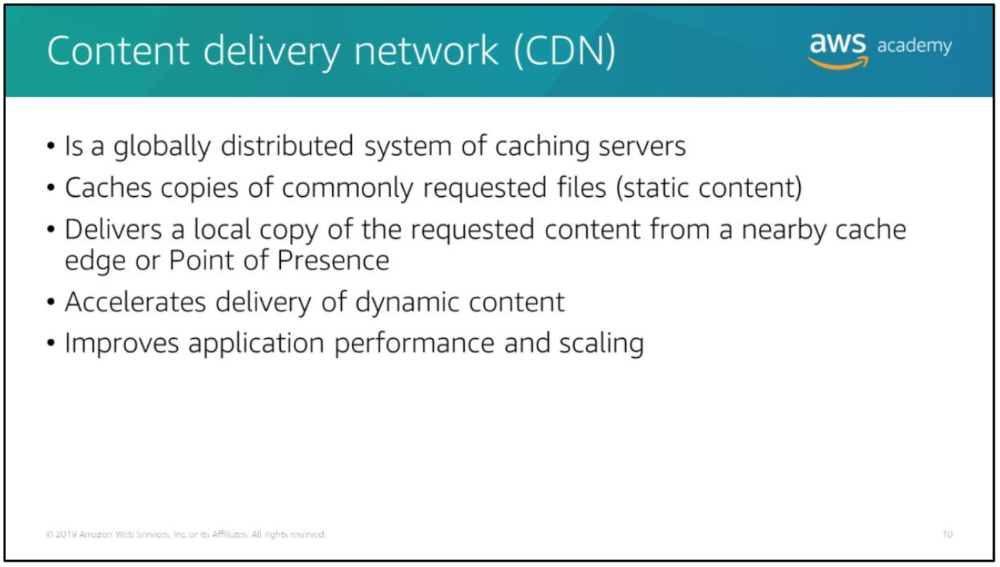
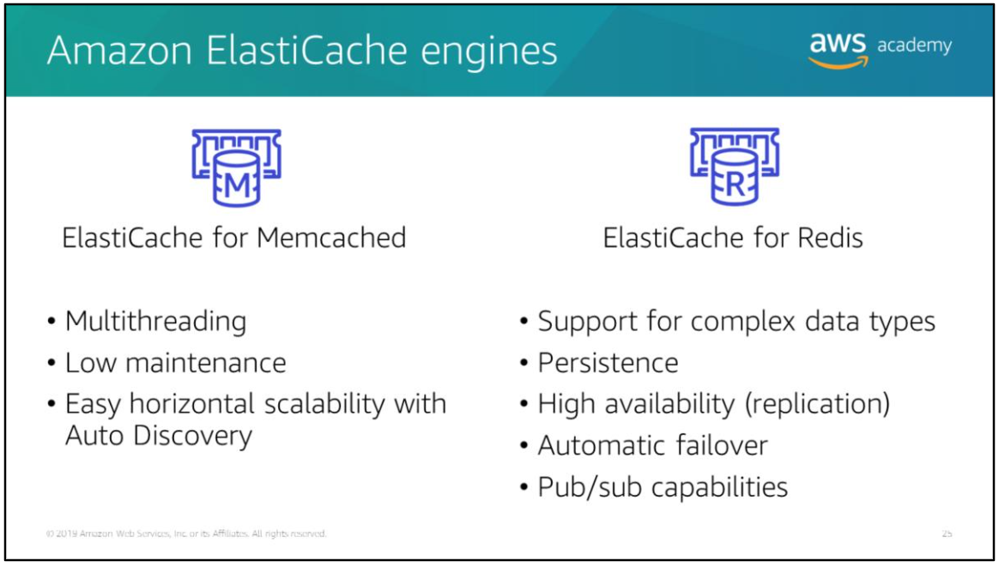
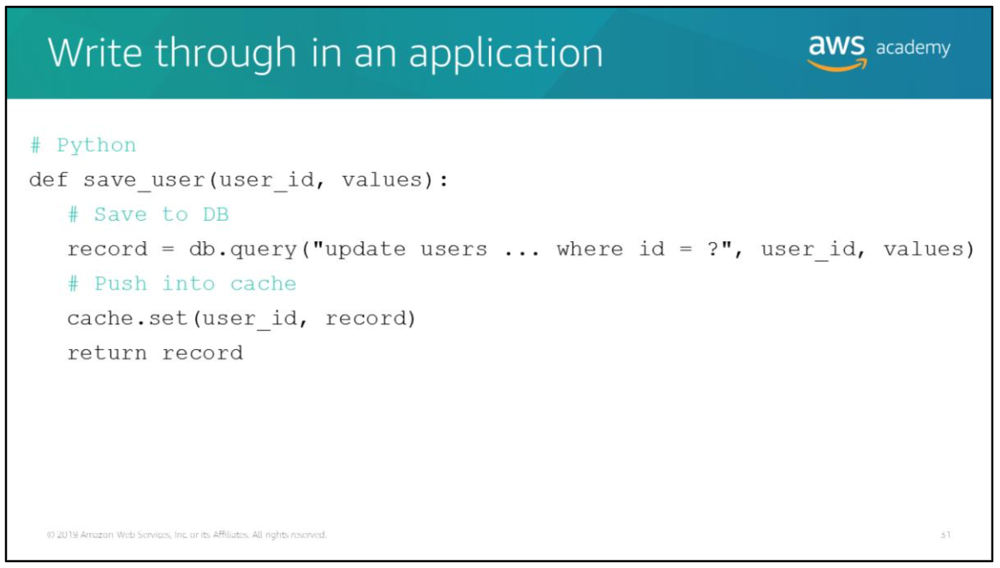

## Topics

- Caching overview
- Caching with Amazon CloudFront
- Caching with Amazon ElastiCache
- Caching strategies

# Caching overview

The primary purpose of a cache is to increase the performance of data retrieval by reducing the need to access the underlying slower storage layer.

Unlike a database, which usually stores data in a complete and durable form, a cache transiently stores a subset of data. Future requests for that cached data are served faster than requests that access the data's primary storage location.

Caching trades capacity for speed, and it enables you to efficiently reuse prevously retrieved or computed data. The data in cache is generally stored in fast-access hardware, such as Random Access Memory (RAM).

## Caching use case

Caching can benefit for this workloads:
- Read-heavy application workloads -> caching can significantly reduce latency and improve IOPS for many read-heavy application workloads, such as social networking, gaming, media sharing, and Q&A portals.
- Compute-intensive workloads -> caching can also benefit compute-intensive workloads that manipulate datasets, such as recommendation engines and high performance computing (HPC) simulations. (In this applications, very large datasets must be accessed in real-time accross clusters of machines that can span hundreds of nodes. Due to the speed of the underlying hardware, manipulating this data in a disk-based store is a significant bottleneck for these applications)

## When to consider caching your data

- If the data requires a slow and expensive query to acquire, it's a candidate for caching. If acquiring the data requires a relatively quick and simple query, it still might be a candidate for caching, depending on other factors.
- For caching to provide a meaningful benefit, the data should be relatively static and frequently accessed. Do not cache data if caching it provides no speed or cost advantage.
- When you determine whether your data is a candidate for caching, you must also determine your application's tolerance for stale data. By definition, cached data is stale data (out-of-date data).

# Amazon CloudFront

## Content Delivery Network (CDN)

Content Delivery Network (CDN) is a globally distributed system of caching servers.

A CDN caches copies of commonly requested files (static content, such as HTML, CSS, JavaScript, and image files) that are hosted on the application origin server.

CDNs also deliver dynamic content that is unique to the requestor and not cacheable.

The CDN establishes and maintain secure connections closer to the requestor.

## Amazon CloudFront overview

As the objects become less popular, individual edge locations may remove those objects to make room for more popular content. For the less popular content, CloudFront has *regional edge caches*.

Regional edge caches are CloudFront locations that are deployed globally and close to your viewers. They're located between your origin server and the global edge locations that serve content directly to viewers.

Amazon CloudFront uses a global network of 166 Points of Presence (155 Edge Locations and 11 Regional Edge Caches) in 65 cities across 29 countries to deliver content to end users with lower latency.

## Amazon CloudFront example

## Amazon CloudFront distributions

When you use CloudFront to distribute your content, you create a distribution to tell CloudFront where you want content to be delivered from (that is, which origin servers to get your files from) and the details about how to track and manage content delivery.

Two types of CloudFront distributions:
- Web distributions -> serve content over HTTP or HTTPS. If you're serving content over HTTP, your origin server is either an Amazon S3 bucket or an HTTP server, such as a web server. (Your HTTP server can run on an Amazon EC2 instance or on a server that you manage)
- Real-Time Messaging Protocol (RTMP) -> stream media files using Adobe Real Time Messaging Protocol. If you use the Adobe Media Server RTMP protocol to distribute media files on demand, your origin server is always an Amazon S3 bucket.

CloudFront assigns a domain name to your new distribution and sends your distribution's configuration to all of its edge locations.

## Managing expiration

Typically, CloudFront serves a file from an edge location until the cache duration that you specified passes (until the file expires). After it expires, the next time the edge location gets a user request for the file, CloudFront forwards the request to the origin server to verify that the cache contains the latest version of the file.

## Amazon S3 Transfer Acceleration

Transfer acceleration takes advantage of Amazon CloudFront's globally distributed edge locations. As the data arives at an edge location, data is routed to Amazon S3 over an optimized network path.

> When using Transfer Acceleration, additional data transfer charge may apply.

### Amazon S3 Transfer Acceleration setup

To get started using Amazon S3 Transfer Acceleration:
1. For your bucket to work with transfer acceleration, the bucket name must conform to DNS naming requirements and must not contain periods ("."). You can enable Transfer Acceleration on a bucket via the Amazon S3 console, the PUT *Bucket accelerate* API operation, or the AWS CLI and SDKs.
2. Transfer data to and from the acceleration-enabled bucket by using one of the following s3-accelerate endpoint domain names:
- `<bucket-name>.s3-accelerate.amazonaws.com` -> to access an acceleration-enabled bucket.
- `<bucket-name>.s3-accelerate.dualstack.amazonaws.com` -> to access an acceleration-enabled bucket over IPv6. Amazon dual-stack endpoints support requests to S3 buckets over IPv6 and IPv4. (The Transfer Acceleration dual-stack endpoint only uses the virtual hosted-style type of endpoint name)

# Amazon ElastiCache

Amazon ElastiCache is an in-memory key-value store that sits between your application and the data store (database) that it accesses.

The primary purpose of an in-memory key-value store is to provide ultrafast (sub-millisecond latency) and inexpensive access to copies of data.

## Amazon ElastiCache overview

Amazon ElastiCache is a web service that makes it easy to deploy, operate, and scale an in-memory data store or cache in the cloud.

### Amazon ElastiCache architecture example

In the example architecture above, Elastic Load Balancing (ELB) distributes application traffic across multiple EC2 application instances that are making external application instances that are making external Application Programming Interface (API) requests.

Numerous database read requests for the same data increases the response time, so Amazon ElastiCache can be added to improve response times and alleviate database pressure.

The application reads from the cache. If the information is not available in the cache or is expired, then the application reads from the database (such as an Amazon RDS DB instance, DynamoDB, or another database). If the database receives numerous read requests for the same data, then the application writes the data received from the store to the cache so that it can be retrieved more quickly the next time it is requested.

## Benefits of Amazon ElastiCache

The benefits of Amazon ElastiCache include:
- Extreme performance -> Amazon ElastiCache works as an in-memory data store and cache to support the most demanding applications that require sub-millisecond response times.
- Fully managed -> Amazon ElastiCache manages the work involved in setting up a distributed in-memory environment, from provisioning the server resources you requests to installing the software (after your environment is up and running, the service automates common administrative tasks, such as failure detection, recovery, and software patching). Amazon ElastiCache provides detailed monitoring metrics that are associated with your nodes, enabling you to diagnose and react to issues quickly. For example: you can set up threshold and receive alarms if one of your node is overloaded with requests.
- Scalable -> Amazon ElastiCache can scale out, scale in, and scale up to meet fluctuating application demands. Write and memory scaling is supported with sharding. Replicas provide read scaling.

## Amazon ElastiCache terminology

Key concepts for working with Amazon ElastiCache:
- A node is the smallest building block of an ElastiCache deployment. A node is a fixed-size chunk of secure, network-attached RAM. Each-node runs an instance of either *Memcached* or *Redis*, depending on which engine you selected when you created your cluster.
- A cluster is a logical grouping of one or more nodes.
- An endpoint is the unique address that your application uses to connect to an ElastiCache node or cluster.
- A shard is a grouping of 1-6 related *Redis* nodes.
- A replication group is a collection of *Redis* shards, with one primary read/write node and up to five secondary, read-only replica nodes.

## Cache hit and cache miss

A *cache hit occurs* when the requested information is in the cache and is current.

A *cache miss occurs* when the requested information or the information has expired.

In a cache hit/cache miss scenario:
1. When your application receives a request for data, it first checks to see if the data is in the cache.
2. If the data exists in the cache and is current (cache hit), ElastiCache returns the data to your application.
3. If the data does not exist in teh cache or the data in the cache has expired (cache miss), then your application requests the data from your data store, which returns the data to your application.
4. Your application then writes the data received from the store to the cache so it can be more quickly retrieved next time it is requested.

> Note that there is a *cache miss penalty*. Each cache miss result in three trips (sending the initial request for data to the cache, querying the database for the data, and updating the cache) which can noticeably delay getting data to the application.

## Time to live

Cache expiration can get very complex, very quickly. In a real application, a given page or screen often cache many different kinds of data at the same time (profile data, top news stories, recommendations, comments, and so forth) all of which are begin updated by different methods.

One strategy is to always apply a Time To Live (TTL) to all of your cache keys. Time To Live (TTL) is an integer value that specifies the number of seconds until the key expires.

## Amazon ElastiCache engines

Amazon ElastiCache supports two open-source in-memory caching engines:
- Memcached
- Redis

Amazon ElastiCache for Memcached offers:
- Multithreading -> allows Memcached to use more CPU cores than Redis.
- Low maintenance -> requires less maintenance than Redis.
- Easy horizontal scalability with Auto Discovery -> Memcached clusters can easily add and remove nodes using the Auto Discovery feature. This feature automatically discovers changes to the node membership in a cluster, such as new nodes that are added or nodes that were subtracted.

Amazon ElastiCache for Redis offers:
- Support for complex data types -> example of data types: strings, hashes, lists, sets, sorted sets, and bitmaps. Memcached is designed to cache flat strings (flat HTML pages, serialized JavaScript Object Notation (JSON), etc) and objects, like databases.
- Persistence -> data in Redis has persistence, so you can use it as primary data store. Memcached engine doesn't support persistence, this means that if a node fails and is replaced by a new, empty node, or if your terminate a node or scale one down, you lose the data that's stored in cache memory.
- High availability (replication) -> replicate your data from the primary node to one or more read replicas for read-intensive applications.
- Automatic failover -> in certain cases (for example: planned maintenance, failure of primary node or Availability Zone), Redis detects and replaces the primary node. If you enabled Multi-AZ deployment with automatic failover on the cluster, the role of the primary node fails over to one of the read replicas.
- Pub/sub capabilities -> in the publish/subscribe (pub/sub) paradigm, you send a message to a specific channel not knowing who, if anyone, receives it. Recipients of the message are those who are subscribed to the channel. (You can use Redis to manage the channels and enable quick messaging and communications between publishers and subscribers.

> If you must decide which ElastiCache engine to use, base your decision on a use case that can justify using Redis. Memcached is typically preferred when your cache doesn't need the advanced features that Redis offers.

Choose Memcached if you:
- Need the simplest model possible
- Must run large nodes with multiple cores or threads
- Must scale out and in
- Must cache objects such as databases

## Caching strategies

### Lazy loading vs write through

Lazy loading:
- Updates the cache only when necessary, as in cache hit/cache miss scenario.
- Use when you have data that will be read often, but written infrequently.

Write through:
- Adds data or updates data in the cache whenever data is written to the database.
- Usen when you have data that must be updated in real time.

### Lazy loading

Advantages:
- Only requested data is cached -> avoids filling up the cache with data that isn't requested.
- Node failures are not fatal -> when a node fails, it is replaced by a new, empty node. The application continues to function, though with increased latency. As requests are made to the new node, each cache miss results in querying the database and adding the data copy to the cache. Subsequent requests for this data are retrieved from the cache.

Disadvantage:
- Cache miss penalty -> each cache miss results in three trips (sending the initial request for data from the cache, querying the database for the data, and updating cache) which can noticeably delay getting data to the application.
- Stale data -> if data is only written to the cache when there's a cache miss, data in the cache can become stale because the cache isn't updated when data is changed in the database.

Example:

Above is an example of the lazy caching workflow in python pseudocode.

### Write through

Advantage:
- Up-to-date data -> because the data in the cache is updated every time it is written to the database.

Disadvantages:
- Write penalty -> every write involves two trips (a write to the cache and a write to the database) which adds latency to the process.
- Missing data -> when a new node is created to scale up or to replace a failed node, the node doesn't contain all of the data. Data continues to be missing until it is added or updated in the database.
- Unused data -> since most data is never read, the cluster could have a large quantity of data that is never read.
- Cache churn -> the cache may be updated often if certain records are updated repeatedly.

Example:

## Memcached and Redis comparison

The table above compares the capabilities that are enabled by Memcached and Redis.
