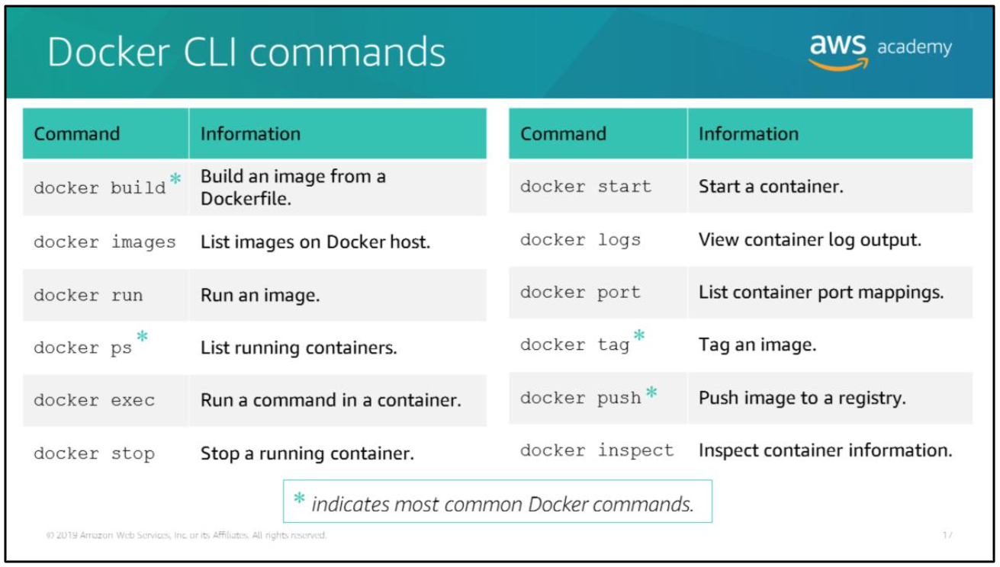
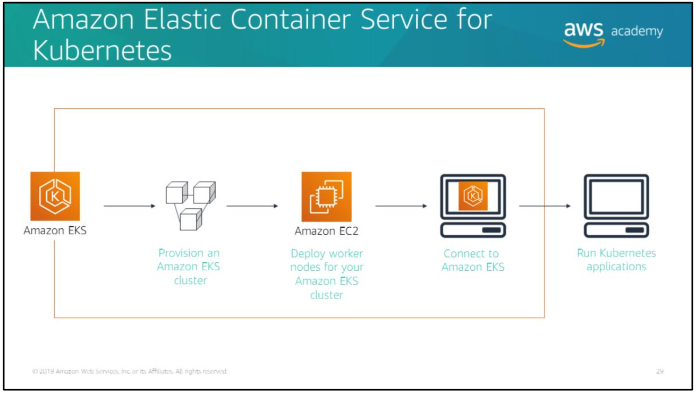

## Topics

- Introduction to containers
- Containers vs Hardware virtualization
- Microservices: use case for containers
- Amazon container orchestration services

> `RUN`: command when build container image  
> `CMD`: command to run container image

# Introduction containers

In computing platforms, a container is a standardized unit of software designed to run quickly and reliably on any computing environment that is running the containerization platform.

Container is a miniature operating system virtualization that contains everything a software application needs to run, such as the application code, runtime, system tools, system libraries, and settings. Containers can help ensure that applications deploy quickly reliably, and consistently regardless of deployment environment.

> What a miniature operating system virtualization means is, for the most part the virtualization relies on the main/host operating system for resources, such as kernel and other low level stuff. So, it's only emulate the interface of an operating system to access a certain application.

# Docker as a virtualization platform

Docker container:
- is lightweight container virtualization platform.
- provides tools to create, store, manage, and run containers.
- integrates with automated build, test, and deployment pipeline.

Docker container benefits:
- Portable runtime application environment.
- Application and dependencies can be packaged in a single, immutable artifact called an `image`.
- After you create a `container image`, the `container image` can go anywhere that Docker is supported.
- Run different application versions with different dependencies simultaneously.

## Docker container terminology

Docker container are created from a read-only template that is called an image. Images are built from a `Dockerfile`, which is a plain text file that specifies all of the components that are included in the container.

## Container images

## Dockerfile example

To build your own image, you create a `Dockerfile` using a simple syntax to define how to create the image and run it. Each instruction in a `Dockerfile` creates a read-only layer in the image.

### Example 1

In the example above, you start with the Ubuntu latest image that is already created for you, and hosted on Docker Hub or some other site. The only thing you do is add a command to echo the message `Hello world` after the container is running.

### Example 2

In the example above, you start with the open Java Development Kit (JDK) version 8 image, copy the .jar file that contains your code from your system to the container, and then call Java to run you code. When this container is instantiated, it runs the Java application

### Example 3

In the example above, you start with the CentOS 7 image. Next, you update the OS and install `Apache`. Then, you expose `Port 80`. Finally, you copy your shell script for your application and give it run permissions. After the container is instantiated, the command will run the shell script.

Each instruction in the `Dockerfile` creates a layer:
1. The first layer is the base layer, which includes the software update and the `Apache` installation.
2. The next layer opens and exposes `Port 80`.
3. The third layer includes command to copy the shell script.
4. Finally, the last layer makes the shell script run.

All those layers are read-only, which makes the container image an immutable object.

> If you change the `Dockerfile` and rebuild the image, only the layers that have changed are rebuilt. This feature is part of what makes container images so lightweight, small, and fast compared to other virtualization technologies.

## Docker CLI commands

> To open a bash prompt on your running, use `docker exec`  
> For more info: https://docs.docker.com/engine/reference/commandline/cli/

## Docker image vs container

Review:
- A *container image* is a read-only, immutable template that is highly portable. You can port it to any environment that supports docker, and it can be stored in a registry for easy reuse.
- A *container* is an instance of an image. You can run one container or several containers based on that image.
- Each *container* has a thin, read/write layer on top of the existing image when it is instantiated. This architecture is what makes the actual process of spinning up the containers fast. Most of the actual work is read-only because of the file system layers.

Docker uses a copy-on-write system, where changed files are written to the read/write layer of the container. The underlying image remains unchanged. This is why multiple containers can share access to the same underlying image, but still have their own data state. When the container is deleted, this writable container is also deleted.

> The read/write layer of the container enables your applications to function properly while they are running, but it's not designed for long-term data storage. Persistent data should be stored in a volume somewhere. Consider a container as a discrete compute unit, not a storage unit.

# Microservices

## Monolithic vs microservice architecture

Consider this example of a *monolithic architecture*:  
For each application, all the processes are tightly coupled and run as a single service. This means that if onee process of an application experiences a spike in demand, the entire architecture must be scaled.  
Adding or improving features becomes more complex as the code base grows, which limits experimentation and makes it difficult to implement new ideas.  
Monolithic architectures also add risk for application availability because having many dependent and tightly coupled processes increase the impact of a single process failure.

Now, consider the same three applications running in a *microservice architecture*:  
Each application is built as an independent component that runs as a service, and communicates by using lightweight API operations. Each service performs a single function that can support multiple applications. Because the service run independently, the can be updated, deployed, and scaled to meet the demand for specific functions of an application.

> A microservice architecture allows for much quicker iteration, automation, and overall agility. Start fast, fail fast, and recover fast.

## Characteristic of microservices

> Containers are the underlying technology that powers modern microservice architectures. Likewise, with microservice architectures, developers can take full advantage of containers.

### Decentralized, evolutionary design

Each container uses the language and technology that is best suited for the functioning of the service, instead of requiring users to use a specific language or a specific technology. Each component or system in the architecture is evolved separately, instead of updating the system in a monolithic style.

### Smart endpoints and dump pipes

There is no enterprise service bus. Data is not transformed when it's going between services. The service that receives the data should be smart enough to handle whatever data is sent.

### Independent products, not projects

In contrast to the traditional waterfall project model, think of a microservice as a separate product with its own inputs and outputs. No assumptions are made about the runtime environment. Containers enable you to package all your dependencies and libraries into a single immutable object.

### Designed for failure

Everything fails all the time. Services are designed to be resilient, redundant. Services are also designed to handle bad input, or to handle cases when the service that the microservice wants to communicate with is not there.

### Disposable

If something goes wrong, you can gracefully shut down what has failed and spin up a new instance. You start fast, fail fast, and release any file handlers. The development pattern is like a circuit breaker.

In traditional architectures, servers are named, deployed, evaluated, and remain pretty stable. By contrast, the cloud architecture is disposable and transitory. Containers are added and removed, workloads change, and resources are temporary because they constantly change.

### Development and production parity

Containers can make development, testing, and production environments consistent. This facilitates DevOps, in which a containerized application that works on a developer's system will work the same way on a production system.

# The challenge with managing containers

Running one or two containers on a single host is simple. However, what happens when you move into a staging environment where you have tens of hosts with possibly hundreds of containers?

Imagine a full production environment with hundreds of hosts and maybe thousands of containers. You are now managing an enterprise-scale, clustered environment, and cluster management is difficult. You need a way to place your containers intelligently on instances to maximize availability, resilience, and performance, which means that you must know the sate of everything in your system. You need a way to manage your containers at scale.

The situation before is where *container management platforms* come in. Container management platforms handle the scheduling and placement of containers based on the underlying hardware infrastructure and needs of the application.

The container management platforms integrate with other services, such as services for networking, persistent storage, security, monitoring, and logging.

.

## Amazon Elastic Container Service (Amazon ECS)

Amazon ECS is a container orchestration service that supports Docker containers.

You can use Amazon ECS to schedule the placement of containers across a managed cluster of Amazon Elastic Compute Cloud (Amazon EC2) instances.

Amazon ECS provides its own schedulers, but it can also integrate with third-party schedulers to meet business or application-specific requirements.

### Amazon ECS architecture

Here is a high-level overview of Amazon ECS:
1. First, container images are pulled from a registry. This registry can be Amazon Elastic Container Registry (Amazon ECR) or a third-party or private registry.
2. Next, you define your application. Customize the container images with the necessary code and resources, and then create the appropriate configuration files to group. Then, define your containers as short-running tasks or long-running services within Amazon ECS.
3. When you are ready to bring your services online, you select one of two launch types:
- The Fargate launch type provides a near-serverless experience, where the infrastructure that supports your containers is completely managed by AWS.
- The EC2 launch type is useful when you want more control over the infrastructure that supports your tasks. When you use the EC2 launch type, you create and manage clusters of EC2 instances to support your containers. You also define the placement of containers across your cluster based on your resource needs, isolation policies, and availability requirements.
- You can mix and match the two launch types as needed within your application. For example:  
You can launch services that have more predictable resource requirements by using EC2, and launch other services that are subject to wide swings in demand by using Fargate. Regardless of the launch type that you use, Amazon ECS manages your containers for availability, and it can scale your application as necessary to meet demand.

## Amazon Elastic Kubernetes Service (Amazon EKS)

Kubernetes manages clusters of EC2 instances, and it runs containers on those instances with processes for deployment, maintenance, and scaling. By using kubernetes, you can run any type of containerized application by using the same toolset on premises and in the cloud.

Amazon EKS is a managed service that runs the kubernetes management infrastructure across multiple AWS Availability Zones to reduce the change of having a single point of failure.

Amazon EKS is certified kubernetes conformant, so you can use existing tooling and plugins from partners and kubernetes community.

Applications that run on any standard kubernetes environment are fully compatible, and they can be migrated to Amazon EKS.

### Amazon EKS example process

When you select Amazon EKS as your container management service, you provision an Amazon EKS cluster and deploy Amazon EC2 worker nodes (that is, worker machines) for your Amazon EKS cluster. You then connect to Amazon EKS and run your kubernetes applications.

## Amazon Elastic Container Registry (Amazon ECR)

Amazon ECR is a cloud-based Docker image registry that makes it easy for you store, manage, and deploy Docker container images.

Amazon ECR integrates with Amazon ECS and the Docker CLI.

You can push your container images to Amazon ECR by using the Docker CLI from your development machine, and Amazon ECS can pull them directly for production deployments.

### Creating an Amazon ECR repo and pushing an image

You can use the AWS Command Line Interface (AWS CLI) and the Application Programming Interfaces (APIs) to create, monitor, and delete repo and set repo permissions. You can also perform those actions in the Amazon ECR console, which can be accessed from the Amazon ECS console.

Amazon ECR integrates with the Docker CLI, which allows you to push, pull, and tag images on your development machine.

The example above shows how to create a repo called `hello-world` with Amazon ECR:
1. Use Docker CLI commands to build and tag an image.
2. Push it into the repo. (In order to push an image into Amazon ECR, you must first authenticate the Docker client to your Amazon ECR registry.
