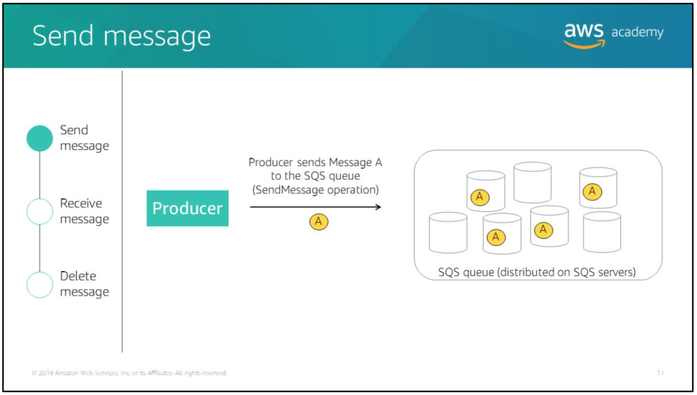
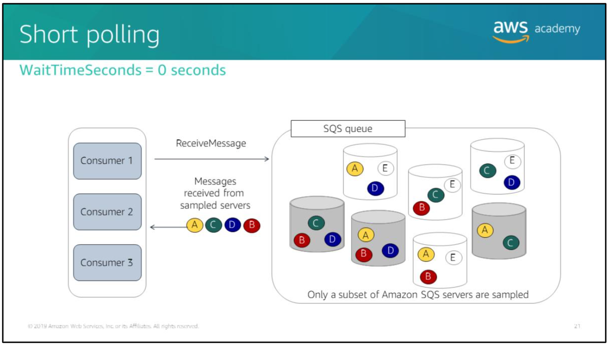

## Topics

- Intro to message queues
- Intro to Amazon SQS
- Amazon SQS developer concepts
- Intro to Amazon SNS
- Amazon SNS developer concepts
- Intro to Amazon MQ

# Message queues

In modern cloud architecture, applications are decoupled into smaller, independent building blocks that are easier to develop, deploy, and maintain. Message queues provide communication and coordination for these distributed applications.

A message queue is a temporary repo for messages that are waiting to be processed. Messages are usually small, and can be things like requests, replies, error messages, or plain information. Example of messages: customer records, product orders, invoices, patient records.

To send a message, a component that is called a *producer* adds a message to the queue. The message is stored in the queue until another component that is called a *consumer* retrieves and processes it.

## Synchronous process

Message queues enable you to create an asynchronous process.

Say that you have a producer and a consumer. The producer generates a message, notifies the consumer, and waits for the message to be processed. The consumer processes the message and notifies the consumer when it's done. The consumer then waits for the next message. As you can see, this is a very dependent process, where there is strong interdependency between the producer and the consumer. This interdependency creates a *tightly coupled system*.

### Disadvantage of a synchronous process

The disadvantage of a tightly coupled system is that *it is not fault-tolerant*. This means that if any component of the system fails, then the entire system will fail.

If the consumer fails while processing a message, then the producer will be forced to wait until that message gets processed (assuming that the message is not lost).

Additionally, if new consumer instances are launched to recover from a failure or to keep up with an increased workload, the producer must be explicitly made aware of the new consumer instances. In this scenario, the producer is tightly coupled with the consumer, and the coupling is prone to brittleness.

## Asynchronous process

A message queue is a component of asynchronous process.

In asynchronous system, the producer generates a message and puts it on the queue. The producer then generates another message and puts it on the queue. The producer does not have to wait for the first message to be read and processed before it puts the second message on the queue. Instead, the producer can continue to put messages on the queue whether they are being read by the consumer or not.

When the consumer reads a message off the queue and starts to process it, the producer is not impacted if this consumer fails. The producer can continue to put messages on the queue. There is no interdependency between the producer and the consumer, which makes for a more loosely coupled system. This solution has far greater fault tolerance.

### An asynchronous process is scalable

An asynchronous solution is also more scalable. You can add and remove producers and consumers as your application requires. A queue can support multiple producers and consumers. A single queue can be used simultaneously by many distributed application components, with no need for those components to coordinate with each other to share the queue.

# Amazon Simple Queue Service (Amazon SQS)

Amazon Simple Queue Service (Amazon SQS) is a fully managed message queueing service that enables you to decouple and scale microservices, distributed systems, and serverless applications.

You can use Amazon SQS to send, store, and receive messages between software components at any volume, without losing messages or requiring other services to be available.

Amazon SQS offers:
- Fully managed -> AWS manages all on-going operations underlying infrastructure that are required to provide a highly available and scalable message queueing service.
- Delivers messages reliably -> you can use Amazon SQS to transmit any volume of data at any level of throughput, without losing messages or requiring other services to be available. Amazon SQS enables you to decouple application components so that they run and fail independently, which increases the overall fault tolerance of the system. (Multiple copies of every message are stored redundantly across multiple Availability Zones so that they are available when they are needed)
- Scales elastically -> Amazon SQS uses the AWS Cloud to dynamically scale based on demand. There is no limit to the number of messages per queue, and standard queues provide nearly unlimited throughput.
- Cost effective -> Costs are based on usage.
- Keeps sensitive data secure -> Amazon SQS supports Server Side Encryption (SSE). SSE lets you transmit sensitive data in encrypted queues by using 256-bit Advanced Encryption Standard (AES) encryption. SSE protects the contents of messages in Amazon SQS queues by using keys that are managed in AWS Key Management Service (AWS KMS). AWS KMS is integrated with AWS CloudTrail to provide logs of all encryption key usage.

## Amazon SQS architecture example

Say you have an application that processes images. A user uploads a photo to your Amazon Simple Storage Services (Amazon S3) bucket, which triggers an AWS Lambda function. The Lambda function sends a message containing information about the image to an SQS queue. A processing server sitting behind an Amazon EC2 Auto Scaling group polls the SQS queue for messages to process. After processing the photo, the processing server sends the processed photo back to the Amazon S3 bucket.

> Note that the Auto Scaling group scales based on the size of the SQS queues. The processing servers keep working until the queue is empty, and then keep holding until messages appear. Further, if the backend processing servers went down, the Lambda function can keep generating messages and putting them on the queue until the Auto Scaling group was ready to start consuming messages again.

## Amazon SQS queue types

Amazon SQS supports two types of message queues:
- Standard queues (default queue type) -> ensure messages are delivered in the same order that they are sent. Support at-least-once message delivery. However, occasionally more than one copy of a message might be delivered out of order. Support a nearly unlimited number of Transactions Per Second (TPS) per action.
- First-In-First-Out (FIFO) queues -> designed to enhance messaging between applications when the order of operations and events is critical, or where duplicates can't be tolerated. Provide exactly once processing, but have a limited number of Transactions Per Second (TPS). Support up to 300 messages per second, per action without batching and up to 3000 messages per second, per action with batching.

## Amazon SQS queue type use cases

### Standard queue

You can use standard message queues in many scenarios, as long as your application can process messages that arrive more than once and out of order.

For example:  
- Decouple live user requests from intensive background work (let users upload media while resizing or encoding it).
- Allocate task to multiple worker nodes (process a high number of credit card validation requests).
- Batch messages for future processing (schedule multiple entries to be added to a database).

### FIFO queue

You can use FIFO queues for applications when the order of operations and events is critical, or in cases where duplicates can't be tolerated.

For example:
- Bank transactions (ensure that a deposit is recorded before a bank withdrawal happens).
- Credit card transactions (ensure that a credit card transaction is not processed more than once).
- Course enrollment (prevent a student from enrolling in a course before they register for an account).

## Amazon SQS message lifecycle

The lifecycle of Amazon SQS message:
1. A producer component sends a message to the SQS queue.
2. A consumer component retrieves the message from the queue. The visibility timeout period starts.
3. The consumer component processes the message and then deletes it from the queue during the visibility timeout period.

You can perform these actions with the `SendMessage`, `ReceiveMessage`, and `DeleteMessage` API calls, respectively, either programmatically or from the Amazon SQS console.

> There are a variety of configuration options that affect cost, message processing, and message retention.

## Send message

With Amazon SQS, you can use the `SendMessage` operation to send messages individually to a queue, or you can use the `SendMessageBatch` operation to send up to 10 messages to a queue. When a producer sends a message to an SQS queue, the queue redundantly stores the message across multiple Amazon SQS servers.

### `SendMessage` operation

`SendMessage` operation delivers a message to a specific queue. This operation takes the following request parameters:
- `MessageBody` *(required)* -> the message to send (max string size is 256 KB).
- `QueueUrl` *(required)* -> the url of the Amazon SNS queue where a message is sent.
- `MessageAttribute` (optional) -> Amazon SQS enables you to include structured metadata (such as timestamps, geospatial data, signatures, and identifiers) *message attribute*. Each message can have up to 10 attributes. Message attributes are separate from the message body (however, they are sent alongside it). Each message attribute consists of a name, type, and value.
- `DelaySeconds` (optional) -> the length of time, in seconds, to delay a specific message.

> After you send a message, Amazon SQS returns a `MessageId`, which is a system-assigned identifier that is useful for identifying messages.

## Receive message

You can retrieve one or more messages (up to 10) from the queue by using the `ReceiveMessage` operation. You set the number of messages that you want to retrieve by using the `MaxNumberOfMessages` parameter.

Each time you receive a message from a queue, you receive a *receipt handle* for that message. This handle is associated with the action of receiving the message, not with the message itself.

> If you receive a message more than once, you get a different receipt handle each time you receive it.

To delete the message or to change the visibility of the message, you must provide the receipt handle (not the message ID). Thus, you must always receive a message before you can delete it (you can't put a message into the queue and then recall it). The maximum length of a receipt handle is 1024 characters.

### Visibility timeout

When a consumer receives and processes a message from a queue, the message remains in the queue. **Amazon SQS doesn't automatically delete the message**.

Because Amazon SQS is a distributed system, there's no guarantee that the consumer actually receives the message (for example: because of a connectivity issue, or because of an issue in the consumer application). Thus, the consumer must delete the message from the queue after it receives and processes it.

*Visibility timeout* is a period of time where Amazon SQS prevents other consumers from receiving and processing the message.

> The default visibility timeout for a message is 30 seconds. The minimum is 0 seconds. The maximum is 12 hours. You set this value by using the `VisibilityTimeout` parameter.

The visibility timeout begins when Amazon SQS returns a message. During this time, the consumer processes and deletes the message. However, if the consumer fails before it deletes the message and your system doesn't delete the message before the visibility timeout expires, the message becomes visible to other consumers and the message is received again.

FIFO queues allow the producer or consumer to attempt multiple retries:
- If the producer detects a failed `SendMessage` action, it can retry sending as many times as necessary.
- If the consumer detects a failed `ReceiveMessage` action, it can retry as many times as necessary.

### Short polling model

Amazon SQS uses a polling model to retrieve messages from a queue.

By default, when you make a `ReceiveMessage` API call, Amazon SQS performs *short polling*, in which it samples a subset of servers (based on a weighted random distribution). It immediately returns only the messages that are on the sampled servers.

In the example above, short polling returns messages A, B, C, and D, but it doesn't return message E.

Short polling occurs when the `WaitTimeSeconds` parameter of a `ReceiveMessage` call is set to 0.

If the number of messages in the queue is small (fewer than 1000), you will most likely get fewer messages than you requested per `ReceiveMessage` call. If the number of messages in the queue is extremely small, you might not receive any messages from a particular `ReceiveMessage` call. If you keep requesting `ReceiveMessage`, Amazon SQS will sample all the servers and you will eventually receive all of your messages.

### Long polling model

With long polling, Amazon SQS queries all of the servers and waits until message is available in the queue before it sends a response.

Long polling helps reduce the cost of using Amazon SQS by eliminating the number of empty responses (when no messages are available for a `ReceiveMessage` request).

You can enable long polling by setting the `WaitTimeSeconds` parameter of the `ReceiveMessage` request to a non-zero value between 1 and 20 seconds.

### `ReceiveMessage` example

In the example of a query above, say we want to retrieves messages from a queue named `testQueue`. Here is the term explanation:
- `MaxNumberOfMessages` parameter is set to 5, which indicates the maximum number of messages to return.
- `WaitTimeSeconds` parameter is set to 10, which indicates that long polling is enabled.
- `VisibilityTimeout` parameter is set to 15, which indicates that the message will be invisible to other consumers for processing for 15 seconds.

## Delete message

To prevent a message from being received and processed again when the visibility timeout expires, the consumer must delete the message. You can use the `DeleteMessage` operation to delete a specific message from a specific queue, or you can use `DeleteMessageBatch` to delete up to 10 messages. To select the message to delete, use the receipt handle of the message.

Amazon SQS automatically deletes messages that have been in a queue longer than the queue's configured message retention period.

> The default message retention period is 4 days. However, you can set the message retention period to a value from 60 seconds to 1209600 seconds (14 days) by using the `SetQueueAttributes` action.

### `DeleteMessage` example

In the example above is a query request that deletes a message from a queue named `testQueue`.

The parameter `ReceiptHandle` is the receipt handle that's associated with the message to delete.

## Dead-letter queues

For messages that cannot be processed, you can create a dead-letter queue in Amazon SQS to receive message from other SQS queues (which are referred to as *source queues*) after the maximum number of processing attempts has been reached. Dead-letter queues can help you troubleshoot incorrect transmission operations.

Messages can be sent to and received from a dead-letter just like any other Amazon SQS queue. You can create a dead-letter queue from the Amazon SQS API or the Amazon SQS console.

The image above illustrate how to configure a dead-letter queue from the console. To configure the dead-letter queue:
1. Choose **Use Redrive Policy**.
2. Enter the name of the existing **Dead Letter Queue** where you want source queues to send messages.
3. Set **Maximum Receives** to configure the number of times that a message can be received before it is sent to a dead-letter queue.

## Amazon SQS queue operations

You can use `CreateQueue` API call to configure many of the same parameters. For example:  
You can enable long polling either by setting `WaitTimeSeconds` parameter for a `ReceivedMessage` call or by setting the `ReceiveMessageWaitTimeSeconds` parameter for a `CreateQueue` call.

Other basic queue:
- `SetQueueAttributes` and `GetQueueAttributes` -> set and retrieve the attributes of a queue, respectively. These options help you estimate the resources required to process SQS messages.
- `GetQueueUrl` -> retrieves the URL of an Amazon SQS queue.
- `ListQueues` -> retrieves a list of your queues.
- `DeleteQueue` -> deletes a queue regardless of whether the queue is empty. When a queue is deleted, any messages in the queue are no longer available.
> It is important to note that Amazon SQS can delete your queue without notification if actions like `SendMessage`, `ReceiveMessage`, `DeleteMessage`, and `GetQueueAttributes`, `SetQueueAttributes`, `AddPermission`, and `RemovePermissions` have not been performed on the queue for 30 consecutive days.

## Amazon SQS security

There are three ways to secure your Amazon SQS resources:
- AWS Identity and Access Management (IAM) policies and Amazon SQS policies -> access to Amazon SQS requires credentials that AWS can use to authenticate your requests. These credentials must have permissions to access AWS resources, such as Amazon SQS queues and messages. Amazon SQS has its own resource-based permissions system that uses policies that are written in the same language that is used for IAM policies. Thus, you can achieve similar things with Amazon SQS policies and IAM policies.
- Server Side Encryption (SSE) -> SSE lets you transmit sensitive data in encrypted queues. SSE protects the contents of messages in Amazon SQS queues by using keys that are managed in AWS Key Management Service (AWS KMS).
- Amazon Virtual Private Cloud (Amazon VPC) -> if you use Amazon VPC to host you AWS resources, you can establish a connection between you VPC and Amazon SQS. You can use this connection to send messages to your Amazon SQS queues without crossing the public internet.

# Amazon Simple Notification Service (Amazon SNS)

## Pub/sub messaging

Publish/subscribe (pub/sub) messaging provides instant event notifications for distributed applications.

The pub/sub model allows messages to be broadcast to different parts of a system asynchronously. To broadcast a message, a component called a *publisher* simply pushes a message to the topic.

Unlike message queues, which batch messages until they are retrieved, message topics transfer messages with no or little queuing, and push them out immediately to all *subscribers*. A subscriber will receive every message that is broadcast, unless it sets a message filtering policy.

> Examples of subscribers include web servers, email addresses, Amazon SQS queues, AWS Lambda functions.

The subscribers to the message topic often perform different functions, and can each do something different with the message in parallel. The publisher doesn't need to know who is using the information that it is broadcasting, and the subscribers don't need to know who the message comes from. This style of messaging is a little different from message queues, where the component that sends the message often knows the destination it is sending to.

> In the pub/sub messaging paradigm, notifications are delivered to clients using a *push mechanism* that eliminates the need to periodically check or poll for new information and updates.

## Amazon SNS

Amazon SNS provides topics for high-throughput, push-based, many-to-many messaging.

## Amazon SNS for pub/sub messaging

Amazon SNS coordinates and manages the delivery or sending of messages to subscribing endpoints or clients.

In Amazon SNS, there are two types of clients, publishers and subscribers.

Publishers communicate asynchronously with subscribers by producing and sending a message to a topic, which is a logical access point and communication channel.

Subscribers consume or receive the message or notification over one of the supported protocols. Amazon SNS supports notification deliveries to the following endpoint types: Lambda functions, SQS queues, HTTP(S), email, worldwide Short Message Service (SMS), and mobile push notifications.

When you create an Amazon SNS topic, you can control access to it by defining policies that determine which publishers and subscribers can communicate with the topic.

A publisher can send messages to topics they have created or to topics they have permission to publish to. Instead of including a specific destination address in each message, a publisher sends a message to the topic. Amazon SNS matches the topic to a list of subscribers who have subscribed to that topic. It then delivers the message to each of those subscribers.

Each topic has a unique name that identifies the Amazon SNS endpoint for publishers to post messages and subscribers to register for notifications. Subscribers receive all messages that are published to the topics that they subscribe to, and all subscribers to a topic receive the same messages.

### Use case: Fanout design pattern

When a message must be processed by more than one consumer, you can combine a message queue with pub/sub messaging in a *fanout design pattern*.

Fanout is when an Amazon SNS message is sent to a topic and then replicated and pushed to multiple Amazon SQS queues, HTTP endpoints, or email addresses. This allows for parallel asynchronous processing.

For example:  
You could develop an application that sends an Amazon SNS message to a topic when an order is placed for a product. Then, the Amazon SQS queues that are subscribed to that topic would receive identical notifications for the new order. The Amazon EC2 server instance that is attached to one of the queues could handle the processing or fulfillment of the order. The other server instance could be attached to a data warehouse for analysis of all orders that are received.

You could also use fanout to replicate data that is sent to your production environment to your development environment.

For example:  
You could subscribe yet another queue to the same topic for new incoming orders. Then, by attaching this new queue to your development environment, you could continue to improve and test your application by using data received from your production environment.

#### Fanout example: image processing

In the example above, when a user uploads images to an Amazon Simple Storage Service (Amazon S3) bucket for image processing, a message about the event is published to an SNS topic. Multiple SQS queues are subscribed to that topic.

When the SQS queues receive the message, they each invoke a Lambda function with the payload of the published message. The Lambda functions process the image (for example, generate thumbnail images, size images for mobile applications, or size images for web applications) and send the results to another S3 bucket.

## Amazon SNS operations

A few common API calls:
- `CreateTopic` -> creates a topic where notifications can be published. Users can create a maximum of 3,000 topics. If a requester already owns a topic with the specified name, that topic's Amazon Resource Name (ARN) is returned without creating a new topic.
- `Subscribe` -> Prepares to subscribe to an endpoint by sending a confirmation message to the endpoint. If the service was able to create a subscription immediately (without requiring endpoint owner confirmation), the response of the Subscribe request includes the ARN of the subscription. (To actually create a subscription, the endpoint owner must call the `ConfirmSubscription` action with the token from the confirmation message).
- `ConfirmSubscription` -> verifies an endpoint owner's intent to receive messages by validating the token that was sent to the endpoint by an earlier Subscribe action. If the token is valid, the action creates a new subscription and returns its ARN.
- `DeleteTopic` -> deletes a topic and all its subscriptions. Deleting a topic might prevent some messages that were previously sent to the topic from being delivered to subscribers.
- `Publish` -> sends a message to all of a topic's subscribed endpoints. When a `message ID` is returned, the message has been saved and Amazon SNS will attempt to deliver it to the topic's subscribers.

## Amazon SNS raw message delivery

Except for SMS messages, Amazon SNS messages can contain up to 256 KB of text data, including Extensible Markup Language (XML), JavaScript Object Notation (JSON), and unformatted text.

By default, when Amazon SNS sends a message to an Amazon SQS queue, it encodes the message as a JSON document that contains the message and metadata about the message. Enabling raw message delivery reduces the need for endpoints to process JSON formatting.

For example:  
When you enable raw message delivery for an Amazon SQS endpoint, the Amazon SNS metadata is not included and the published message is delivered to the subscribed Amazon SQS endpoint as-is.

In the example above, the publisher sent a JSON-formatted message to an Amazon SNS topic. Amazon SNS then published the message as-is to subscribers without adding Amazon SNS metadata.

## Filter policies

By default, an Amazon SNS topic subscriber receives every message that is published to the topic. To receive a subset of the messages, a subscriber must assign a filter policy to the topic subscription.

A filter policy is a simple JSON object that contains attributes that define which messages the subscriber receives. When you publish a message to a topic, Amazon SNS compares the message attributes to the attributes in the filter policy for each of the topic's subscriptions. If any of the attributes match, Amazon SNS sends the message to the subscriber. Otherwise, Amazon SNS skips the subscriber without sending the message.

If a subscription doesn't have a filter policy, the subscription receives every message that is published to its topic.

In the example above, an online buyer visits a website, cancels one order, and places another order. These messages are published to the SNS topic Shopping Events. The Payment SQS queue subscriber has a filter policy applied so it receives only the messages about the orders. The Lambda function subscriber has a filter policy to receive only the message that the product page was visited.

### Message filtering example

A subscription filter policy allows you to specify attribute names and assign a list of values to each attribute name.

To continue the ecommerce example, the Lambda function `SearchIndex` is subscribed to the SNS topic `ShoppingEvents` and a filter policy is attached to it. The filter policy has the attribute “`event_type`” with the value “`product_page_visited`”.

When you publish a message to a topic, Amazon SNS compares the message attributes to the attributes in the filter policy for each of the topic's subscriptions. If any of the attributes match, Amazon SNS sends the message to the subscriber.

In the e-commerce example, the message attribute “`event_type`” with the value “`product_page_visited`” matches only the filter policy that is associated with the search engine subscription. Therefore, only the Lambda function that is subscribed to the SNS topic is notified about this navigation event, and the Payment SQS queue is not notified.

## Amazon SNS security

You have a detailed control over which endpoints a topic allows, who is able to publish to a topic, and under what conditions.

There are three ways to secure Amazon SNS resources:
- AWS Identity and Access Management (IAM) policies and Amazon SNS policies -> Amazon SNS is integrated with IAM so that you can specify which Amazon SNS actions a user in your AWS account can perform with your Amazon SNS resources. You can specify a particular topics in the policy. An IAM policy can restrict access only to users within your AWS account, not other AWS accounts. You can use an Amazon SNS policy with a particular topic to restrict who can work with that topic (for example: who can publish messages to it and who can subscribe to it). Amazon SNS policies can give access to other AWS accounts, or to users within your own AWS account.
- Server Side Encryption (SSE) and AWS Key Management Service (AWS KMS) -> SSE lets you transmit sensitive data in encrypted topics. SSE protects the contents of messages in Amazon SNS topics by using keys that are managed in AWS KMS.
- Amazon Virtual Private Cloud (Amazon VPC) -> if you use Amazon VPC to host your AWS resources, you can establish a private connection between your VPC and Amazon SNS. With this connection, you can publish messages to your Amazon SNS topics without sending them through public internet.

# Amazon MQ

Amazon MQ is a managed message broker service that provides compatibility with many popular message brokers.

Message brokers allow different software systems (which often use different programming languages and are on different platforms) to communicate and exchange information.

Amazon MQ supports open standard APIs and protocols for messaging, including Java Message Service (JMS), .NET Message Service (NMS), Advanced Message Queuing Protocol (AMQP), Streaming Text Oriented Messaging Protocol (STOMP), MQ Telemetry Transport (MQTT), and WebSocket. You can move from any message broker that uses these standards to Amazon MQ, usually without needing to rewrite any messaging code. In most cases, you can simply update the endpoints of your applications to connect to Amazon MQ and start sending messages.

## The difference between Amazon MQ and (Amazon SQS and Amazon SNS)

Amazon MQ is a managed message broker service that provides compatibility with many popular message brokers. Amazon SQS and Amazon SNS are queue and topic services, respectively, that are highly scalable, simple to use, and don't require you to set up message brokers.

The use case:
- If you use messaging with existing applications, and want to move your messaging to the cloud quickly and easily, we recommend using Amazon MQ. It supports open standard APIs and protocols so you can switch from any standards-based message broker to Amazon MQ without rewriting the messaging code in your applications.
- If you are building new applications in the cloud, we recommend using Amazon SQS and Amazon SNS. Amazon SQS and Amazon SNS are lightweight, fully managed message queue and topic services, respectively, that scale almost infinitely and provide simple, easy-to-use APIs. You can use Amazon SQS and Amazon SNS to improve reliability and to decouple and scale microservices, distributed systems, and serverless applications.

## Amazon MQ use case: Hybrid cloud environment

Many organizations, particularly enterprises, rely on message brokers to connect and coordinate different systems. Message brokers enable distributed applications to communicate with each other.

In many cases, these organizations have started to build new cloud-native applications or to lift-and-shift applications to AWS. There are some applications, such as mainframe systems, that are too costly to migrate. In these cases, the on-premises applications must still interact with cloud-based components.

Amazon MQ enables organizations to send messages between applications in the cloud and applications that are on-premises to enable hybrid environments and application modernization.

For example:  
You can invoke AWS Lambda from queues and topics that are managed by Amazon MQ brokers to integrate legacy systems with serverless architectures.

The example above shows that you can use Amazon MQ to integrate on-premises and cloud environments by using the network of brokers feature of ActiveMQ. The diagram shows the message lifecycle from the on-premises producer to the on-premises broker, which traverses the hybrid connection between the on-premises broker and Amazon MQ.Finally, the message moves to consumption within the AWS Cloud.
