## Topics

- Intro to serverless computing with AWS Lambda
- Overview of how AWS Lambda works
- Models for invoking Lambda functions
- AWS Lambda permissions
- Overview of authoring and configuring Lambda functions
- Overview of deploying Lambda functions

> AWS CloudFormation to collect your application's components into a single package that can be deployed and managed as one resource.

# Serverless computing

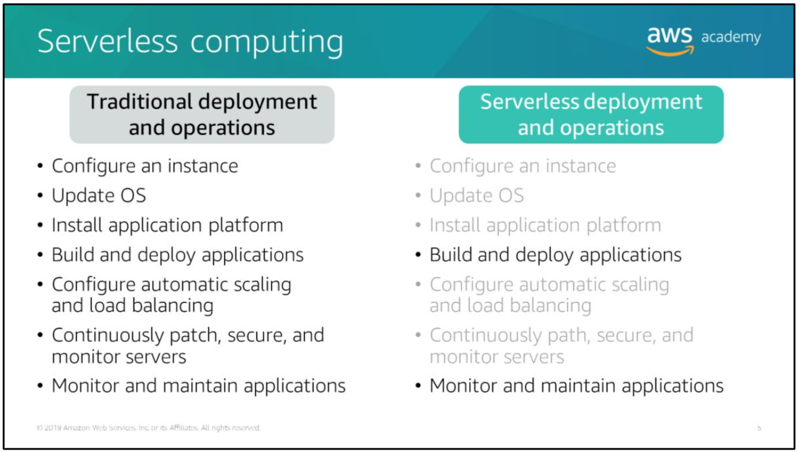

One of the benefits of cloud computing is that you can abstract the infrastructure layer so you don’t have to worry about operational tasks.

For example:  
You can choose an Amazon Elastic Compute Cloud (Amazon EC2) instance type and configure it with Elastic Load Balancing and EC2 Auto Scaling to handle demand. Serverless computing extends the infrastructure abstraction even further.

Serverless computing allows you to focus on the code for your applications. You do not have to manage instances,operating systems, or servers.

# AWS serverless platform

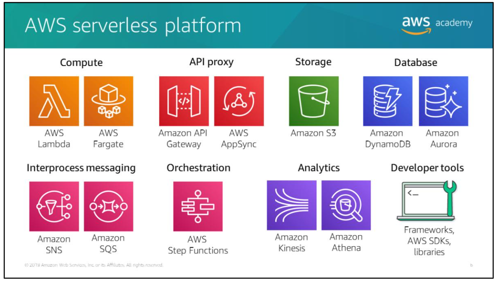

Developer tools (such as the AWS Serverless Application Model (AWS SAM)) help simplify the development of serverless applications.

# AWS Lambda

AWS Lambda:
- Lets you run code without provisioning or managing servers.
- Triggers your code in response to events that you configure.
- Scales automatically based on demand.
- Incorporates built-in monitoring and logging with Amazon CloudWatch.

## AWS Lambda features

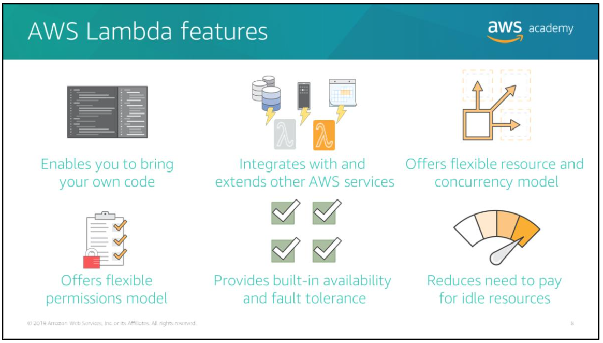

AWS Lambda provides the following features:
- Enables you to bring your own code -> you can bring your code (written in your language of choice, such as Node.js, Java, Python, C#, Go, or Ruby), custom runtimes, and libraries.
- Integrates with and extends other AWS services -> from within your Lambda function, you can do anything traditional applications can do, e.g., calling an AWS software development kit (SDK), invoking a third-party application programming interface (API), etc.
- Flexible resource and concurrency model -> lambda scales in response to events. You configure memory settings, and AWS handles the details, such as CPU, network, and I/O throughput.
- Flexible permissions model -> lambda uses AWS Identity and Access Management (IAM) to securely grant access to your resources and give you fine-grained control for invoking your functions.
- Provides built-in availability and fault tolerance -> because Lambda is a fully managed service, high availability and fault tolerance are integrated into the service, without any additional configuration on your part.
- Reduces the need to pay for idle resources -> lambda functions only run when triggered, so you never pay for idle capacity.

## AWS Lambda use cases

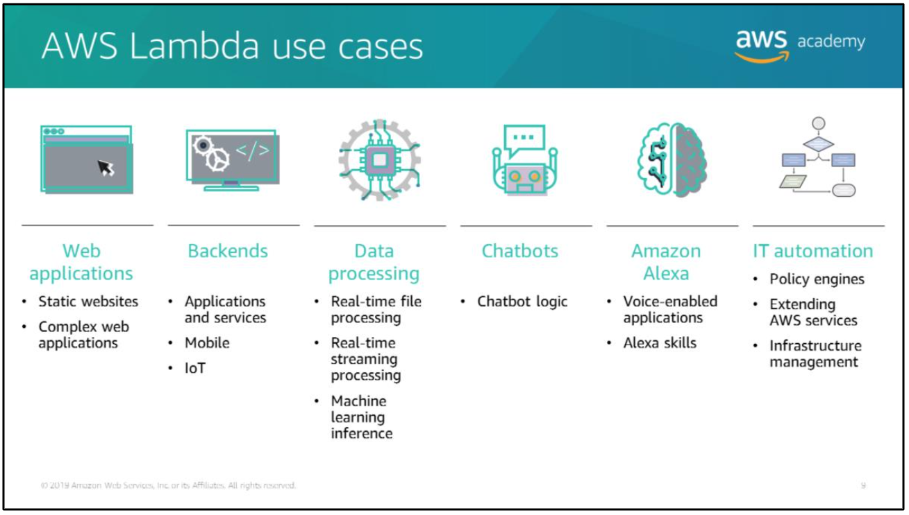

Use cases:
- Web applications
- Backends -> build serverless backends using AWS Lambda to handle web, mobile, Internet of Things (IoT), and third-party Application Programming Interface (API) requests, build backends using AWS Lambda and Amazon API Gateway to authenticate and process API requests.
- Data processing -> you run code in response to triggers, such as changes in data, shifts in system state, or actions by users.
- Chatbots -> Amazon Lex is a service for building conversational interfaces into any application using voice and text. Amazon Lex uses the same deep learning technologies that power Amazon Alexa, and it integrates with AWS Lambda.
- Amazon Alexa -> build the backend for custom Alexa skills.
- IT automation -> automate repetitive processes by triggering them with events or by running them on a fixed schedule.

## How AWS Lambda works

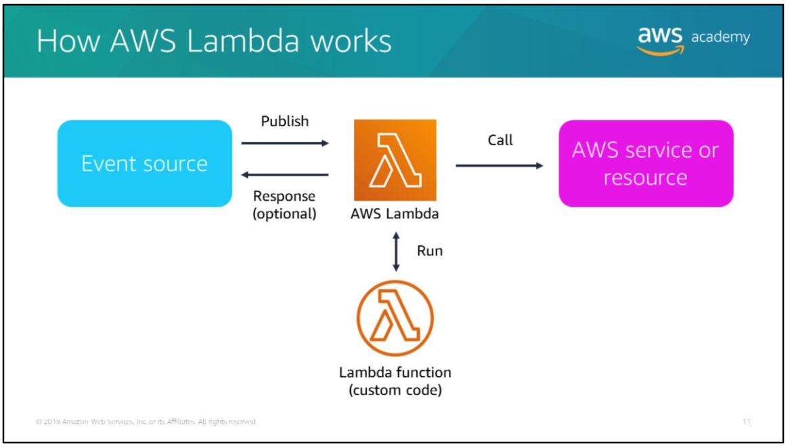

An event source is the entity that publishes events to AWS Lambda, and a Lambda function is the custom code you provide that processes the events. AWS Lambda runs your Lambda function on your behalf.

> Note about event sources: AWS Lambda integrates with other AWS services to invoke functions. You can configure triggers to invoke a function in response to resource lifecycle events, respond to incoming HTTP requests, consume events from a queue, or run on a schedule.

## Lambda functions

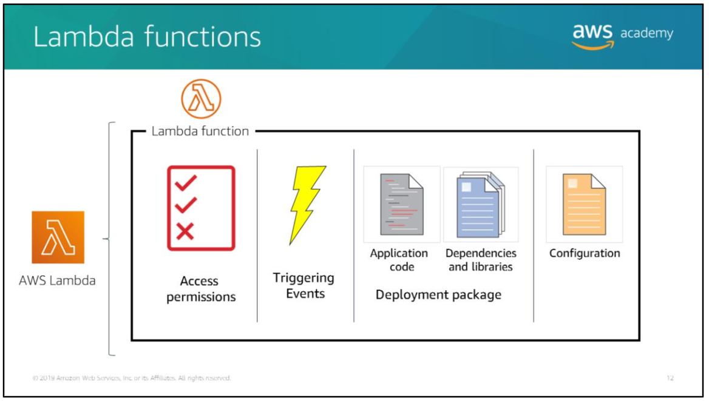

When you create a function, you define the permissions for the function and specify which events trigger the function. You also create a deployment package that includes your application code and any dependencies and libraries that are necessary to run your code. Finally, you configure parameters such as memory, time out, and concurrency.

When your function is invoked, Lambda will provide a runtime environment based on the runtime and configuration options that you selected.

> You can create a mapping between an event source and your Lambda function. AWS Lambda will read items from the event source and trigger the function.

## Push and pull models

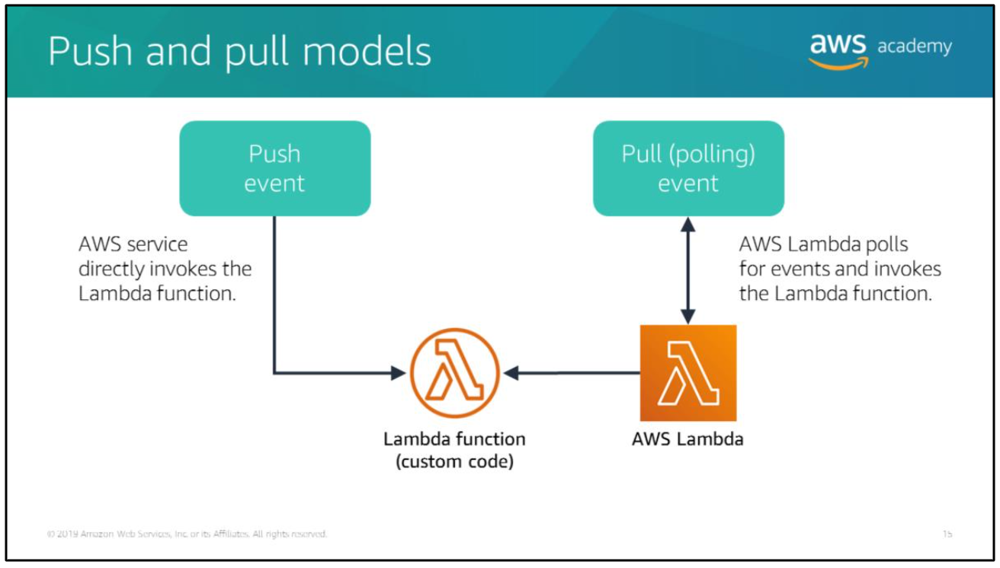

Each event source invokes a Lambda function by using either a push or a pull model:
- Push model -> and event source directly invokes the Lambda function when the event occurs.
- Pull (or polling) model -> an event source puts information into a stream or queue. AWS Lambda pulls the stream or queue and invokes your Lambda function when it detects an event.

### Push event types

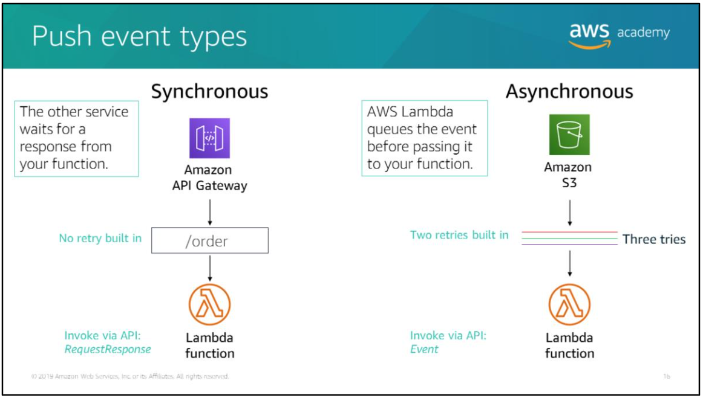

In both cases, you invoke your Lambda function using the Invoke operation, and you can specify the invocation type as synchronous or asynchronous.

When you use an AWS services as a trigger, the invocation type is predetermined for each service. You have no control over the invocation type that these event sources use when they invoke your Lambda function.

#### Synchronous invocation

For synchronous invocation, the other service waits for the response from your function.

Consider an example where Amazon API Gateway is the event source. In this case, when a client makes a request to your API, that client expects a response immediately.

With this model, there is no built-in retry in Lambda. You must manage your retry strategy in your application code.

> Example of synchronous event sources:  
Elastic Load Balancing, Amazon Cognito, Amazon Lex, Amazon Alexa, Amazon API Gateway, AWS CloudFormation, and Amazon CloudFront, and Amazon Kinesis Data Firehose.

#### Asynchronous invocation

For asynchronous invocation, AWS Lambda queues the event before passing it to your function.

The other services gets a success response as soon as the event is queued and isn't aware of what happens afterwards.

If an error occurs, AWS Lambda will automatically retry the invocation twice. It can send failed events to a dead-letter queue that you configure.

> Example of asynchronous event sources:  
Amazon Simple Storage Service (Amazon S3), Amazon Simple Notification Service (Amazon SNS), Amazon Simple Email Service (Amazon SES), AWS CloudFormation, Amazon CloudWatch Logs, Amazon CloudWatch Events, AWS CodeCommit, and AWS Config.

### Pull event types

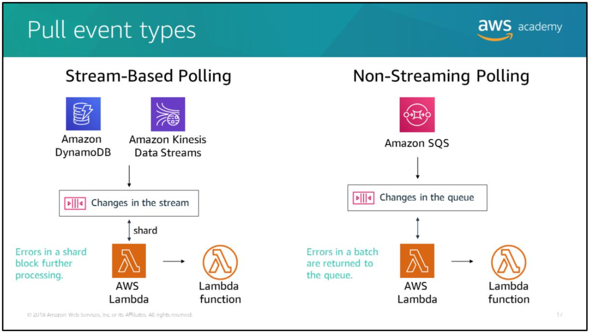

In the pulling model, event sources put information into a stream or queue. AWS Lambda pulls the stream or queue. If it finds records, it will deliver the payload and invoke the Lambda function.

In this model, the Lambda service itself is pulling data from the stream or queue for processing by the Lambda function.

#### Stream-based event sources

Stream-based event sources include Amazon DynamoDB and Amazon Kinesis Data Streams. Stream records are organized into shards.

AWS Lambda pulls the stream for records and attempts to invoke the function. If there's a failure, AWS Lambda will not read any new shards until the failed batch of records expires or is processed successfully.

#### The non-streaming event sources

The non-streaming event sources is Amazon SQS.

Amazon Lambda pulls the queue for records. If the invocation fails or times out, then the failed message is returned to the queue. Lambda will keep retrying the failed message until it's processed successfully or the message retention period expires.

If the message expires, it will either go to the dead-letter queue (if configured) or it will be discarded.

## AWS Lambda permissions

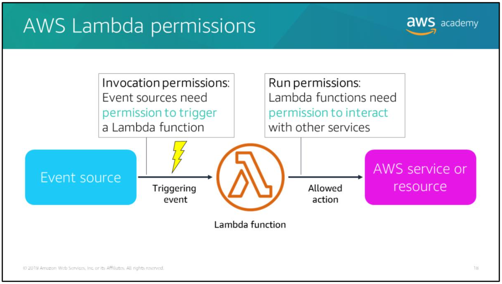

AWS Lambda has two types of permissions:
1. Event sources need permission to trigger a Lambda function (invocation permissions).
2. Lambda functions need permission to interact with other AWS services and resources (run permissions).

> Permissions are handled through AWS Identity and Access Management (IAM).

### Invocation permissions

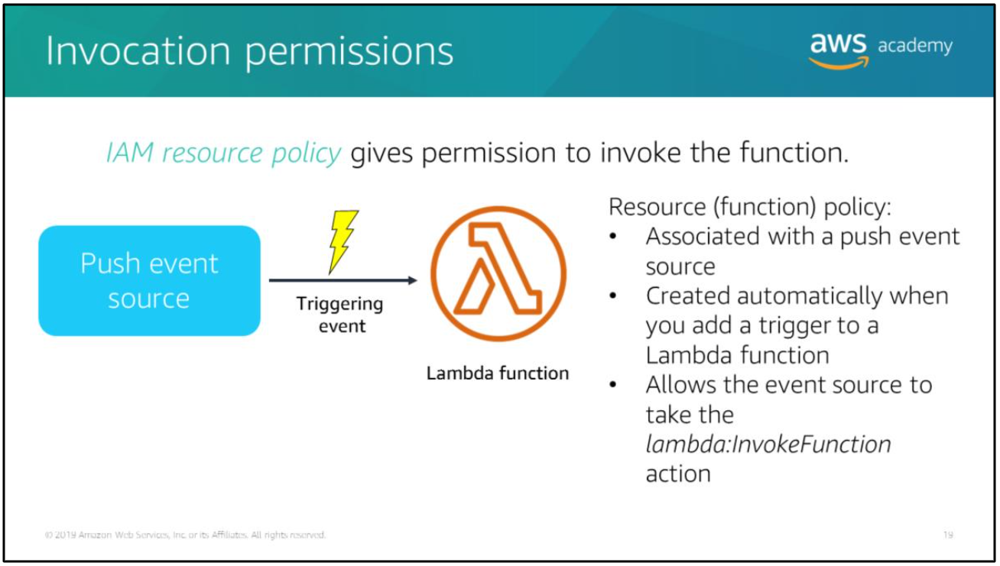

An *IAM resource policy* tells the Lambda service which push event sources have permission to invoke the Lambda function.

Resource policies also make it easy to grant access to the Lambda function across AWS accounts.  
For example:  
If you need an S3 bucket in account A to invoke your Lambda function in account B, you can create a resource policy that allows account A to invoke the function in account B.

The resource policy for a Lambda function is called a *function policy*. When you add a trigger to your Lambda function from the AWS Lambda console, the function policy will be generated automatically. It allows the event source to take the `lambda:InvokeFunctionaction`.

#### Resource (function) policy example

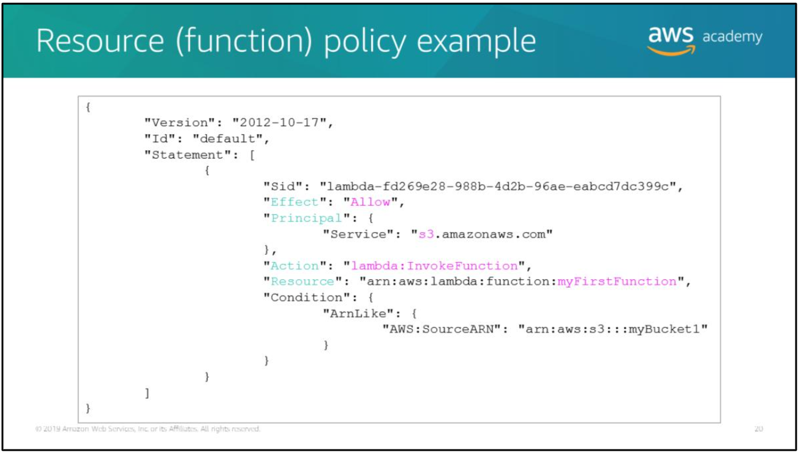

In the example above, the resource policy gives Amazon S3 permission to invoke the Lambda function called `myFirstFunction`.

### Execution role

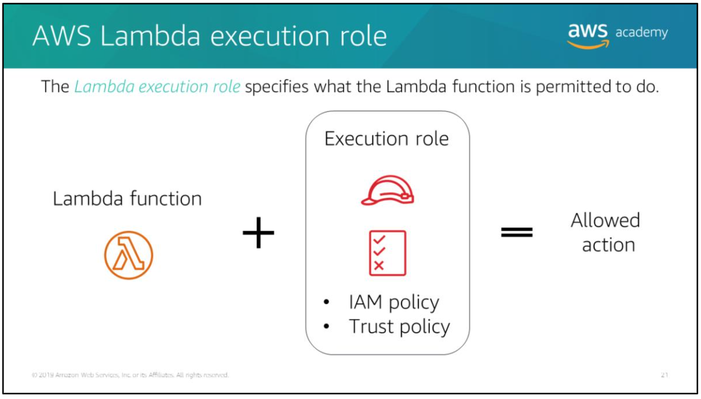

The *Lambda execution role* grants your Lambda function permission to access AWS services and resources. You select or create the execution role when you create a Lambda function.

Two policies are attached to the execution role:
- IAM policy -> defines the actions that the Lambda function is allowed to take another AWS service or resources, such as writing to a DynamoDB table.
- Trus policy -> allows the AWS Lambda service to assume the execution role.

> To grant permission to AWS Lambda to `AssumeRole`, you must have permission for the `iam:PassRole` action.

#### Execution role example

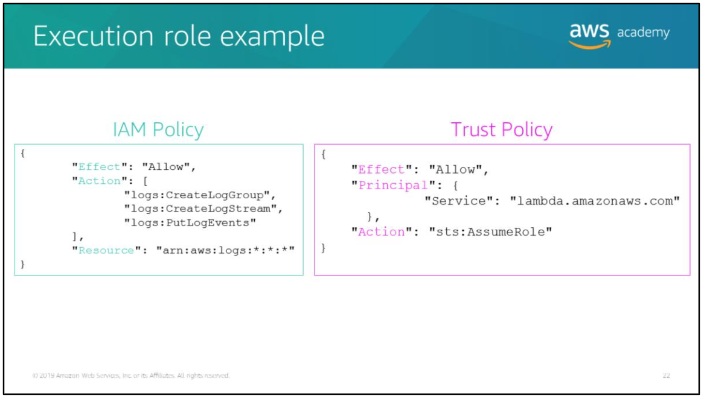

Above is a couple of examples of the relevant policy lines for an execution role:
- In the example, the IAM policy allows your Lambda function to perform the following Amazon CloudWatch Logs actions: create a log group and log stream, and write to the log stream.
- In the example, the trust policy gives the AWS Lambda service permission to assume the role and invoke the Lambda function on you behalf.

## Create Lambda deployment package

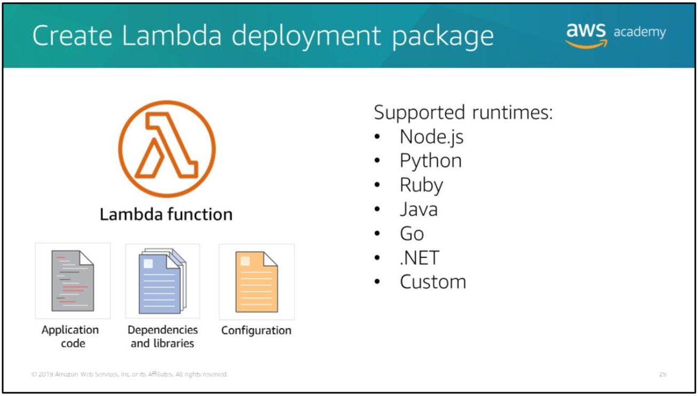

To create a Lambda function, you first create a Lambda function deployment package, which is a `.zip` or `.jar` file that consists of your code and any dependencies.

AWS Lambda supports multiple languages through the use of runtimes. Lambda supports the Node.js, Python, Ruby, Java, Go, and .NET runtimes. You can also implement a custom runtime if you want to use another language in Lambda.

> You choose a runtime when you create a function, and you can change runtimes by updating your function's configuration.

## Specify the function handler

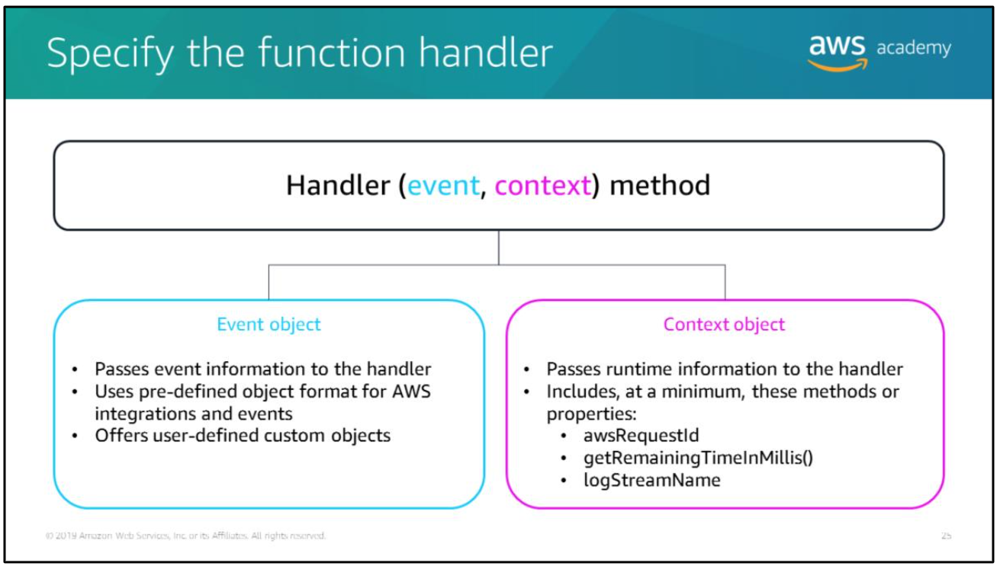

When you create a Lambda function, you specify the function handler. The Lambda *function handler* is the entry point that AWS Lambda calls to start running your Lambda function.

The handler method always takes two objects:
- Event object
- Context object

### Event object

Event object provides information about the event that triggered the Lambda function. This could be a pre-defined object that an AWS service generates, or it could be a custom user-defined object in the form of a serializable string, such as a POJO (plain old Java object) or a JavaScript Object Notation (JSON) stream.

The contents of the event object include all the data and metadata that your Lambda function needs todrive its logic. The contents and structure of the event object vary, depending on which event source created it.

For example:  
An event that is created by Amazon API Gateway contains details that are related to the HTTPS request that was made by the API client, such as path, query string, and request body. However, an event that is created by Amazon S3 includes details about the bucket and the new object.

### Context object

Context object was generated by AWS and provides runtime information.

The context object allows your function code to interact with the Lambda runtime environment.

The contents and structure of the context object vary based on the language runtime that your Lambda function uses. However, at a minimum, the context object will contain:
- `awsRequestId` -> this property is used to track specific invocations of a Lambda function (important for error reporting or when contacting AWS support).
- `logStreamName` -> the CloudWatch log stream that your log statements will be sent to.
- `getRemainingTimeInMillis()` -> this method returns the number of milliseconds that remain before running your function times out.

## Design a Lambda function: Example

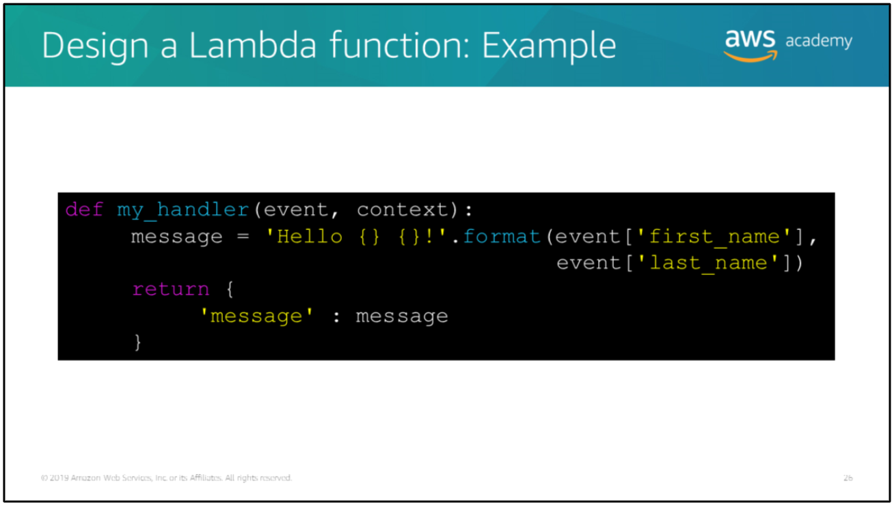

The example above is a Lambda function that is written in Python. It defines a handler function that is called `my_handler`. The function returns a message that contains data from the event it received as input.

Note that each language has its own requirements for how a function handler can be defined and referenced within the deployment package.

## Design a Lambda function: Best practices

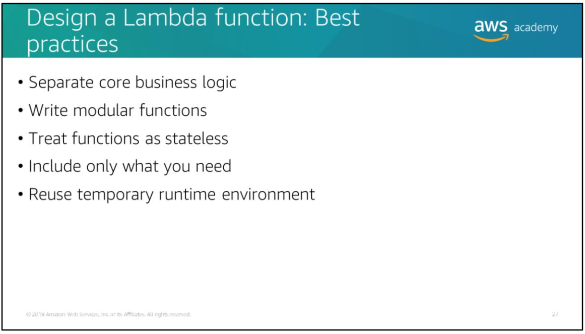

Here are some best practices to follow when you are designing your Lambda function:
- Separate core business logic from the handler method -> This makes your code more portable and enables you to target unit tests at your code without worrying about the configuration of the function.
- Write modular functions -> Create single-purpose functions.
- Treat functions as stateless -> No information about state should be saved within the context of the function itself. Because your functions only exist when there is work to be done, it’s important for serverless applications to treat each function as stateless.
- Only include what you need:
	- Minimize both the size and  the dependencies of your deployment package. For example:  
	Choose only the modules that you need (such as Amazon DynamoDB and Amazon S3 software development kit (SDK) modules, Lambda core libraries) and don’t include an entire AWS SDK library in your deployment package.
	- Reduce the time it takes Lambda to unpack deployment packages that are authored in Java.
	- Minimize the complexity of your dependencies. For example:  
	Choose Dagger or Guice instead of more complex frameworks like Spring Framework.
- Reuse temporary runtime environment to improve the performance of your function -> temporary runtime environment initializes any external dependencies of your Lambda function code. Make sure any externalized configuration or dependencies that your code retrieves are stored and referenced locally after the initial run. Limit re-initializing variables and objects on every invocation. Keep alive and reuse connections (such as HTTP, database,etc) that were established during a previous invocation.

## Create a Lambda function: Best practices

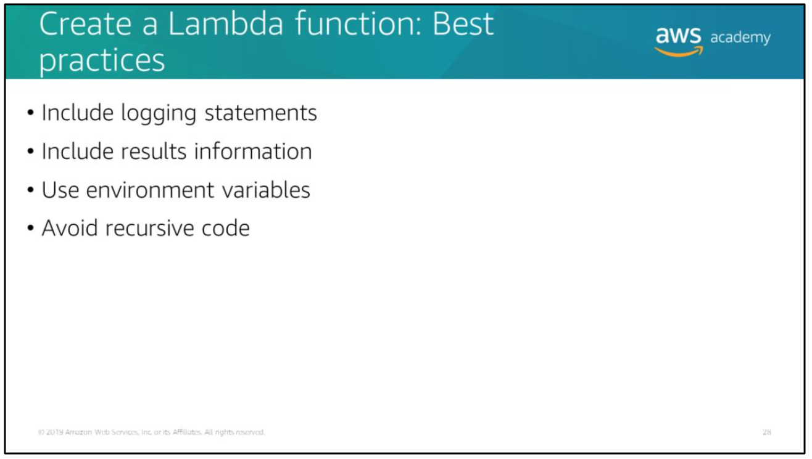

Here are some best practices to follow when you are writing code:
- Include logging statements -> Lambda functions can and should include logging statements that are written to CloudWatch.
- Include results information -> Functions must give AWS Lambda information about the results of their run. For example:  
If you are writing to an S3 bucket, configure the bucket name as an environment variable instead of hard coding the bucket name. You can also use environment variables to store sensitive information that is required by the function.
- Avoid using recursive code -> Avoid a situation where a function calls itself. This could continue to spawn new invocations that would make you lose control of your concurrency.

## Upload Lambda deployment package

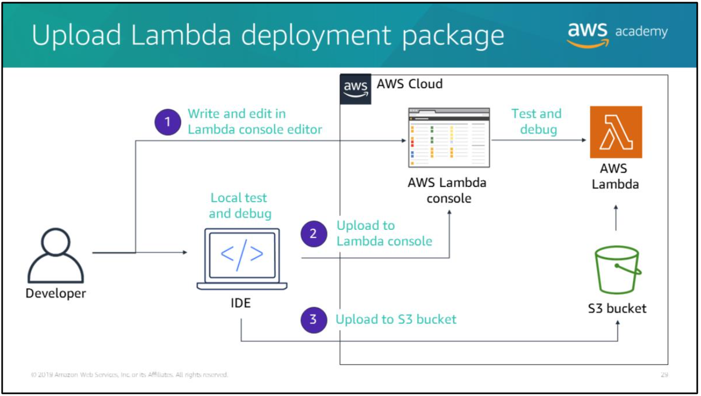

You can author Lambda functions in three different ways:
- Lambda console editor -> if your code doesn't require custom libraries (other than the AWS SDK), then you can edit your code inline through the AWS Management Console. The console will compress your code (with the relevant configuration information) into a deployment package that the Lambda service can run.
- Upload to the AWS Lambda console -> In an advanced scenario where your code requires custom libraries, you can create your deployment package in your IDE, and then upload it through the AWS Lambda console.
- Upload to Amazon S3 -> You can also upload your deployment package to an S3 bucket and provide the S3 bucket, object key, and optional version for the object. AWS Lambda will load your code directly from Amazon S3.

## Configure Lambda function

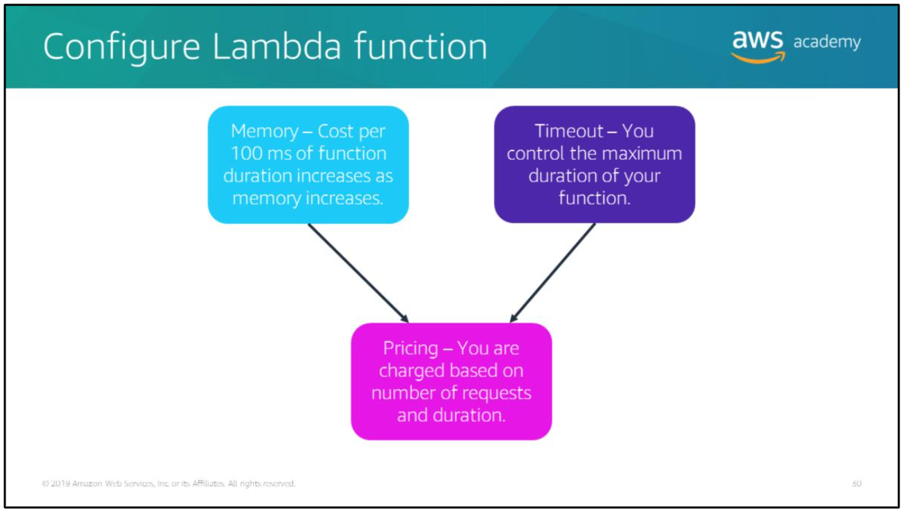

Memory and timeout are configurations that determine how your Lambda function performs. These configurations affect your billing.

With AWS Lambda, you are charged based on the number of requests for your functions (the total number of requests across all your functions) and the duration (the time it takes for your code to run).

> The price depends on the amount of memory you allocate to your function.

### Memory

You specify the amount of memory you want to allocate to your Lambda function. Lambda then allocates CPU power that is proportional to the memory. Lambda is priced so that the cost per 100 ms of function duration increases as the memory configuration increases.

### Timeout

You can control the maximum duration of your function by using the timeout configuration. Using a timeout can prevent higher costs that come from long-running functions. You must find the right balance between not letting the function run too long and being able to finish under normal circumstances.

### Best practices

- **Test the performance of your Lambda function** to make sure that you choose the optimum memory size configuration. You can view the memory usage for your function in Amazon CloudWatch Logs.
- **Load-test your Lambda functions** to analyze how long your function runs and determine the best timeout value. (This is important when your Lambda function makes network calls to resources that might not be able to handle the scalling of Lambda functions)

## Versioning Lambda function

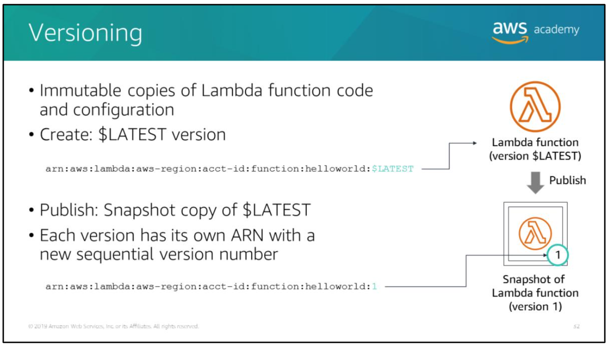

Versioning allows you to publish one or more versions of your Lambda function. As a result, you can work with different variations of your Lambda function in your development workflow, such as development, beta, and production.

When you create a Lambda function, there is only one version, the $LATEST version. You can refer to this function using its Amazon Resource Name (ARN).

When you publish a new version, AWS Lambda makes a snapshot copy of the $LATEST version to create the new version. The new version has a unique ARN that includes a new sequential version number.

## Aliases

Conceptually, an alias is a pointer to a specific Lambda function version. You can use the alias in the Amazon Resource Name (ARN) to reference the Lambda function version that is currently associated with that alias.

Using an alias makes it easy to promote or roll back versions without changing any code. Aliases abstract the need to know which version is being referenced.

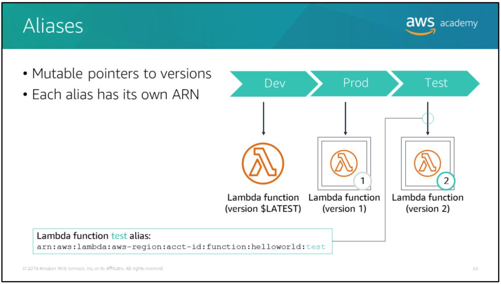

In the example above, the test alias points to version 2 of the Lambda function.

## Example using versioning and aliases

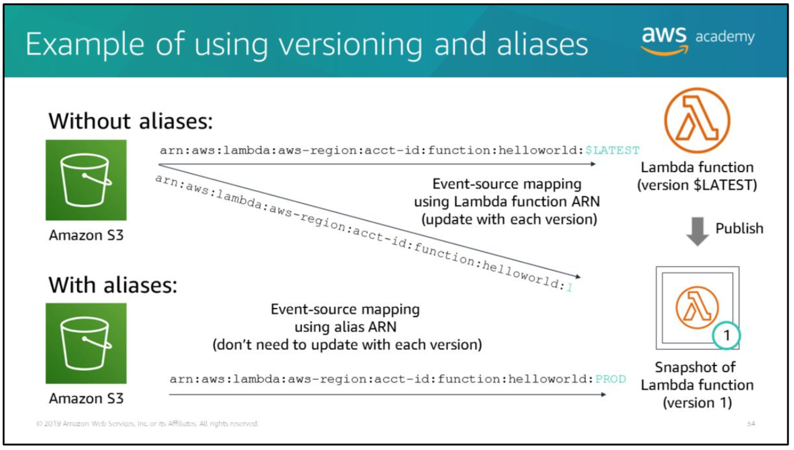

Suppose that Amazon S3 is the event source that invokes your Lambda function when new objects are created in a bucket. When Amazon S3 is your event source, you store the information for event-source mapping in the configuration for bucket notifications. In that configuration, you can identify the Lambda function ARN that Amazon S3 can invoke. However, in this case, you must update the notification configuration so that Amazon S3 invokes the correct version each time you publish a new version of your Lambda function.

Instead of specifying the function ARN, you can specify an alias ARN in the notification configuration (for example, you can specify the PROD alias ARN). As you promote new versions of your Lambda function into production, you only need to update the PROD alias to point to the latest stable version. You don't need to update the notification configuration in Amazon S3.

## Lambda layers

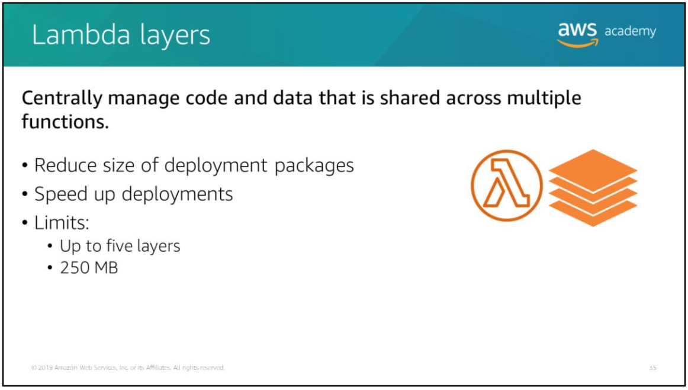

When you build serverless applications, it is common to have code that is shared across Lambda functions. It can be custom code that is used by more than one function, or a standard library that you add to simplify the implementation of your business logic.

Previously, you had to package and deploy this shared code together with all the functions that used it. Now, you can configure your Lambda function to include additional code and content as layers.

A layer is a `.zip` archive that contains libraries, a custom runtime, or other dependencies. With layers, you can use libraries in your function without needing to include them in your deployment package.

> For Node.js, Python, and Ruby functions, you can develop your function code in the Lambda console as long as you keep your deployment package under 3 MB.

A function can use up to five layers at a time. The total unzipped size of the function and all layers can't exceed the unzipped deployment package size limit of 250 MB.

> For more info how to use layers: https://aws.amazon.com/blogs/aws/new-for-aws-lambda-use-any-programming-language-and-share-common-components
