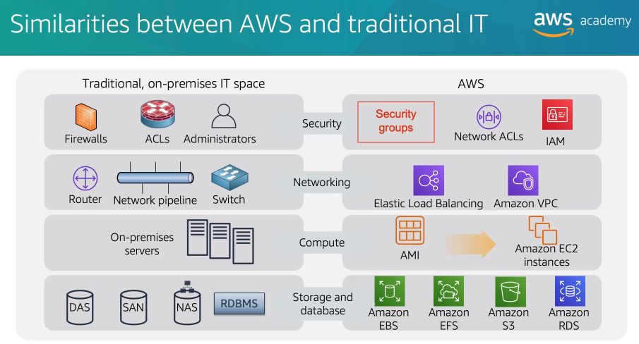
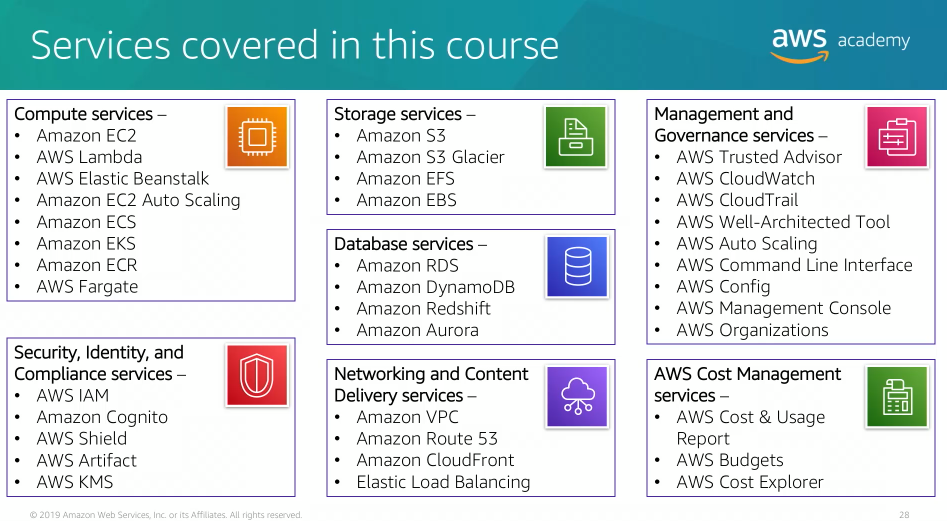

## Goals module 1
- Define different types of cloud computing models
- Describe six advantages of cloud computing
- Recognize the main AWS service categories and core services
- Review the AWS Cloud Adoption Framework (AWS CAF)

# Cloud computing defined

Cloud computing is the on-demand delivery of compute power database, storage, applications, and other IT resources via the internet with pay-as-you-go pricing.

Cloud computing enables you to stop thinking of your infrastructure as hardware, and instead think of it as software. What does that mean?
- In the traditional compute model, infrastructure is thought of as hardware. Hardware solutions are physical, which means they require space, staff to maintain it, physical security, planning, and capital expense.
- With a hardware solution, you must ask if there's enough resource capacity or sufficient storage to meet your needs. Your provision capacity guessing theoritical maximum peaks and if you don't meet your projected maximum peak, then you pay for expensive resources that stay idle and don't render you any benefit. And if you exceed your projected maximum peak, then you don't have sufficient capacity to meet your needs and your customers do not receive the service that they desire.

Cloud computing enables you to think of your infrastructure as software. Software solutions are flexible, that means you can select cloud services that best match your needs, provision them, and terminate their use based on your demand.

# Cloud service models

There are three main cloud service models:
- IaaS (Infrastructure as a Service) -> more control over IT resources
- PaaS (Platform as a Service)
- SaaS (Software as a Service) -> less control over IT resources

## Infrastructure as a service

Infrastructure as a service are the basic building blocks for your cloud information technology, and typically provide you with access to networking features, computers (whether it's virtual or dedicated), and provide storage space

Infrastructure as a service provides you with the highest level of flexiblility and control over your IT resources.

## Platform as a service

Platform as a service removes the need for you to manage the underlying infrastructure (usually this relates to the hardware and operating system). It does it through automation and allows you to focus on the deployment and management of your applications as opposed to the provisioning.

## Software as a service

Software as a service provides you with a complete product that is run and managed by the service provider. In most cases, software as a service refers to end-user applications. With software as a service, you don't have to think about how the service is maintained or how the underlying infrastructure is managed, you only need to think about how you will use that particular piece of software.

A common example of software as a service is a web-based email application.

# Cloud computing deployment models

There are three main cloud computing deployment models. Each of these represent the cloud environment that your applications can be deployed in. The three are:
- Cloud
- Hybrid
- On-premises (private cloud)

## Cloud deployment implementation

A cloud-based application is fully deployed in the cloud, in the all-in-the-cloud type of implementation. All parts of your application will be running in the cloud.

Application in the cloud have either been created in the cloud or have been migrated from an existing infrastructure. To take advantages of the cloud computing, your applications then can be built-on low-level infrastructure pieces, or you can use higher level services that provide abstraction from the management, architecting, and scaling requirements of your core infrastructure.

## Hybrid deployment implementation

In hybrid implementation, the deployment is such a way that to connect your existing infrastructure and applications to a cloud-based resources. They're not located in the cloud, they're located in your physical facilities.

## On-premises deployment implementation

Deploying resources on-premises use virtualization and resource management tools (sometimes called private cloud). It's sometimes sought for its ability to provide dedicated resources.

In most cases, the deployment model is the same as a legacy information technology infrastructure, while using application management and virtualization technology to try and increase resource utilization.

# Similarities between AWS and traditional IT

- AWS security group and Network Access Control Lists (ACLs) are similar to firewalls.
- AWS Identity and Access Management (IAM) is similar to user provisioning and Access Control Lists (ACLs).
- Elastic Load Balancing and Amazon Virtual Private Cloud (VPC) represent your cloud networking infrastructure, which compares to routers, network pipelines, and switches.
- Amazon Machine Images (AMI) are used to initialize Amazon EC2 instances, they're similar to your on-premise virtual servers.
- Amazon Elastic Block Store (EBS) represents a harddisk that attaches to your virtual machines and is equivalent to a direct attached storage.
- Amazon Elastic File System (EFS) also attaches to your virtual machines, but it represents a traditional storage are network.
- Amazon Simple Storage Service (S3) provides the ability for you to store files using the internet and is similar to network attached storage.
- Amazon Relational Database Service (RDS) is the equivalent to your physical relational database management system.

# Advantages of cloud computing

## Trade capital expense for variable expense

Capital expenses (capex) are funds that a company uses to acquire, upgrade, and maintain physical assets, such as property, industrial buildings, or equipment. You must pay for everything in the data center, whether you use it or not.

By contrast, a variable cost is a cost that you can easily alter or avoid by using cloud computing. Instead of investing heavily in data centers and servers before you know how you will use them, you can pay only when you consume resources and pay only for the amount that you consume. It also enables you to adapt to new applications with as much space as you need in minutes instead of weeks or days.

## Massive economies of scale

By using cloud computing you can achieve a lower variable cost than you can get on your very own. Because usage from hundreds of thousands of customers is added up in the cloud and providers such as AWS can achieve higher economies of scale that translate into lower pay-as-you-go prices to you.

## Stop guessing capacity

Eliminate guessing about your infrastructure capacity needs. When you make decisions about capacity before you deploy an application, you often either have expensive idle resources, or deal with limited capacity. With cloud computing, you can access as much or as little as you need, and scale up and down as required with only a few minutes notice.

## Increase speed and agility

In cloud computing environment, new information technology resources are only a click away.

## Stop spending money on running and maintaining data centers

Focus on projects that differentiate your business instead of focusing on the infrastructure. Cloud computing enables you to focus on your own customers instead of the manual racking, stacking, and powering of servers.

## Go global in minutes

You can deploy your application in multiple AWS Regions around the world with just a few clicks.

# What are web services?

A web service is an application that is provisioned using the internet. We only concern ourselves with what type of dataset we provision to the service in order to do its job and then we worry about what dataset the service gives us back as a response.

So in general, a web service is a piece of software that makes itself available over the internet or you can actually have it on your private network. A web service normally uses a standarized format for the input dataset as well as the output dataset, the format can be extensible markup language (XML) or javascript object notation (JSON).

# What is AWS?

Amazon Web Service (AWS) is a cloud platform that offers a broad set of global cloud-base products

The billing for AWS services becomes an operational expense instead of a capital expense, that means that you pay for what you use, when you use it.

# Choosing a service

## Amazon EC2 (Elastic Cloud Compute)

When you want complete control over your AWS compute resources and infrastructure.

## AWS Lambda

When you want to run code and not manage or provision servers.

## AWS Elastic Beanstalk

Allows you to provision a service that then deploys, manages, and scales your web applications automatically for you.

## Amazon Lightsail

A cloud platform for a simple web application. Use it when you just want to launch a web application in a straightforward way.

## AWS Batch

Use it when you run hundreds of thousands of batch workloads and you need to run them reliably.

## AWS Outposts

Use it when you want to run AWS infrastructure in your on-premises data center.

## Amazon Elastic Container Service, Amazon Elastic Kubernetes Service, or AWS Fargate

Implement a containers or a microservices architecture

## VMware Cloud on AWS

Use it when you have an on-premise server virtualization platform that you want to migrate to AWS.

# Three ways to interact with AWS

- AWS Management Console (browser-based interface)
- Command Line Interface (AWS CLI)
- Software Development Kits (Access directly from your code)

# AWS Cloud Adoption Framework (AWS CAF)

Organizes guidance into six areas of focus called Perspectives.

## Focus on business capabilities

- Business
- People
- Governance

## Focus on technical capabilities

- Platform
- Security
- Operations
