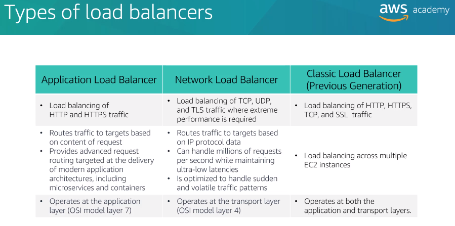
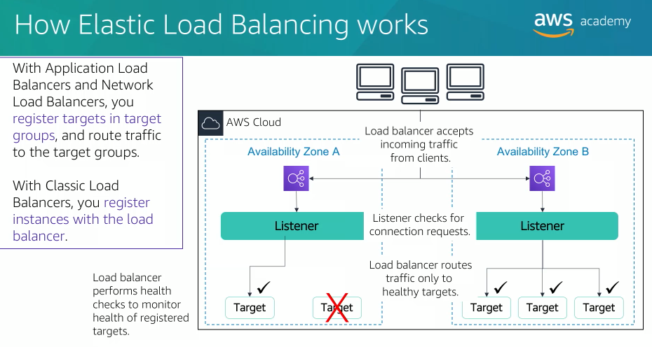
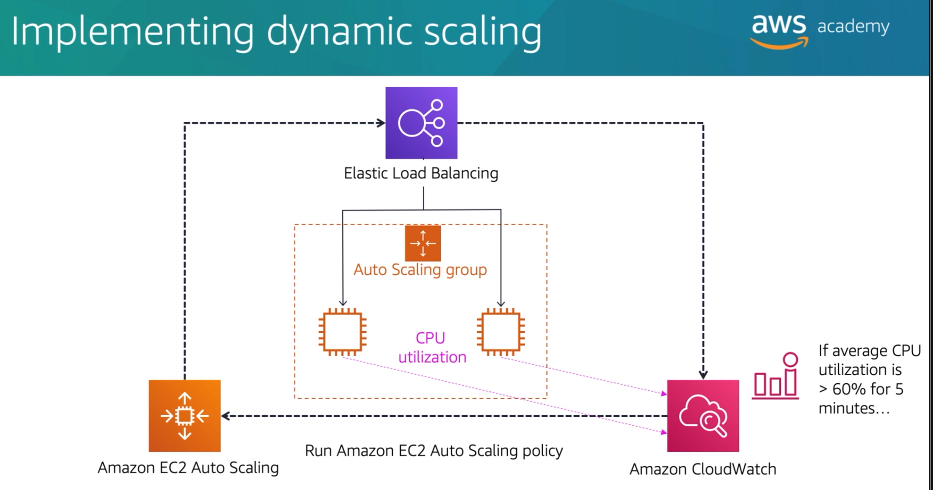

## Topics

- Elastic Load Balancing
- Amazon CloudWatch
- Amazon EC2 Auto Scaling

# Elastic Load Balancing

Elastic Load Balancing is an AWS service that distributes incoming application or network traffic across multiple targets, such as EC2 instances, containers, IP addresses, and Lambda functions in a single Availability Zone or across multiple Availability Zones.

Elastic Load Balancing scales your load balancer as traffic to your application changes over time.

There are three types of Elastic Load Balancing:
- Application Load Balancer -> it routes traffic to targets based on content of the request, for advanced load balancing of HTTP and HTTPS traffic.
- Network Load Balancer -> it routes traffic to targets based on IP protocol data, for load balancing both TCP and UDP traffic.
- Classic Load Balancer (previous generation) -> operates at both the application level and network transport level, supports the load balancing of application that use HTTP, HTTPS, TCP, and SSL protocols.

## How Elastic Load Balancing works

You configure your load balancer to accept incoming traffic by specifying one or more listeners. A listener is a process that checks for connection requests, it is configured with a protocol like HTTP and a port number such as port 80.

You can also configure your load balancer to perform health checks which are used to monitor the health of the registered targets so that the load balancer only sends requests to the healthy instances.

When the load balancer detects an unhealthy target, it stops routing traffic to that target, it then resumes routing traffic to that target when it detects that target is healthy again.

## Load balanceer monitoring

A few ways to monitor your load balancer:
- Amazon CloudWatch metrics
- Access logs
- AWS CloudTrail logs

# Amazon CloudWatch

Amazon CloudWatch is a monitoring and observability service that is built for DevOps engineers, developers, site reliability engineers, and IT managers.

Amazon CloudWatch monitors your AWS resources and the applications that you run on AWS in real-time.

Other things you can do with Amazon CloudWatch:
- Alarms -> send notifications for certain event
- Events -> define rules to match changes in AWS environment and route these events to one or more target functions or streams for processing.

# Amazon EC2 Auto Scaling

A launch configuration is a template that an Auto Scaling group uses to launch EC2 instances. When you create a launch configuration, you specify information for the instances such as the AMI, the instance type, a key pair, security group and disks.
