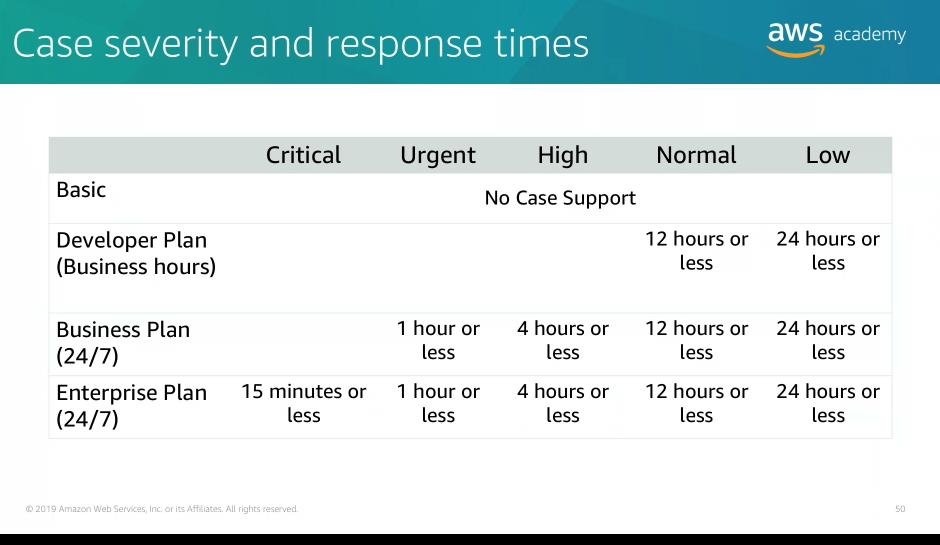

## Topics

- Fundamentals of pricing
- Total cost of ownership
- AWS organizations
- AWS billingand cost management
- Technical support

## Goals module 2

- Explain AWS pricing philosophy
- Recognize fundamental pricing characteristics
- Indicate the elements of total cost of ownership
- Discuss the results of the AWS Pricing Calculator
- Identify how to set up an organizational structure that simplifies billing and account visibility to review cost data
- Indentify the functionality in the AWS Biling Dashboard
- Describe how to use AWS Bills, AWS Cost Explorer, AWS Budgets, and AWS Cost and Usage Reports
- Identify the various AWS technical support plans and features

# AWS pricing model

There are three fundamentals drivers of costs with AWS:
- Compute -> charged per hour/second (linux only), varies by instance type
- Storage -> charged typically per GB
- Outbound data transfer -> charged typically per GB

In most cases, there is no charge for inbound data transfer (with some exceptions), data that you put into AWS is free. Also, data transfer between services in the same region is free. For outbound data transfers, it's aggregated accross services and then charged at the outbound data transfer rate. This charge appears on the monthly statement as AWS data transfer out.

## Pay less by using more

Get volume-based discounts and realize important savings as your usage increases. For services like Amazon S3, pricing is tiered which means that you pay less per GB when you use more.

AWS storage services offer options to help you lower pricing based on how frequently you access your data.

# Custom Pricing

If none of AWS pricing models work for your project, custom pricing is available for high volume projects with unique requirements.

# AWS Free Tier

For one year (new user):
- Amazon EC2 T2 microinstance
- Amazon S3
- Amazon EBS for storage
- etc

Services with no charge:
- Amazon VPC
- AWS Elastic Beanstalk (there might be charges associated with other AWS services that are used with these services)
- Auto scaling (there might be charges associated with other AWS services that are used with these services)
- AWS CloudFormation (there might be charges associated with other AWS services that are used with these services)
- AWS Indentity and Access Management (IAM)

# On-premises vs cloud

The difference between on-premises and cloud implementation is how they're deployed.

An on-premises infrastructure is installed on a company's own computers and servers. There are several fixed costs, also known as capital expenses, that are associated with this traditional infrastructure. Capital expenses include facilities, hardware, licenses, and maintenance staff.

A cloud infrastructure is purchased from a service provider who builds and maintains the facilities, hardware, and maintenance staff. A Customer pays for what is used.

# Total Cost of Ownership (TCO)

Total cost of ownership (TCO) is a financial estimate intended to help buyers and owners determine the direct and indirect cost of a product or system. TCO includes the cost of a service plus all the costs that are associated with owning the service.

In the cloud environment, TCO is used to compare the cost of running an entire infrastructure environment for specific workload in an on-premises or co-location facility to the same workload running on a cloud-based infrastructure.

# AWS pricing calculator

Help you estimate a monthly AWS bill. You can use this tool to explore AWS services and create an estimate for the cost of your use cases on AWS.

You can model your solutions before building them, explore the price points and calculations behind your estimate, and find the variable instances types and contract terms that meet your needs.

The AWS pricing calculator enables you to name your estimate and to create and name groups of services. Groups are containers that you add services to in order to organize and build your estimate. Within a group, you can see the estimated cost for each service.

# AWS Organizations

Use AWS Organizations for consolidated billing of multiple accounts.

AWS Organizations is a free account management service that enables you to consolidate multiple AWS accounts into an organizational tree with each branch representing a department or team.

You can also use AWS Organizations to apply security controls to one or more of the accounts represented.

AWS Organizations does not replace associating AWS Identity and Access Management (IAM) policies with users, groups, and roles within an AWS account.

An IAM policy can be applied only to IAM users, groups, or roles, and it cannot restrict the AWS account itself. In contrast, with AWS Organizations you use service control policies to allow or deny access to particular AWS services for AWS accounts directly, or as a group of accounts in a branch.

# Organizations setup

1. Create your organization with your current AWS account as the primary account, and also invite one AWS account to join your organization and create another account as a member account.
2. Create two organizational units (OU) in your new organization and place the member accounts in those OUs
3. Create service control policies, which enables you to apply restrictions to what actions can be delegated to users and roles in the member accounts. A service control policy is a type of oragnizational control policy.
4. Test your organizational's policies. Sign in as a user for each of the roles such as OU1 and see how the service control policies impact account access. Alternatively, you can use IAM policy simulator to test and troubleshoot IAM and resource-based policies that are attached to IAM users, groups, or roles in your AWS account.

# Accessing AWS Organizations

- AWS Management Console (browser-based interface)
- AWS Command Line Interface (AWS CLI)
- Software Development Kits (SDKs)
- Https Query Application Programming Interface (API)

# AWS Billing and Cost Management

AWS Billing and Cost Management is a service that you use to pay your AWS bill, monitor your usage, and budget your expenses.

You can set a custom time period and determine whether you would like to view your data at a monthly or daily level of granularity.

## AWS Billing Dashboard

Lets you view the status of your month-to-date AWS expenses and identify the services that account for the majority of your overall monthly bill.

### Tools in Billing Dashboard

- AWS Budgets
- AWS Cost and Usage Report
- AWS Cost Explorer

## Bills Page

Lists the costs that you incurred over the past month for each AWS service, with a further breakdown by AWS region and linked account.

## Cost Explorer Page

For viewing your AWS cost data as graph. Visualize, understand, and manage your AWS Costs and usage over time

## Budgets Page

To create a notifications when you go over your budget for the month. Budgets can be tracked at the monthly, quarterly, or yearly level, and you can customize the start and end dates.

Budget alerts can be sent via email or via Amazon Simple Notification Service (SNS).

## Reports Page

Info about your AWS costs and usage. Lists the usage for each service category that is used by an account and its users in hourly or daily line items and any tax that you activated for tax allocation purposes.

You can have AWS publish billing reports to an S3 Bucket, these reports can be updated once a day.

# Support plans

- Basic support:
	- Resource center access
	- Service health dashboard
	- Product FAWs
	- Discussion forums
	- Support for health checks

- Developer support: Support for early development on AWS
- Business support: Customers that run production workloads
- Enterprise support: Customers that run business and mission-critical workloads

# A few knowledge check question

1. For services like Amazon EC2 and Amazon Relational Database Service (RDS), you can invest in reserved capacity.
> What options are available for Reserved Instances? AURI (All Upfront Reserved Instance), NURI (No Upfront Reserved Instance), PURI (Partial Upfront Reserved Instance).

2. When are free data transfers applicable accross AWS?
> Free inbound data transfer for Amazon Elastic Compute Cloud (EC2) instances and free outbound data transfer between AWS services within the same region.
