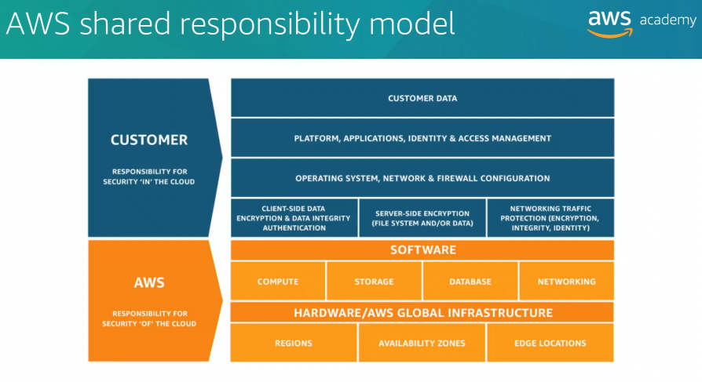

## Topics

- AWS shared responsibility model
- AWS Identity and Access Management (IAM)
- Securing a new AWS account
- Securing accounts
- Securing data on AWS
- Working to ensure compliance

# AWS shared responsibility

AWS is responsible for the security of the cloud, customers are reponsible for the security in the cloud.

# AWS Identity and Access Management (IAM)

The service which allows you to define users and the type of access that they will be allowed to have.

IAM handles authentication and verification of access for a user, role, role, or a specific resource.

# Identity and Access Management (IAM) Essentional Components

- IAM user -> a person or application that can authenticate with an AWS account.
- IAM group -> a collection of IAM users that are granted indentical authorization.
- IAM policy -> the document that defines which resources can be accessed and the level of access to each resource.
- IAM role -> a mechanism for granting temporary access to AWS services.

# Authenticate as an IAM user to gain access

You can assign two different types of access to users:
- Programmatic access -> if granted, user will be required to present an access key ID and secret access key when they make an AWS API call by using AWS CLI or AWS SDK.
- AWS management console access -> if granted, user will be required to fill at least their username and password.

# IAM authorization

The idea of users groups and roles having zero access when they are created relates to the principle of least privilege. This is the principle of applying the minimal set of permissions need to perform a particular task.

# IAM policies

There are two types of IAM policies:
- Identity-based policies -> permission policies that you can attach to a principal or identity, such as IAM user, role, or group.
- Resource-based policies -> attach to a resource, such as AWS S3 bucket.

If there is a competition between an allow statement and a deny statement, the deny statement always wins.

Inline Policy, which is a policy assigned to just one User or Group. Inline Policies are typically used to apply permissions for one-off situations.

# IAM groups

- A user can belong to multiple groups
- Groups cannot be nested -> a group can contain only users and cannot contain other groups.

# IAM role

IAM role is an IAM identity that you can create in your account and that has specific permissions. Instead of being uniquely associated with one person, a role is intended to be assumable by anyone who needs it.

A role does not have standard long term credential such as a password or access keys associated with it. Instead, you assume a role and the role provides you with temporary security credentials for your role session.

# AWS root account

When you first create an AWS account, you begin with a single identity that has complete access to all AWS services. This identity is called the AWS root account and it's accessed by signing into the AWS Management Console with the email address and password that you used to create the account.

The AWS root account has full access to all resources in the account, do not use this account for day-to-day interactions. Instead, use Identity and Access Management (IAM) to create users, assign permissions to these users, and then follow the principle of least privilege.

## To stop using the root account user

1. While you're logged in as the account root user, create an IAM user for yourself. Save the access keys if needed.
2. Create an IAM group, give it full administrator permissions and add the IAM user to the group.
3. Enable a password policy for all users.
4. Before you start using this new user, make sure to disable and remove your root account access key if they exist.
5. To begin using your new administrator access account, copy the sign in link from Identity and Access Management (IAM) Console dashboard page and sign out as the root user.
6. Finally, browse to the sign in link that you copied and sign to the console using your new user credentials (such as password).

# AWS CloudTrail

AWS CloudTrail is a service that logs all API requests to resources in your account. AWS CloudTrail is the baseline login service in order to answer the who, the what, the when, and the where of your API interactions. AWS CloudTrail keeps a record of the last 90 days of account management event activity, but you can extend the retention period beyond 90 days if needed.

# Security features of AWS Organizations

- Group multiple accounts into organizational units (OU) and attach different access policies to each OU (policies in AWS Organizations are called Service Control Policies)
- Supports Identity and Access Management (IAM) and expands that control to the account level if needed, by giving you control over what users and roles in an account can do (similar to IAM)

## Service Control Policies (SPCs)

Service Control Policies (SPCs) offer central control over the maximum available permissions for all accounts in your organization, enabling you to ensure that your accounts stay in your organization's access control guidelines.

Service Control Policies (SPCs) are available only in an organization that has all features enabled, including consolidated billing. Service Control Policies (SPCs) are not available if your organization has enabled only consolidating billing feature.

Service Control Policies (SPCs) are similar to Identity and Access Management (IAM):
- they use almost the same syntax
- SCP never grant permissions
- SCP are JSON syntax policies that specify the maximum permissions for an organization or Organizational Unit (OU)

Service Control Policies (SPCs) is not a substitute for well-managed Identity and Access Management (IAM) configurations within each account. You must still attach Identity and Access Management policies to users and roles in your organization's accounts to actually grant permissions to use them.

# AWS Key Management Service (AWS KMS)

AWS Key Management Service (AWS KMS) is a service that enables you to create and manage encryption keys, and to control the use of encryption across a wide range of AWS services and your applications.

AWS KMS integrates with AWS CloudTrail to provide you with logs of all key usage to help meet your regulation and compliance needs.

Customer master keys are used to control access to other keys that encrypt and decrypt your data. You can import keys from your own key management infrastructure into AWS KMS.

# Amazon Cognito

Amazon Cognito provides control access to AWS resources from your application. You can define roles and map users to different roles so your application can access only the items that are authorized for each user.

Amazon Cognito uses common identity management standards, such as the Security Assertion Markup Language (SAML) version 2.0. SAML is an open standard for exchanging identity and security information with applications and identity service providers.

Applications and identity service providers that support SAML enable you to sign in by using your corporate directory credentials, such as your username and password from Microsoft Active Directory.

With SAML, you can use single sign-on to sign into all your SAML-enabled applications by using a single set credentials.

# AWS Shield

AWS Shield is a managed Distributed Denial of Service (DDoS) attack protection service that safeguards applications that run on AWS. It provides always-on detection and automatic mitigations that minimize application downtime and latency.

AWS Shield helps protect your website from all types of DDoS attacks, including infrastructure layer attacks like user datagram protocol or UDP floods, state exhaustion attacks like TCP SYN floods, and application-layer attacks like HTTP GET or POST floods.

AWS Shield Advanced is an optional paid service. AWS Shield Advanced provides additional protection against more sophisticated and larger attacks for your applications that run on Amazon EC2 instances, Elastic Load Balancers, Amazon CloudFront, Amazon Global Accelerator, and Amazon Route 53.

# Data at rest

Data at rest refers to data that is physically stored on disk or on tape, it's not moving, it's simply stored. Encrypted at rest by using AES-256 encryption algorithm.

# Data in transit

Data in transit refers to data that is moving across the network. Encryption of data in transit is accomplised using Transport Layer Security (TLS) 1.2 that uses AES-256 cipher.

# AWS Certificate Manager

AWS Certificate Manager is a service that enables you to provision and manage the deployment of SSL and TLS certificates for use with your AWS services.

# Protect Amazon S3 Bucket

To protect Amazon S3 Bucket, you can use Amazon S3 Block Public Access, this overrides any other policy or object permission and enabled by default when you create the bucket.
