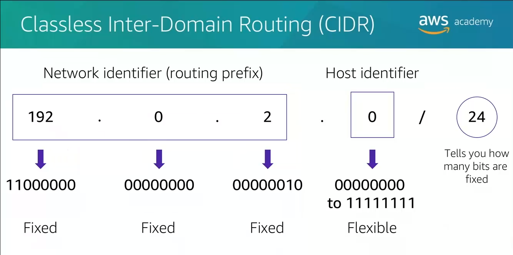
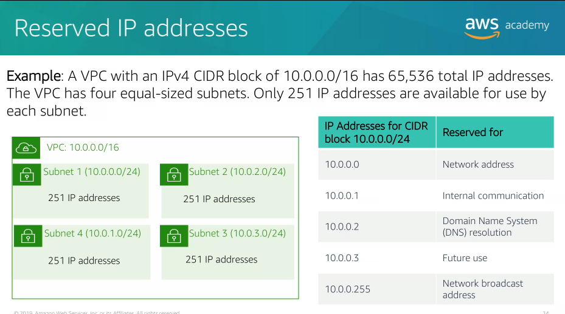

## Topics

- Networking basics
- Amazon VPC
- VPC networking
- VPC security
- Amazon Route 53
- Amazon CloudFront

# Networks

A network can be logically partitioned into subnets. Networking requires a networking device, such as a router or a switch.

Each machine on the network has a unique Internet Protocol (IP) address assigned to it. IP address is a unique number assigned to a machine in order to identify it uniquely. The IP number is expressed as four decimal numbers separated by dots. Machine convert that decimal number to binary format in order to use it.

For the IP address 192.0.2.0, each of the four dot separated numbers of the address represents a maximum of 8 bits. That means that each of the four numbers can be anything from 0 to 255. The combined total of the four number for an IP address is 32 bits in binary format.

A 32 bits IP address is called an IPv4 address. IPv6 address also exist and use 128 bits. IPv6 address can accommodate more user devices were invented to compensate for the fact that IPv4 address are in short supply.

An IPv6 address is composed of eight groups of four letters and numbers that are separated by colons. Each of the eight colon-separated groups of IPv6 address represents 16 bits. That means each of the eight groups can be anything from 0 to ffff. The combined total of the eight groups for an IPv6 address is 128 bits in binary format.

# Classless Inter-Domain Routing (CIDR)

A common method to describe networks and groups of IP addresses is Classless Inter-Domain Routing (CIDR).

A CIDR address is expressed as an IP address, which is the first address of the network. It's followed by a `/` character. The number after the `/` character tells you how many bits of the routing prefix must be steady and allocated for the network identifier. The bits that are not fixed are allowed to change.

CIDR is a way to express a group of IP addresses that are consecutive of each other. In this example, the CIDR address is 192.0.2.0/24. The last number, 24, tells you that the first 24 bits must be fixed, and the last 8 bits are flexible which means that 256 IP addresses are available for the network. They go in range from 192.0.2.0 all the way to 192.0.2.255. So basically, the four decimal digit is allowed to change from 0 to 255.

# Open System Interconnection (OSI) model

Open System Interconnection (OSI) model is a conceptual model that is used to explain data as it travels over a network. It consist of seven layers and shows the common protocols and addresses that are used to send data at each layer.

For example: hubs and switches work at layer 2 (the data link layer), routers work at layer 3 (the network layer).

The OSI model can be used to understand how communication takes place in the cloud and in basic networking.

# Amazon Virtual Private Cloud (Amazon VPC)

Amazon Virtual Private Cloud (Amazon VPC) is a service that lets you provision a logically isolated section of the AWS cloud called VPC. It's your very own private space in the AWS Cloud.

Amazon VPC gives you control over your virtual networking resources, including the selection of your own IP address range, the creation of subnets, the configuration of route tables, and the creation of network gateways. You can use both IPv4 and IPv6 in your VPC for secure access to your resources and applications. You can also customize the network configuration for your VPC. For example: you can subdivide your VPC into subnets and create a public subnet for your web servers that can access the public internet.

You can place your backend system, such as database or application servers, in a private subnet with no public internet access at all.

You can use multiple layers of security, including security groups and network access control lists to help control access to Amazon Elastic Compute Cloud (Amazon EC2) instances in each subnet.

# VPCs and Subnets

VPC is a virtual network that is logically isolated from other virtual networks in the AWS Cloud. A VPC is dedicated to your account.

VPCs belong to a single AWS Region and can span multiple availability zones.

After you create a VPC, you can divide it into one or more subnets. A subnet represents an isolated segment of your VPC with it's very own range of IP addresses.

Subnets belong to a single availability zone. You can create subnets in different availability zones for high availability.

Subnets can be public or private. Public subnets have direct access to the internet but private subnets do not.

# IP addresses

IP addresses enable resources in your VPC to communicate with each other and resources over the internet as well. When you create a VPC, you assign an IPv4 CIDR block, meaning a range of private IPv4 addresses to it.

After you create a VPC, you cannot change the addresses range, so it's important that you choose it carefully.

The largest IPv4 CIDR block you can choose is `/16` which gives you a total of 65536 possible addresses. The smallest IPv4 CIDR block is `/28`, which give you a total of 16 possible addresses for your VPC. It's important to remember this maximum and minimum blocks that you can actually utilize. They are hard limits so they cannot be broken.

You can associate an IPv6 CIDR block with your VPC and subnets and assign IPv6 addresses as well from that block to resources in you VPC. IPv6 CIDR blocks have a different block size limit. The CIDR of block of a subnet can be the same as a CIDR of block for a VPC, that means that a subnet can be as large as the entire VPC. But you can also use a subnet with its own CIDR block to subdivide your VPC. If you create more than one subnet in a VPC, the CIDR blocks of the subnets cannot overlap. You cannot have duplicate IP addresses in the same VPC.

When you create a subnet, it requires its own CIDR block. For each CIDR block that you specify, AWS reserves five IP addresses within that block, and these addresses are not available for you to use. AWS reserve the following fivee IP addresses for different reasons:
1. for network address
2. for VPC local routing and internal communications
3. for domain name system (DNS) resolution
4. for future use
5. for network broadcast address

For example: suppose that you create a subnet with an IPv4 CIDR block of 10.0.0.0/24. That in theory gives you 256 total IP addresses. The subnet has 256 IP addresses but only 251 are actually available because five of them are reserved by AWS.

# Public IP address types

There are two types of public IP address:
- Public IPv4 address -> manually assigned through an Elastic IP address, automatically assigned through the auto-assign public IP address setting at the subnet level.
- Elastic IP address -> associated with an AWS account, can be allocated and remapped anytime, additional costs might apply.

When you create a VPC, every virtual machine in that VPC gets a private IP address automatically. You can request a public IP address to be assigned to a virtual machine when you create the instance by modifying the subnet's auto assign public IP address properties.

An elastic IP address is a static public IPv4 address. You can associate an elastic IP address with any instance or network interface for any VPC in you account.

With an elastic IP address, you can mask the failure of an instance by rapidly remapping the address to another instance in your VPC. Associating the elastic IP address with the network interface has an advantage over associating directly with the instance. That means you can move all of the attributes of the networking interface from one instance to another in the event of a failure in just a single step. (additional cost may apply when you use an elastic IP address, so it's important to release them when you no longer need them).

# Elastic network interface

Elastic network interface is a virtual network interface that you can attach or detach from an instance in a VPC. A network interface attribute follows it when it is re-attached to another instance.

When you move a network interface from one instance to another, network traffic is redirected to the new instance. Each instance in your VPC has a default network interface that is called the primary network interface. It's assigned a private IPv4 address automatically and it is within the IPv4 address range of your VPC. You cannot detach a primary network interface from an instance. You can create and attach an additional network interface to any instance in your VPC. The number of network interface that you can attach changes by the instance type that you're utilizing.

# Route tables and routes

A route table contains a set of rules called routes that directs network traffic to and from your subnet. Each routes specifies a destination and a target. The destination is the CIDR block where you want traffic from your subnet to go. The target is the processing resource where the traffic is sent through.

By default, every route table that you create contains a local route. This is for internal communications within the VPC. You can customize route tables by adding additional routes. You cannot delete the local route table entry, that is used for internal communications and is steady and unchangeable.

Each subnet in your VPC must be assiciated with a route table. The main route table is the route table that is automatically assigned to your VPC. It controls the routing for all subnets that are not explicitly assiciated with a custom route table. A subnet can be associated with only route table at a time but you can associate multiple subnets to the same route table, that means that mapping between subnets and route table is a one-to-one mapping despite the fact that you can use the route table for multiple subnets.

# Internet gateway

An internet gateway is a scalable, redundant, and highly available VPC component that allows communication between instances in your VPC and the public internet.

An internet gateway serves two purposes:
- Provide a target in your VPC route tables for internet traffic
- Perform network address translation for instances that were assigned public IPv4 addresses

To make a subnet public, you attach an internet gateway to your VPC and add a route entry to the route table associated with the subnet.

# Network Address Translation (NAT) gateway

A network address translation (NAT) gateway enables instances in a private subnet to connect to the internet or other AWS services but it prevents the public internet from initiating a connection with those instances.

To create a NAT gateway:
1. You must specify the public subnet in which NAT gateway should live
2. You must specify an elastic IP address to associate with the NAT gateway when you create it

After you create a NAT gateway, you must update the route table that is associated with one or more of your private subnets to point internet-bound traffic to the NAT gateway. This will allow instances in your private subnets to communicate with the internet.

You can also use NAT instance in a public subnet in your VPC instead of a NAT gateway.

# VPC sharing

VPC sharing enables customers to share subnets with other AWS accounts in the same organization.

# VPC peering connection

VPC peering connection enables you to privately route traffic between two VPCs. Instances in eithere VPC can communicate with each other as if they were on the same network.

You can create a VPC peering connection between your own VPCs with a VPC in another AWS account or with a VPC in different AWS region.

VPC peering has some restrictions:
- IP address ranges cannot overlap
- Can only have one peering resource between the same two VPCs
- Transitive peering is not supported (traffic from a VPC goes to the second VPC and it stops there, it cannot go to a third VPC)

# AWS Direct Connect

AWS Direct Connect enables you to establish a dedicated private connection between your network and one of the direct connect locations.

Direct Connect uses 802.1q virtual local area networks.

# VPC endpoints

VPC endpoints is a virtual device that enables you to privately connect your VPC to these supported AWS services

Two types of endpoints:
- Gateway endpoints -> gateway that you specify as a target for a route in your route table, for traffic destined to either Amazon S3 or Amazon DynamoDB
- Interface endpoints -> powered by AWS PrivateLink (eliminating the exposure of data to the public internet)

# AWS Transit Gateway

AWS Transit Gateway is a network transit hub that you use to interconnect your virtual private clouds, you can also connect on-premises network.

You can attach a VPC, AWS Direct Connect gateways, or VPN connections to a transit gateway.

# Amazon VPC firewall

## Security groups

Security group acts as a virtual firewall that controls inbound and outbound traffic to and from your instance.

You can think of a security group as a way to filter traffic to and from your instances.

## Network Access Control Lists (Network ACLs)

Network access control lists work at the subnet level and control traffic in and out of the subnet.

You can associate a network ACL with multiple subnets, however, a subnet can only be associated with on network ACL.

## Security groups vs network ACL

# Amazon Route 53

DNS resolution is the process of translating an internal name to the corresponding IP address.

Amazon Route 53 gives you the ability to register a domain name, such as `yourcompany.com` and have the service handles the names and hosts related to that domain.

## Amazon Route 53 supported routing

- Simple routing -> lets you configure standard DNS records, route traffic to a single resource.
- Weighted routing -> assign weights to resource record sets to specify the frequency with which different responses are served. You might want to use this to do A/B testing (blue/green deployment). With blue/green deployment, you send a small portion of traffic to a server where you made a software change in order to verify that it's all working.
- Latency routing -> when you want the response to arrive in the fastest way possible, this does not always means that the shortest path will be used.
- Geolocation routing -> lets you choose the resources that serve your traffic based on the geographic location of your users, determines where the request has originated from in terms of geographic location and responds with the address of the closest point of access to your service.
- Failover routing or DNS failover -> detect an outage of your website and redirect users toward an alternate location where your application is operating properly, requires a health check to be configured.
- Multi-value respond -> combine any of the other routing options.

# Amazon CloudFront

Amazon CloudFront is a fast content delivery service that securely delivers data to customers at high transfer speeds.

Amazon CloudFront delivers files to users over a global network of edge locations.

Amazon CloudFront relies on Route 53 geolocation routing.

As data becomes stale, it's removed from the cache at the edge location in order to make room for new content. You can define the expiration of data in the cache using a time-to-live number.
