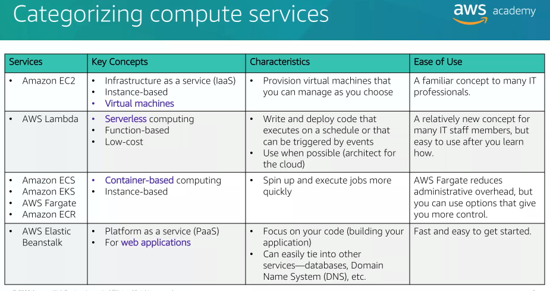
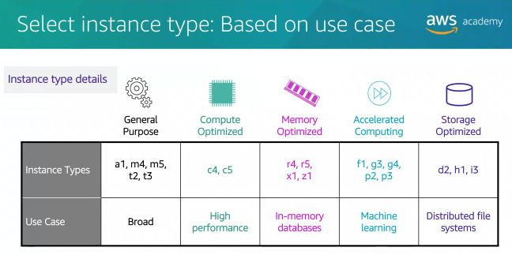
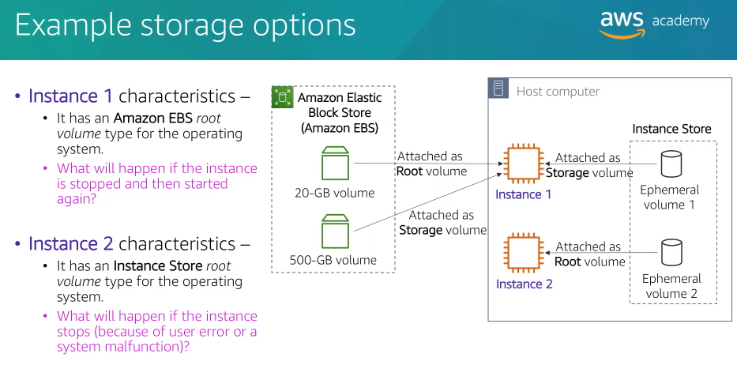
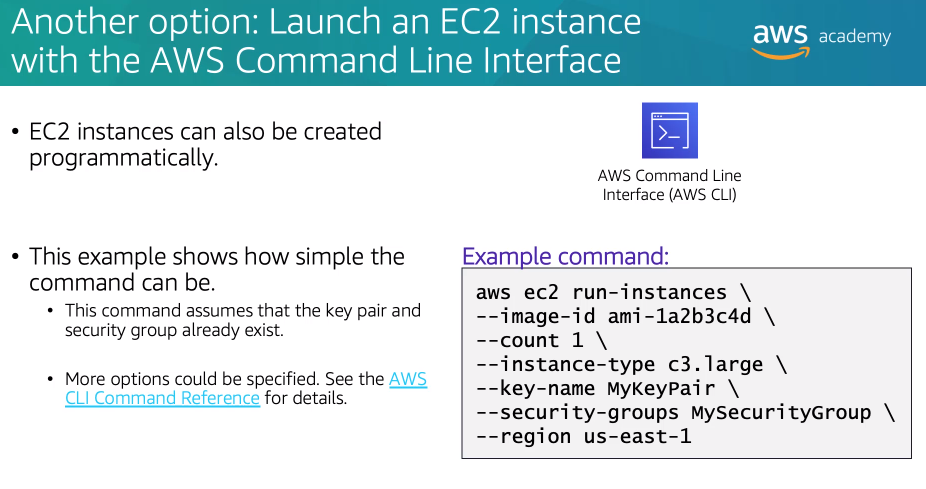
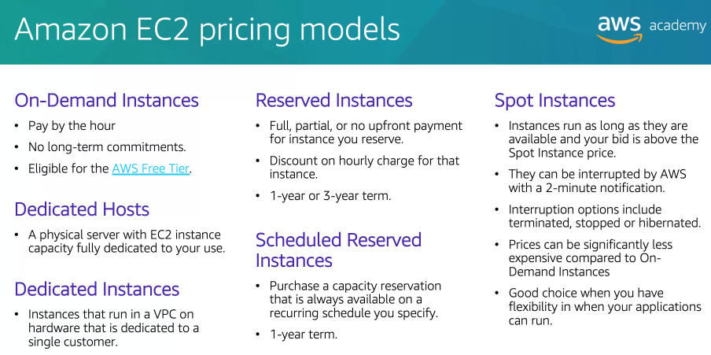
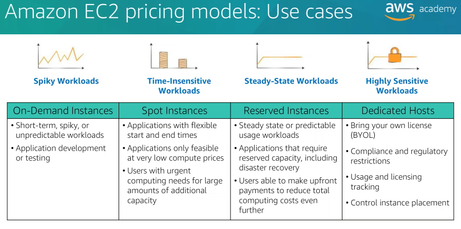
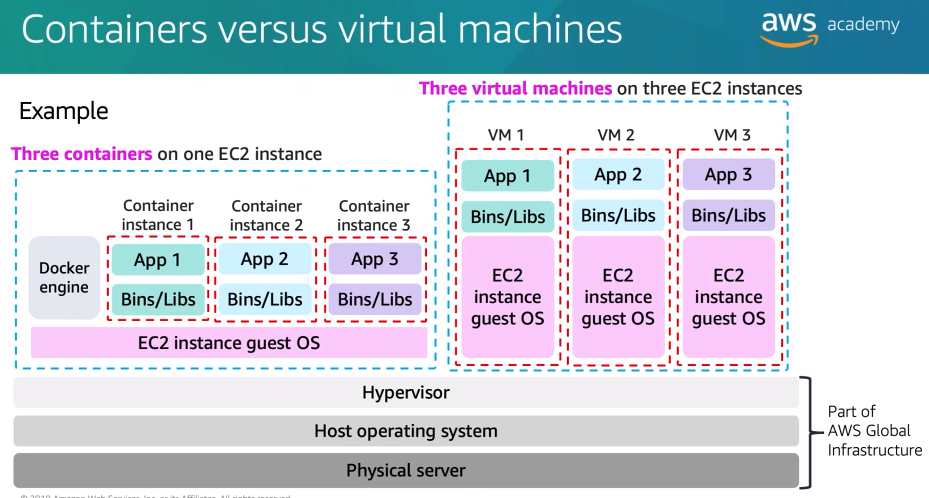

## Topics

- Compute services overview
- Amazon EC2
- Amazon EC2 cost optimization
- Container services
- Introduction to AWS Lambda
- Introduction to AWS Elastic Beanstalk

# AWS compute services

- Amazon Elastic Compute Cloud (Amazon EC2) -> provides resizeable virtual machines.
- Amazon EC2 Auto Scaling -> supports application availability by allowing you to define conditions that will automatically launch or terminate EC2 instances.
- Amazon Elastic Container Registry (Amazon ECR) -> used to store and retrieve docker images.
- Amazon Elastic Container Service (Amazon ECS) -> a container orchestration service that supports docker.
- VMware Cloud on AWS -> provision a hybrid cloud without custom hardware.
- AWS Elastic Beanstalk -> provides a simple way to run and manage web apllications.
- AWS Lambda is a serverless compute solution (pay only for the compute time that you use).
- Amazon Elastic Kubernetes Service (Amazon EKS) -> run managed kubernetes on AWS.
- Amazon Lightsail -> provides a simple-to-use service for building an application or a website.
- AWS Batch -> provides a tool for running batch jobs at any scale.
- AWS Fargate -> provides a way to run containers that reduce the need for you to manage servers or clusters.
- AWS Outpost -> provides a way to run selected AWS services in your on-premises data center.
- AWS Serverless Application Repository -> provides a way to discover, deploy, and publish serverless applications.

Infrastructure as a Service for compute that provides you with virtual machines, serverless computing, container-based computing.

Platform as a Service for web applications.

# Amazon Machine Images (AMI)

Amazon Machine Images (AMI) is a virtual machine templates.

Amazon Machine Images (AMI) includes:
- A template for the root volume for the instance (for example, an operating system or an application server with applications)
- Launch permissions that control which AWS accounts can use the AMI to launch instances
- A block device mapping that specifies the volumes to attach to the instance when it is launched

# Choices made using the Launch Instance Wizard

## Select an AMI

Which Amazon Machine Image (AMI) to launch the EC2 instance from?

AMI choices:
- Quick start -> pre-built AMIs provisioned by AWS.
- My AMIs -> contains AMIs that you have created.
- AWS marketplace -> pre-configured templates from third parties.
- Community AMIs -> AMIs shared by others (not checked by AWS).

## Select an instance type

Instance types you choose determines:
- Momory (RAM)
- Processing power (CPU)
- Disk space and disk type (Storage)
- Network performance

Instance type categories:
- General purpose
- Compute optimized
- Memory optimized
- Storage optimized
- Accelerated computing

Instance type naming, for example: `t3.large`
- `t` is the family name
- `3` is the generation number
- `large` is the size

## Specify network settings

- Where should the instance be deployed?
- Should a public IP address be automatically assigned?

## Attach IAM role (optional)

It's common to use EC2 instances to run an application that must make API calls to other AWS services. To support these use cases, AWS allows you to create and attach an IAM role to the EC2 instances.

## User data script (optional)

When you create an EC2 instance, you have the option of passing user data to the instance. User data can automate the completion of installations and configuration at instance launch.

By default, user data only runs the first time that an instance starts up.

## Specify storage

For example, you can configure the size of the root volume where the guest operating system such as Windows or Linux is installed. You can also attach additional storage volumes when you launch the instance.

For each volume that your instance will have, you can specify the size of the volumes and the volume type, and whether the storage will be retained if the instance is terminated. You can also specify if encryption should be used or not.

Amazon EC2 storage options:
- Amazon Elastic Block Store (Amazon EBS) -> durable block storage volumes, you can stop the instance and start it again and the data will still be there.
- Amazon EC2 Instance Store -> attached to the host computer where the EC2 instance is running, if the instance stops, data stored here is deleted.
- Not for the root volume -> mount Amazon Elastic File System (Amazon EFS) file system, connect to Amazon Simple Storage Service (Amazon S3).

## Add tags

A tag is a label that you assigned to an AWS resource, such as EC2 instance. Each tag consists of aa key and an optional value.

Tags enables you to categorize AWS resources in different ways. For example, you might tag instances by purpose, owner, or environment.

Tagging is how you can attach metadata to an EC2 instance. For example, a commonly used tag for EC2 instances is a tag key called Name and a tag value that describes the instance, such as Web Server 1.

## Security group settings

A security group acts as a virtual firewall that controls network traffic for one or more instances.

You can add rules to each security group. Rules allow traffic to or from its associated instance.

When traffic attempts to reach an instance, all the rules from all the security groups that are associated with the instance are evaluated.

When you define a rule, you can specify the allowable source of the network communication for inbound rules or destination for outbound rules.

By default, a security group includes an outbound rule that allows all outbound traffic.

## Identify or create the key pair

When launching an EC2 instance through the launch wizard is to specify a key pair. A key pair consists of a public key and a private key.

When creating an EC2 instance, you can choose an existing key pair, proceed without a key pair, or create a new key pair.

# Launch Amazon EC2 instance from CLI

# Amazon EC2 instance lifecycle

Instances that are backed by Amazon EBS can be stopped. They enter the stopping state before the attain the fully stopped state. A stopped instance will not incur the same cost as a running instance.

Starting a stopped instance puts it back into the pending state which moves the instance to a new host machine.

# Amazon EC2 pricing models

- On-demand instances -> the lowest upfront cost and the most flexibility.
- Dedicated host -> physical servers where instance capacity is dedicated for your use, use your existing software licenses such as microsoft SQL server.
- Dedicated instances -> instances that you run in a Virtual Private Cloud on hardware that is dedicated to a single customer.
- Reserved instances -> reserve computing capacity for one-year or three-year terms with low hourly running costs, the discounted usage price is fixed for as long as you own the reserved instances.
- Scheduled reserved instance -> purchase capacity reservations that recur on a daily, weekly, or monthly basis with a specified duration for a one-year term.
- Spot instances -> bid on unused EC2 instance capacity which can lower your costs, your instance runs whenever the bid exceeds the current market price.

# Cost optimization

- Choose the right balance of instance types
- Increase elasticity -> design your deployments to reduce the amout of server capacity that sits idle by implementing deployments that are elastic.
- Choose optimal pricing -> analyze your current usage patterns so that you can run EC2 instances with the right mix of pricing options.
- Optimize your storage choices -> reduce unused storage overhead and choose less expensive storage options.

Another recommendations:
- Define and enforce cost allocation tagging
- Define metrics, set targets, and review regularly
- Encourage teams to architect for cost
- Assign the responsibility of optimization to an individual or to a team

# Container basics

Containers are a method of operating system virtualization. Containers are smaller than virtual machines and do not contain an entire operating system. Instead, containers share a virtualized operating system and run as resource isolated processes.

Benefits:
- Repeatability.
- Deliver environmental consistency because the application's code, configurations, and dependencies are packaged into self-contained environments.
- Software runs the same in different environment.
- Faster to launch and stop or terminates than virtual machines.

Virtual machine run directly on a hypervisor, while containers run on any operating system if they have the appropriate kernel features to support docker host software and the docker daemon is present.

# Amazon Elastic Container Service (Amazon ECS) cluster options

Do you want to manage the Amazon ECS cluster that runs the containers?

- If yes, create an Amazon ECS cluster backed by Amazon EC2.
- If no, create an Amazon ECS cluster backed by AWS Fargate.

# Kubernetes

Kubernetes is an open source software for container orchestration. Kubernetes enables you to deploy and manage containerized applications at scale.

# AWS Lambda

AWS Lambda is an event-driven serverless compute service. AWS Lambda enables you to run code without provisioning or managing servers.

You create a Lambda funciton which is the AWS resource that contains the code that you want to run. You then set the Lambda function to be triggered either on a schedule or in response to an event. Your code only runs when it's triggered.

Billing is metered in increments of 100 milliseconds on AWS Lambda.

Lambda functions are triggered by event sources. Event source can be an AWS service or developer-created application that produces events that trigger the AWS Lambda function to run.

You can invoke Lambda functions directly from the Lambda console, via API, SDK, or AWS CLI.

Limits:
- Limits you to 1000 concurrent invocations per region. (soft limit)
- Function and layer storate = 75 GB per region. (soft limit)
- Only able to run up to 15 minutes at a time (function timeout). (hard limit)
- Deployment package size = 250 mb unzipped, including layers. (hard limit)
- At the moment of writing this, the max memory allocations for a single Lambda function is 3008 mb. (hard limit)
