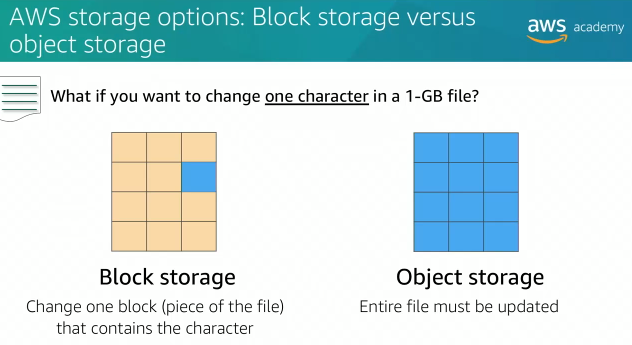
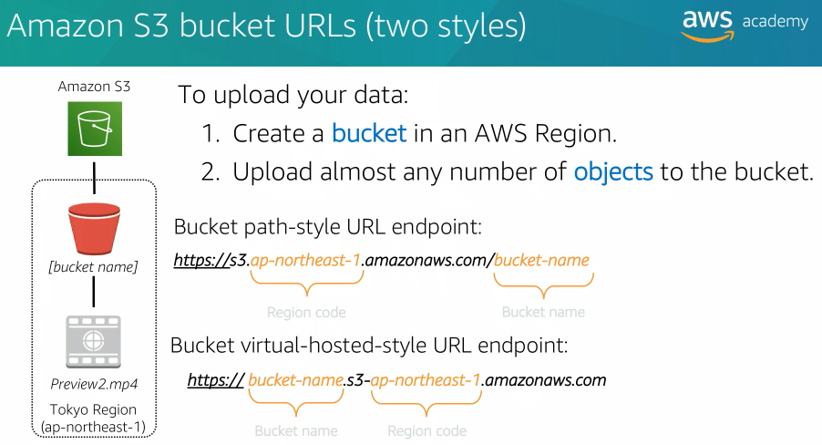
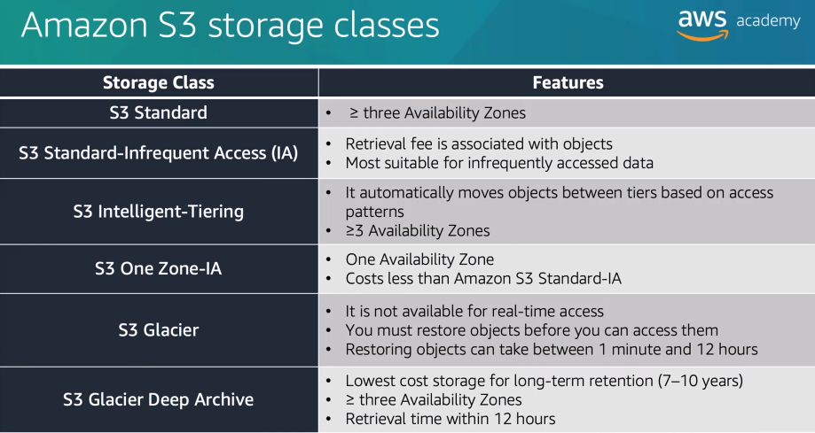
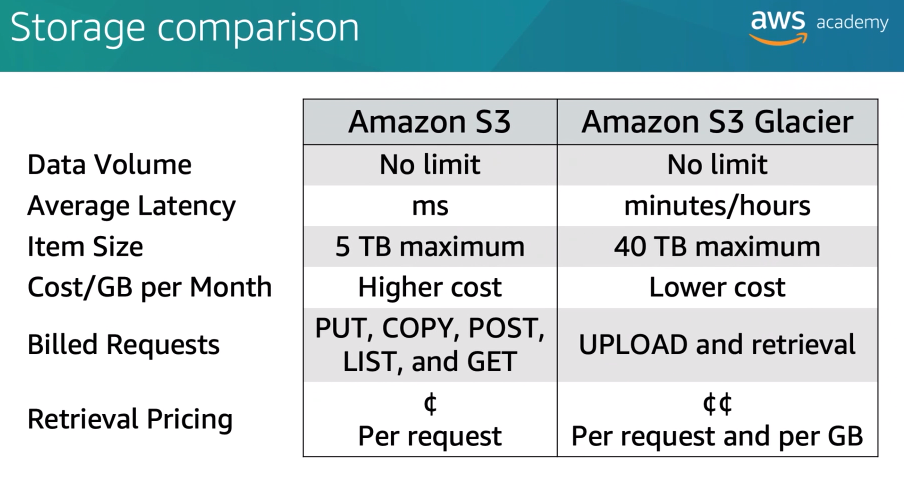

## Topics

- Amazon Elastic Block Store (Amazon EBS)
- Amazon Simple Storage Service (Amazon S3)
- Amazon Elastic File System (Amazon EFS)
- Amazon Simple Storage Service Glacier (Amazon S3 Glacier)

# Amazon Elastic Block Store (Amazon EBS)

Amazon Elastic Block Store (Amazon EBS) provides persistent block storage volumes use with Amazon EC2 instances.

Persistent storage is any data storage device that retains data after power to that device is shut off. It's also called non-volatile storage.

Each Amazon EBS volume is automatically replicated within its availability zone to protect you from component failure.

A backup of an Amazon EBS volume is called a snapshot. The first snapshot is called a Baseline snapshot, any other snapshot after the Baseline captures only what is different from the previous snapshot.

# Block storage vs object storage

One critical difference between storage types is whether they offer block-level storage or object level storage.

Example: What if you want to change one character in a 1 GB file?
> With block storage, you only change the block that contains the character. With object storage, you have to update the entire file.

# Amazon EBS: volumes, IOPS (Input Output Per Second), and pricing

Storage for all Amazon EBS volume types is charged by the amount you provision in GB per month until you release the storage.

Input/Output is included in the price of general purpose SSD volumes. However, for Amazon EBS magnetic volumes, I/O is charged by the number of requests that you make to your volume.

With provision IOPS SSD volumes, you are also charged by the amount you provision in IOPS multiplied by the percentage of days that you provision for the month.

# Amazon EBS: snapshots and data transfer

If you opt for Amazon EBS snapshots, the cost of the snapshot is per GB for each month the data is stored. When you copy Amazon EBS snapshots, you are charged for the data that is transferred across regions. After the snapshot is copied, standard Amazon EBS snapshot charges apply for the storage in the destination region.

# Amazon Simple Storage Service (Amazon S3)

Amazon S3 is object-level storage which means that if you want to change a part of file, you must make the change and then re-upload the entire modified file.

Amazon S3 stores data as objects in resources that are called buckets. Bucket names are universal and must be unique accross the world. Objects can be up to 5 TB in size.

Bucket names need to be all lowercase and contain a combination of only letters, numbers, and dashes.

# Amazon Elastic File System (Amazon EFS)

Amazon Elastic File System (Amazon EFS) implement storage for EC2 instances that multiple virtual machine can access at the same time. It is implemented as a shared file system that uses the Network File System.

Implementation of Amazon Elastic File System (Amazon EFS):
1. Create your Amazon EC2 resources and launch your Amazon EC2 instance
2. Create your Amazon EFS file system
3. Create your mount targets in the appropriate subnets
4. Connect your Amazon EC2 instances to the mount targets
5. Verify the resource and protection of your AWS account

# Amazon S3 Glacier

Amazon S3 Glacier low-cost cloud storage service for data archiving and long-term backup.

When you use the Amazon S3 Glacier to archive data, you can store your data at an extremely low cost, even in coparison to Amazon S3. But, you cannot retrieve your data immediately when you want it.

Data stored in Amazon S3 Glacier can take several hours to retrieve, which is why it works well for archiving.

There are key Amazon S3 Glacier terms:
- An archive is any object such as photo, video, file, or document that you store in Amazon S3 Glacier.
- A vault is a container for storing archives.

Three options for retrieving data:
- Expedited retrivals -> made available within one to five minutes and have the highest cost.
- Standard retrivals -> made available within three to five hours and are less expensive.
- Bulk retrivals -> made available within five to 12 hours and are the least expensive.

To store and access data in Amazon S3 Glacier, you can use the AWS Management Console. However, only a few operations such as creating and deleting vaults and creating and managing archive policies are available in the console. For almost all other operations and interactions with Amazon S3 Glacier, you must use either the Amazon S3 Glacier REST API, the AWS java or .Net SDKs, or AWS CLI.

## Lifecycle policies

Amazon S3 lifecycle policies enable you to delete or move objects based on age.

## Amazon S3 storage class

## Amazon S3 Vs Amazon S3 Glacier

