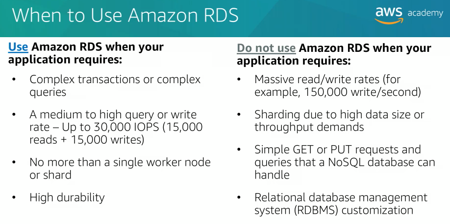

## Topics

- Amazon Relational Database Service (Amazon RDS)
- Amazon DynamoDB
- Amazon Redshift
- Amazon Aurora

# Amazon Relational Database Service (Amazon RDS)

With Amazon Relational Database Service (Amazon RDS), your primary focus is your data on optimizing your application.

With Amazon RDS, you manage your application optimization.

AWS manages installing and patching the operating system, installing and patching the database software, automatic backups, and high availability.

The basic building blocks of the Amazon RDS is the database instance. A database instance is an isolated database environment that you can contain multiple user created database.

Amazon RDS supports six database engines:
- MySQL
- Amazon Aurora
- Microsoft SQL Server
- PostgreSQL
- MariaDB
- Oracle

When you configure a Multi-AZ (Available Zone) deployment, Amazon RDS automatically generates a stand-by copy of the database instance in another availability zone within the same VPC. After seeding the database copy, transactions are synchronously repliacted to the stand-by copy.

If the main database instance fails in a Multi-AZ deployment, Amazon RDS automatically brings the stand-by database instance online as the new main instance.

# Relational Vs Non-relational databases

## Relational database

Relational database works with structured data that is organized by tables, records, and columns. You can think of tables like a spreadsheet with the rows being the records and the columns being the fields.

Relational databases create relationship between tables so you can pull data from multiple tables with queries.

## Non-relational database

Non-relational databases work with lists of key value pairs.

Non-relational databases also known as NoSQL databases.

# DynamoDB

DynamoDB is a fast and flexible NoSQL database service for all applications that need consistent single-digit millisecond latencies at any scale.

With DynamoDB you create tables and then add items to a table. The system automatically partitions your data and has table storage optimized for very large and highly volatile data sets.

One of the benefits of a NoSQL database is that items in the same table can have different attributes. This gives you the flexibility to add attributes as your application evolves.

The core DynamoDB components are tables items and attributes. Table is a collection of data. Items are a group of attributes that is uniquely identifiable.

To find an item in a DynamoDB table other than the item's primary key, you would use the scan operation.

## Primary Key

When you add, update, or delete an item in the table, you must specify the primary key attributes values for that item. DynamoDB supports two different kinds of primary keys:
- Simple primary key -> an attribute that uniquely identifies an item, the attribute is called the partition key.
- Composite primary key -> composed of two attributes: the first attribute is the partition key, the second attribute is called the sort key.

# Amazon Redshift

Amazon Redshift is a fast, fully managed data warehouse that makes it simple and cost-effective to analyze all your data by using standard SQL and your existing business intelligence tools.

## Parallel processing architecture

Amazon Redshift implementation consists of a cluster of leader and compute nodes. The leader node manages communications with client programs and all communication with the compute nodes. It parses and develops plans to perform the series of the steps needed to obtain results from complex queries. The leader node compiles code for individual elements of the plan and assigns the code to individual computer nodes. The compute nodes run the compiled code and send intermediate results back to the leader node for final aggregation.

# Amazon Aurora

Amazon Aurora ia a MySQL and PostgreSQL compatible relational database that is built for the cloud.

Amazon Aurora is a managed service and work seamlessly with AWS Database Migration Service and the AWS Schema Convertion Tool. These tools simplify the process of moving your data set into Amazon Aurora from your legacy relational database management system.
